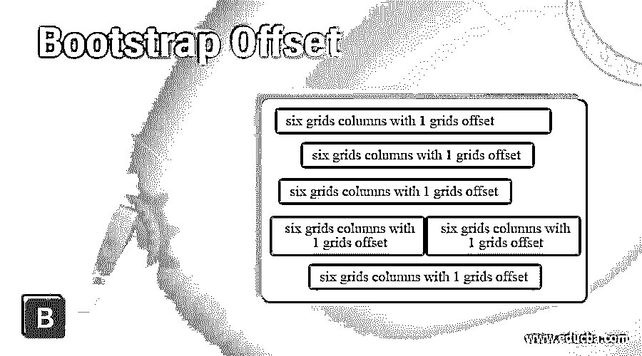
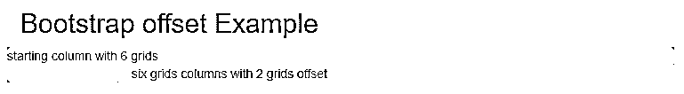
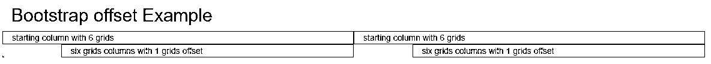
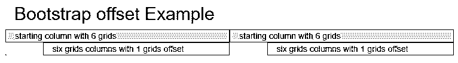
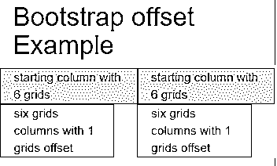

# 自举偏移

> 原文：<https://www.educba.com/bootstrap-offset/>




## 自举失调简介

引导偏移是网格系统的一部分，用于在左侧的列中留出空间。引导数据库偏移在列中为响应应用程序腾出了一些空闲空间。偏移是网格系统的左侧空间管理，使网站更有吸引力和先进性。

**语法**

<small>网页开发、编程语言、软件测试&其他</small>

基本语法如下。

```
<div class ="col-md-6 col-md-offset-2"> column after half </div>
```

*   类别“col –{必需的视口}–offset –{必需的列大小}”用于偏移。
*   在偏移中使用最中等尺寸的显示视窗，但较小尺寸的视窗也适用。
*   offset column 类位于 main column 类之后，以显示所需的列大小和左侧空间。
*   “col-md-6”类用于中等视口中的六列，具有两列偏移。

### Bootstrap 中的偏移是如何工作的？

*   bootstrap 需要某些 HTML 和 CSS 元素来获得偏移量。
*   HTML 文件是在 web 应用程序中创建的，HTML 文件中需要标签。
*   bootstrap 是一种响应性技术，可以查看各种规模设备的应用程序。
*   下面的标签对响应式网页设计很有用。

```
<meta name = "viewport" content = "width=device-width, initial-scale = 1">
```

*   bootstrap 添加了一些受支持的在线文件，以获得用于高级设计的 bootstrap 元素和实用程序。
*   以下三个文件是用于偏移的引导文件。

```
<link rel= "stylesheet" href = "https://maxcdn.bootstrapcdn.com/bootstrap/3.4.1/css/bootstrap.min.css">
<script src = "https://ajax.googleapis.com/ajax/libs/jquery/3.5.1/jquery.min.js">
</script>
<script src = "https://maxcdn.bootstrapcdn.com/bootstrap/3.4.1/js/bootstrap.min.js">
</script>
```

*   与其他网格系统类一起在 div 标签内使用的 offset 类。

```
<div class = "container">
<div class = "col-md-6 col-md-offset-2"> column after half </div>
</div>
```

*   偏移工作程序如下。

```
<!DOCTYPE html>
<html>
<head>
<title> Bootstrap offset Example </title>
<meta name = "viewport" content = "width =device-width, initial-scale= 1">
<link rel ="stylesheet" href =       "https://maxcdn.bootstrapcdn.com/bootstrap/3.4.1/css/bootstrap.min.css">
<script src = "https://ajax.googleapis.com/ajax/libs/jquery/3.5.1/jquery.min.js">
</script>
<script src = "https://maxcdn.bootstrapcdn.com/bootstrap/3.4.1/js/bootstrap.min.js">
</script>
</head>
<body>
<div class = "container">
<div class = "col-md-6 col-md-offset-2"> column after half </div>
</div>
</body>
</html>
```

### 例子

下面提到了不同的例子:

#### 示例#1

基本偏移示例和输出

**代码:**

```
<!DOCTYPE html>
<html>
<head>
<title> Bootstrap offset Example </title>
<meta name = "viewport" content = "width =device-width, initial-scale= 1">
<link rel = "stylesheet" href = "https://maxcdn.bootstrapcdn.com/bootstrap/3.4.1/css/bootstrap.min.css">
<script src = "https://ajax.googleapis.com/ajax/libs/jquery/3.5.1/jquery.min.js">
</script>
<script src = "https://maxcdn.bootstrapcdn.com/bootstrap/3.4.1/js/bootstrap.min.js">
</script>
</head>
<body>
<div class = "container">
<h2> Bootstrap offset Example </h2>
<div class = "row" style = "background-color: lightgrey ;">
<div class = "col-md-6” style = "background-color: lightcyan ;"> starting column with 6 grids </div>
<div class = "col-md-6 col-sm-offset-2" style = "background-color: lavender ;"> six grids columns with 2 grids offset </div>
</div>
</div>
</body>
</html>
```

**输出:**




**描述**

*   第一个正常列是输出图像中显示的浅青色。
*   第二个 div 标签带有一个带有淡紫色列的偏移量。
*   背景颜色为浅灰色，显示在第二个数字列左侧的两列中。

#### 实施例 2

例如，单独行的偏移量和输出。

**代码:**

```
<!DOCTYPE html>
<html>
<head>
<title> Bootstrap offset Example </title>
<meta name = "viewport" content = "width =device-width, initial-scale= 1">
<link rel = "stylesheet" href = "https://maxcdn.bootstrapcdn.com/bootstrap/3.4.1/css/bootstrap.min.css">
<script src = "https://ajax.googleapis.com/ajax/libs/jquery/3.5.1/jquery.min.js">
</script>
<script src = "https://maxcdn.bootstrapcdn.com/bootstrap/3.4.1/js/bootstrap.min.js">
</script>
</head>
<body>
<div class="container">
<h2> Bootstrap offset Example </h2>
<div class= "row" style = "background-color: lightgrey;">
<div class = "col-md-6" style = "background-color: lightcyan ; border:1px solid black"> starting column with 6 grids </div>
<div class = "col-md-6" style = "background-color: lightcyan ; border:1px solid black"> starting column with 6 grids </div>
</div>
<div class= "row" style = "background-color: lightgrey ;">
<div class = "col-md-5 col-md-offset-1" style = "background-color: yellow ; border:1px solid black"> six grids columns with 1 grids offset </div>
<div class = "col-md-5 col-md-offset-1" style = "background-color: yellow ; border:1px solid black"> six grids columns with 1 grids offset </div>
</div>
</div>
</body>
</html>
```

**输出:**




**描述**

*   列的第一行显示带有浅青色且没有空格的默认网格系统。
*   列的第二行用黄色显示，偏移用浅灰色显示。

#### 实施例 3

小尺寸器件的自举失调示例和输出。

**代码:**

```
<!DOCTYPE html>
<html>
<head>
<title> Bootstrap offset Example </title>
<meta name = "viewport" content = "width =device-width, initial-scale= 1">
<link rel = "stylesheet" href ="https://maxcdn.bootstrapcdn.com/bootstrap/3.4.1/css/bootstrap.min.css">
```

```
 <script src = "https://ajax.googleapis.com/ajax/libs/jquery/3.5.1/jquery.min.js">
</script>
<script src = "https://maxcdn.bootstrapcdn.com/bootstrap/3.4.1/js/bootstrap.min.js">
</script>
</head>
<body>
<div class = "container">
<h2> Bootstrap offset Example </h2>
<div class= "row" style = "background-color: lightgrey;">
<div class = "col-sm-6" style = "background-color: lightcyan ; border:1px solid black"> starting column with 6 grids </div>
<div class = "col-sm-6" style = "background-color: lightcyan ; border:1px solid black"> starting column with 6 grids </div>
</div>
<div class= "row" style = "background-color: lightgrey ;">
<div class = "col-sm-5 col-sm-offset-1" style = "background-color: yellow ; border:1px solid black"> six grids columns with 1 grids offset </div>
<div class = "col-sm-5 col-sm-offset-1" style = "background-color: yellow ; border:1px solid black"> six grids columns with 1 grids offset </div>
</div>
</div>
</body>
</html>
```

**输出:**




**描述**

*   大部分胶印用于中等屏幕尺寸的设备，使其看起来更宽敞、更有吸引力。
*   这种偏移适用于小尺寸的屏幕设备。

#### 实施例 4

器件尺寸超小的偏移示例及输出

**代码:**

```
<!DOCTYPE html>
<html>
<head>
<title> Bootstrap offset Example </title>
<meta name = "viewport" content = "width =device-width, initial-scale= 1">
<link rel = "stylesheet" href = "https://maxcdn.bootstrapcdn.com/bootstrap/3.4.1/css/bootstrap.min.css">
<script src = "https://ajax.googleapis.com/ajax/libs/jquery/3.5.1/jquery.min.js">
</script>
<script src = "https://maxcdn.bootstrapcdn.com/bootstrap/3.4.1/js/bootstrap.min.js">
</script>
</head>
<body>
<div class = "container">
<h2> Bootstrap offset Example </h2>
<div class= "row" style = "background-color: lightgrey;">
<div class = "col-xs-6" style = "background-color: lightcyan ; border:1px solid black"> starting column with 6 grids </div>
<div class = "col-xs-6" style = "background-color: lightcyan ; border:1px solid black"> starting column with 6 grids </div>
</div>
<div class= "row" style = "background-color: lightgrey ;">
<div class = "col-xs-5 col- xs-offset-1" style = "background-color: yellow ; border:1px solid black"> six grids columns with 1 grids offset </div>
<div class = "col-xs-5 col-xs-offset-1" style = "background-color: yellow ; border: 1px solid black"> six grids columns with 1 grids offset </div>
</div>
</div>
</body>
</html>
```

**输出:**




### 结论

*   bootstrap offset 使用左侧空间来制作高级且有吸引力的列内容。
*   它根据列的大小和可用设备的大小进行调整。

### 推荐文章

这是自举失调指南。在这里，我们将讨论偏移在 Bootstrap 和示例中的工作原理，以及代码和输出。您也可以看看以下文章，了解更多信息–

1.  [自举日历](https://www.educba.com/bootstrap-calendar/)
2.  [引导转盘](https://www.educba.com/bootstrap-carousel/)
3.  [引导程序块引用](https://www.educba.com/bootstrap-blockquote/)
4.  [包装引导程序](https://www.educba.com/wrap-bootstrap/)


