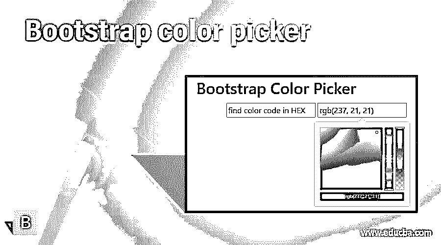
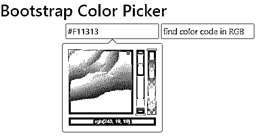
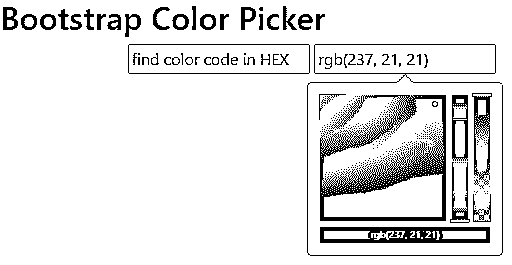
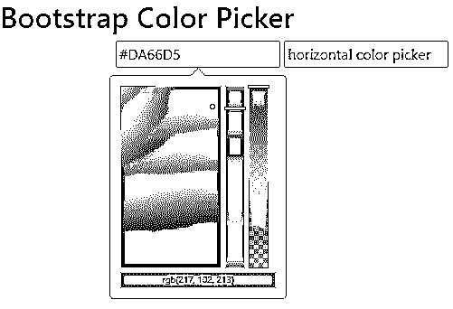
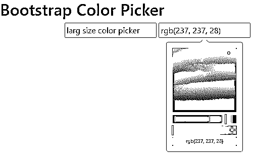
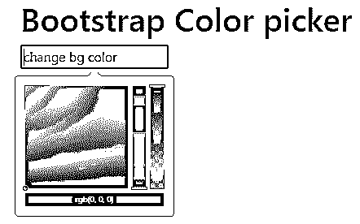
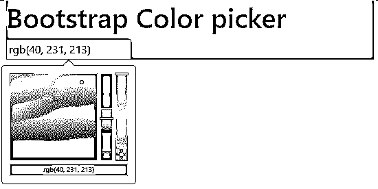

# 引导颜色选择器

> 原文：<https://www.educba.com/bootstrap-color-picker/>




## 引导颜色选择器简介

引导颜色选择器是一个高级的引导插件，用于选择颜色和颜色代码。引导色码分为三种类型，即“RGB”、“HSL”和“hex”。这些颜色选择器有助于识别色码的类型。它有助于在网站和 web 应用程序中改变颜色、背景和组件颜色的主题。颜色选择器允许用户根据您的要求和选择来更改 web 应用程序的前端部分。

**语法**

<small>网页开发、编程语言、软件测试&其他</small>

*   基本的颜色选择器语法需要 bootstrap 和 jquery。
*   HTML 中的基本颜色选择器语法如下。

```
<div class="container">
<input id = "Id_name" type = "text"  />
</div>
```

*   引导 id 对于在 jquery 中引用颜色选择器很重要。
*   这个引导语法显示在 HTML 页面的主体部分。
*   jquery 中的基本颜色选择器语法如下。

```
<script>
$(function () {
$('#Id_name').colorpicker();
});
</script>
```

*   colorpicker 方法与 id 名称一起显示在脚本标记中。
*   jquery 语法根据需要放置主体部分或头部分。

### 如何在 Bootstrap 中创建颜色选择器？

*   web 应用程序及其组件在标签下使用的引导程序响应性地工作。

```
<meta name = "viewport" content = "width=device-width, initial-scale = 1">
```

*   bootstrap4 将以下支持文件添加到工作颜色选择器中。

```
<link rel = "stylesheet" href = "https://maxcdn.bootstrapcdn.com/bootstrap/4.5.2/css/bootstrap.min.css">
<script src = "https://ajax.googleapis.com/ajax/libs/jquery/3.5.1/jquery.min.js">
</script>
<script src = "https://cdnjs.cloudflare.com/ajax/libs/popper.js/1.16.0/umd/popper.min.js">
</script>
<script src = "https://maxcdn.bootstrapcdn.com/bootstrap/4.5.2/js/bootstrap.min.js">
</script>
```

*   head 部分使用了颜色选择器 JavaScript 文件。以下两个文件用于引导支持系统。

```
<script src = "https://cdnjs.cloudflare.com/ajax/libs/bootstrap-colorpicker/3.2.0/js/bootstrap-colorpicker.js" > </script>
<script src = "https://cdnjs.cloudflare.com/ajax/libs/bootstrap-colorpicker/3.2.0/js/bootstrap-colorpicker.min.js" > </script>
```

*   颜色选择器样式文件用于 head 部分。以下两个文件用于引导支持系统。

```
<link rel = "stylesheet" href = "https://cdnjs.cloudflare.com/ajax/libs/bootstrap-colorpicker/3.2.0/css/bootstrap-colorpicker.min.css"/>
<link rel = "stylesheet" href = "https://cdnjs.cloudflare.com/ajax/libs/bootstrap-colorpicker/3.2.0/css/bootstrap-colorpicker.css"/>
```

*   在 html 文件中添加颜色选择器语法。
*   html 中的基本颜色选择器语法如下。

```
<div class="container">
<input id = "color-picker" type = "text" />
</div>
```

*   jquery 中的基本颜色选择器语法如下。

```
<script>
$(function () {
$('#color-picker').colorpicker();
});
</script>
```

*   颜色选择器工作程序示例如下。

```
<!DOCTYPE html>
<html>
<head>
<title>Bootstrap color picker Example</title>
<meta charset="utf-8">
<meta name="viewport" content="width=device-width, initial-scale=1">
<link rel = "stylesheet" href = "https://maxcdn.bootstrapcdn.com/bootstrap/4.5.2/css/bootstrap.min.css">
<script src = "https://ajax.googleapis.com/ajax/libs/jquery/3.5.1/jquery.min.js">
</script>
<script src = "https://cdnjs.cloudflare.com/ajax/libs/popper.js/1.16.0/umd/popper.min.js">
</script>
<script src = "https://maxcdn.bootstrapcdn.com/bootstrap/4.5.2/js/bootstrap.min.js">
</script>
<script src = "https://cdnjs.cloudflare.com/ajax/libs/bootstrap-colorpicker/3.2.0/js/bootstrap-colorpicker.js" > </script>
<script src = "https://cdnjs.cloudflare.com/ajax/libs/bootstrap-colorpicker/3.2.0/js/bootstrap-colorpicker.min.js" > </script>
<link rel = "stylesheet" href = "https://cdnjs.cloudflare.com/ajax/libs/bootstrap-colorpicker/3.2.0/css/bootstrap-colorpicker.min.css"/>
<link rel = "stylesheet" href = "https://cdnjs.cloudflare.com/ajax/libs/bootstrap-colorpicker/3.2.0/css/bootstrap-colorpicker.css"/>
</head>
<body>
<h2> Bootstrap Color Picker </h2>
<div class = "container">
<input id = "color-picker" type = "text" placeholder = "find color code" />
<script>
$(function () {
$('#color-picker').colorpicker();
});
</script>
</div>
</body>
</html>
```

### 例子

下面提到了不同的例子:

#### 示例#1

显示十六进制和 RGB 颜色代码的颜色选择器示例和输出。

**代码:**

```
<!DOCTYPE html>
<html>
<head>
<title> Bootstrap color picker Example </title>
<meta charset="utf-8">
<meta name="viewport" content="width=device-width, initial-scale=1">
<link rel = "stylesheet" href = "https://maxcdn.bootstrapcdn.com/bootstrap/4.5.2/css/bootstrap.min.css">
<script src = "https://ajax.googleapis.com/ajax/libs/jquery/3.5.1/jquery.min.js">
</script>
<script src = "https://cdnjs.cloudflare.com/ajax/libs/popper.js/1.16.0/umd/popper.min.js">
</script>
<script src = "https://maxcdn.bootstrapcdn.com/bootstrap/4.5.2/js/bootstrap.min.js">
</script>
<script src = "https://cdnjs.cloudflare.com/ajax/libs/bootstrap-colorpicker/3.2.0/js/bootstrap-colorpicker.js" > </script>
<script src = "https://cdnjs.cloudflare.com/ajax/libs/bootstrap-colorpicker/3.2.0/js/bootstrap-colorpicker.min.js" > </script>
<link rel = "stylesheet" href = "https://cdnjs.cloudflare.com/ajax/libs/bootstrap-colorpicker/3.2.0/css/bootstrap-colorpicker.min.css"/>
<link rel = "stylesheet" href = "https://cdnjs.cloudflare.com/ajax/libs/bootstrap-colorpicker/3.2.0/css/bootstrap-colorpicker.css"/>
</head>
<body>
<h2> Bootstrap Color Picker </h2>
<div class = "container">
<input id = "color-picker1" type = "text" placeholder = "find color code in HEX"  />
<input id = "color-picker2" type = "text" placeholder = "find color code in RGB"  />
<script>
$(function () {
$('#color-picker1').colorpicker();
});
$(function () {
$('#color-picker2').colorpicker({
format: 'rgba'
});
});
</script>
</div>
</body>
</html>
```

**输出:**




**输出:**




**描述:**

*   引导第一个文本标签显示十六进制类型颜色代码。
*   引导第二个文本标签显示 RGB 类型颜色代码。

#### 实施例 2

颜色选择器与设计颜色选择器的例子和输出。

**代码:**

```
<!DOCTYPE html>
<html>
<head>
<title> Bootstrap color picker Example </title>
<meta charset="utf-8">
<meta name="viewport" content="width=device-width, initial-scale=1">
<link rel = "stylesheet" href = "https://maxcdn.bootstrapcdn.com/bootstrap/4.5.2/css/bootstrap.min.css">
<script src = "https://ajax.googleapis.com/ajax/libs/jquery/3.5.1/jquery.min.js">
</script>
<script src = "https://cdnjs.cloudflare.com/ajax/libs/popper.js/1.16.0/umd/popper.min.js">
</script>
<script src = "https://maxcdn.bootstrapcdn.com/bootstrap/4.5.2/js/bootstrap.min.js">
</script>
<script src = "https://cdnjs.cloudflare.com/ajax/libs/bootstrap-colorpicker/3.2.0/js/bootstrap-colorpicker.js" > </script>
<script src = "https://cdnjs.cloudflare.com/ajax/libs/bootstrap-colorpicker/3.2.0/js/bootstrap-colorpicker.min.js" > </script>
<link rel = "stylesheet" href = "https://cdnjs.cloudflare.com/ajax/libs/bootstrap-colorpicker/3.2.0/css/bootstrap-colorpicker.min.css"/>
<link rel = "stylesheet" href = "https://cdnjs.cloudflare.com/ajax/libs/bootstrap-colorpicker/3.2.0/css/bootstrap-colorpicker.css"/>
<style>
.custom .colorpicker-saturation {
width: 110px;
height: 200px;
}
.custom .colorpicker-hue,
.custom .colorpicker-alpha {
width: 20px;
height: 200px;
}
</style>
</head>
<body>
<h2> Bootstrap Color Picker </h2>
<div class = "container">
<input id = "color-picker1" type = "text" placeholder = "larg size color picker"  />
<input id = "color-picker2" type = "text" placeholder = "horizontal color picker"  />
<script>
$(function () {
$('#color-picker1').colorpicker({
customClass: 'custom',
sliders: {
saturation: {
maxLeft: 190,
maxTop: 150
},
hue: {
maxTop: 150
},
alpha: {
maxTop: 150
}
}
});
});
$(function () {
$('#color-picker2').colorpicker({
format: 'rgba',
horizontal: true
});
});
</script>
</div>
</body>
</html>
```

**输出:**




**输出:**




**描述:**

*   引导第一个文本标签显示定制尺寸调色板。
*   引导第二个文本标签显示水平调色板。

#### 实施例 3

背景颜色选择器的例子和输出。

**代码:**

```
<!DOCTYPE html>
<html lang="en">
<head>
<title> Bootstrap Color picker Example </title>
<meta charset="utf-8">
<meta name="viewport" content="width=device-width, initial-scale=1">
<link rel = "stylesheet" href = "https://maxcdn.bootstrapcdn.com/bootstrap/4.5.2/css/bootstrap.min.css">
<script src = "https://ajax.googleapis.com/ajax/libs/jquery/3.5.1/jquery.min.js">
</script>
<script src = "https://cdnjs.cloudflare.com/ajax/libs/popper.js/1.16.0/umd/popper.min.js">
</script>
<script src = "https://maxcdn.bootstrapcdn.com/bootstrap/4.5.2/js/bootstrap.min.js">
</script>
<script src = "https://cdnjs.cloudflare.com/ajax/libs/bootstrap-colorpicker/3.2.0/js/bootstrap-colorpicker.js" > </script>
<script src = "https://cdnjs.cloudflare.com/ajax/libs/bootstrap-colorpicker/3.2.0/js/bootstrap-colorpicker.min.js" > </script>
<link rel = "stylesheet" href = "https://cdnjs.cloudflare.com/ajax/libs/bootstrap-colorpicker/3.2.0/css/bootstrap-colorpicker.min.css"/>
<link rel = "stylesheet" href = "https://cdnjs.cloudflare.com/ajax/libs/bootstrap-colorpicker/3.2.0/css/bootstrap-colorpicker.css"/>
</head>
<body>
<div class = "container">
<div id = "color-picker">
<h1> Bootstrap Color picker </h1>
<input id = "background-change" type="text" placeholder="change bg color" />
</div>
<script>
$(function () {
$('#background-change').colorpicker({
format: 'rgba'
});
$('#background-change').on('colorpickerChange', function(event) {
$('#color-picker').css('background-color', event.color.toString());
});
});
</script>
</div>
</body>
</html>
</body>
</html>
```

**输出:**




**输出:**




### 结论

颜色选择器使 web 应用程序根据用户的要求变得丰富多彩。颜色选择器使网站的主题和背景颜色看起来更有吸引力和用户友好。网站和 web 应用程序的用户可以选择制作宏伟的、引人入胜的应用程序。

### 推荐文章

这是一个引导颜色选择器的指南。这里我们讨论如何在 Bootstrap 中创建颜色选择器，并给出代码和输出。您也可以看看以下文章，了解更多信息–

1.  [自举输入类型](https://www.educba.com/bootstrap-input-type/)
2.  [引导向导](https://www.educba.com/bootstrap-wizard/)
3.  [自举日历](https://www.educba.com/bootstrap-calendar/)
4.  [自举文本颜色](https://www.educba.com/bootstrap-text-color/)


