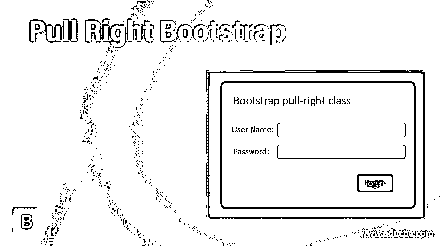
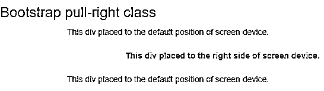
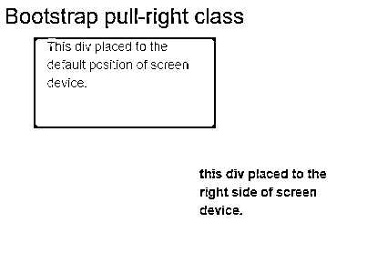
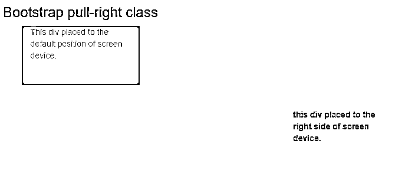
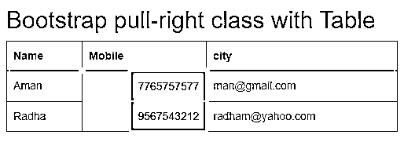
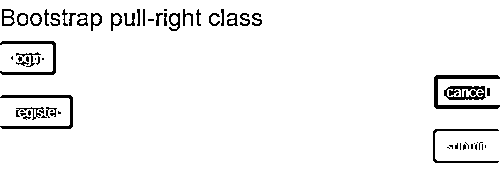

# 向右拉自举

> 原文：<https://www.educba.com/pull-right-bootstrap/>




## 右拉自举简介

pull right 是 bootstrap 中的实用程序类，用于将信息放置在显示屏的右侧。pull-right 类用于将网格系统的内容或元素保持在引导程序的右侧。pull right 实用程序类用于将元素浮动在 web 应用程序屏幕的右侧。pull-right 类一直使用到 bootstrap3，在 bootstrap 4 之后，它被替换为 float-right。

**语法:**

<small>网页开发、编程语言、软件测试&其他</small>

*   右拉语法如下。

```
<div class ="pull-right">
This div placed to the right side of the screen device.
</div>
```

*   在标签中使用的右拉类。
*   所需的信息和内容放在标签中。
*   所需内容显示在 web 应用程序屏幕的右侧。

### Bootstrap Pull Right 是如何工作的？

以下是向右拉动的不同步骤:

**第一步:**

*   必须在引导中为 web 应用程序创建 HTML 页面。

**第二步:**

*   有两种方法添加下面的引导框架文件。
*   引导文件从相应的网站下载，并将路径和链接放在 head 部分。
*   在线引导支持文件也被添加到网页的头部。

```
<link rel = "stylesheet" href = "https://maxcdn.bootstrapcdn.com/bootstrap/3.4.1/css/bootstrap.min.css">
<script src = "https://ajax.googleapis.com/ajax/libs/jquery/3.5.1/jquery.min.js">
</script>
<script src = "https://maxcdn.bootstrapcdn.com/bootstrap/3.4.1/js/bootstrap.min.js">
</script>
```

**第三步:**

*   该引导程序适用于移动设备、桌面设备和记事本设备。该框架具有移动优先的响应优先级。
*   下面的标签和属性被添加到响应 web 应用程序的 head 部分。

```
<meta name = "viewport" content = "width = device-width, initial-scale =1">
```

**第四步:**

*   pull-right 类放在 HTML 文件的 body 部分中。

```
<div class ="pull-right">
This div placed to the right side of screen device.
</div>
```

*   右拉工作步骤的联合如下。

```
<!DOCTYPE html>
<html>
<head>
<title>  Bootstrap pull-right class Example  </title>
<meta charset = "utf-8">
<meta name = "viewport" content = "width = device-width, initial-scale=1">
<link rel = "stylesheet" href = "https://maxcdn.bootstrapcdn.com/bootstrap/3.4.1/css/bootstrap.min.css">
<script src = "https://ajax.googleapis.com/ajax/libs/jquery/3.5.1/jquery.min.js">    </script>
<script src = "https://maxcdn.bootstrapcdn.com/bootstrap/3.4.1/js/bootstrap.min.js">   </script>
</head>
<body>
<div class = "pull-right">
This div placed to the right side of screen device.
</div>
</body>
</html>
```

*   基本的拉右类工作程序如上。

### 例子

以下是向右拉的不同例子:

#### 示例#1

示例中的基本右拉类和输出如下。

```
<!DOCTYPE html>
<html>
<head>
<title> Bootstrap pull-right class Example </title>
<meta charset="utf-8">
<meta name = "viewport" content="width=device-width, initial-scale=1">
<link rel = "stylesheet" href = "https://maxcdn.bootstrapcdn.com/bootstrap/3.4.1/css/bootstrap.min.css">
<script src = "https://ajax.googleapis.com/ajax/libs/jquery/3.5.1/jquery.min.js">
</script>
<script src = "https://maxcdn.bootstrapcdn.com/bootstrap/3.4.1/js/bootstrap.min.js">   </script>
</head>
<body>
<h3> Bootstrap pull-right class </h3>
<div class = "container">
This div placed to the default position of screen device.
</div> <br>
<div class = "container pull-right">
<b> This div placed to the right side of screen device. </b>
</div> <br> <br>
<div class = "container">
This div placed to the default position of screen device.
</div>
</body>
</html>
```

**输出:**




**描述:**

*   容器类放在网页的主体部分。
*   容器类的内容显示在显示屏的默认位置。
*   在第二个标签中添加的右拉类。
*   容器的内容显示在显示屏的右侧。

#### 实施例 2

响应右拉自举示例和输出如下。

```
<!DOCTYPE html>
<html>
<head>
<title> Bootstrap pull-right class Example </title>
<meta name = "viewport" content = "width = device-width, initial-scale =1">
<link rel = "stylesheet" href = "https://maxcdn.bootstrapcdn.com/bootstrap/3.4.1/css/bootstrap.min.css">
<script src = "https://ajax.googleapis.com/ajax/libs/jquery/3.5.1/jquery.min.js">
</script>
<script src = "https://maxcdn.bootstrapcdn.com/bootstrap/3.4.1/js/bootstrap.min.js">   </script>
<style>
.container-fluid {
width: 200px;
height:100px;
background-color: yellow;
}
.container {
width: 200px;
height: 100px;
background-color: orange;
}
</style>
</head>
<body>
<center>
<h3> Bootstrap pull-right class </h3>
</center>
<div class = "container ">
<p>This div placed to the default position of screen device. </p>
</div> <br> <br>
<div class = "container-fluid pull-right">
<b> this div placed to the right side of screen device. </b>
</div>
</body>
</html>
```

**输出 1:**




**输出 2:**




**描述:**

*   引导容器可以使用 pull-right 类将右侧放置在显示屏上。
*   容器类被放置在屏幕设备的默认位置。
*   由于与容器流体类一起使用的 pull-right 类，容器流体被放置在右侧。
*   下拉式容器适用于移动设备、笔记本电脑和桌面设备屏幕。

#### 实施例 3

下面是带有引导表示例和输出的右拉类。

```
<!DOCTYPE html>
<html>
<head>
<title> Bootstrap pull-right class Example </title>
<meta name = "viewport" content = "width = device-width, initial-scale=1">
<link rel = "stylesheet" href = "https://maxcdn.bootstrapcdn.com/bootstrap/3.4.1/css/bootstrap.min.css">
<script src = "https://ajax.googleapis.com/ajax/libs/jquery/3.5.1/jquery.min.js">
</script>
<script src = "https://maxcdn.bootstrapcdn.com/bootstrap/3.4.1/js/bootstrap.min.js">
</script>
<style>
.pull-right {
background-color: orange;
}
</style>
</head>
<body>
<div class = "container">
<h2> Bootstrap pull-right class with Table </h2>
<table class = "table table-bordered">
<thead>
<tr>
<th> Name </th>
<th> Mobile </th>
<th> city </th>
</tr>
</thead>
<tbody>
<tr>
<td> Aman </td>
<td class = "pull-right"> 7765757577 </td>
<td> man@gmail.com </td>
</tr>
<tr>
<td> Radha </td>
<td class = "pull-right"> 9567543212 </td>
<td > radham@yahoo.com </td>
</tr>
</tbody>
</table>
</div>
</body>
</html>
```

**输出:**




**描述:**

*   pull-right 类放在 mobile 的标签中。
*   移动列的内容放在右侧，其余内容放在列的左侧。
*   橙色列使用一个 pull-right 类将手机号码浮动在右侧。

#### 实施例 4

下面是带有按钮示例和输出的基本右拉类。

```
<!DOCTYPE html>
<html>
<head>
<title>  Bootstrap pull-right class Example  </title>
<meta charset = "utf-8">
<meta name = "viewport" content = "width = device-width, initial-scale=1">
<link rel = "stylesheet" href = "https://maxcdn.bootstrapcdn.com/bootstrap/3.4.1/css/bootstrap.min.css">
<script src = "https://ajax.googleapis.com/ajax/libs/jquery/3.5.1/jquery.min.js">    </script>
<script src = "https://maxcdn.bootstrapcdn.com/bootstrap/3.4.1/js/bootstrap.min.js">   </script>
</head>
<body>
<h3> Bootstrap pull-right class </h3>
<button type= "button" class= "btn btn-success"> login </button>
<br>
<button type= "button" class= "btn btn-danger pull-right"> cancel </button>
<br>
<button type= "button" class= "btn btn-info"> register </button>
<br>
<button type= "button" class= "btn btn-warning pull-right"> submit </button>
<br>
</body>
</html>
```

**输出:**




**描述:**

*   在引导系统中使用基类来浮动右侧的按钮。
*   使用一个右拉类将取消和提交按钮放置在右侧。

### 结论

*   pull-right 类用于 web 应用程序内容的设计和样式目的。
*   下拉菜单使 web 应用程序内容对用户有吸引力，并突出显示一些重要信息。
*   bootstrap pull-right 类是一个实用组件，用于优雅和用户友好的设计。

### 推荐文章

这是一个引导拉右。在这里，我们还讨论了 bootstrap Pull Right 的定义和工作方式，以及不同的示例和代码实现。您也可以看看以下文章，了解更多信息–

1.  [引导向导](https://www.educba.com/bootstrap-wizard/)
2.  [包装引导程序](https://www.educba.com/wrap-bootstrap/)
3.  [自举寻呼机](https://www.educba.com/bootstrap-pager/)
4.  [引导左侧菜单](https://www.educba.com/bootstrap-left-menu/)


