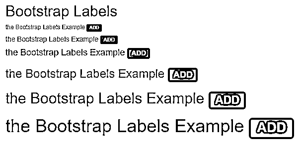
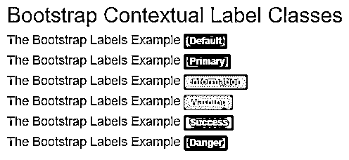
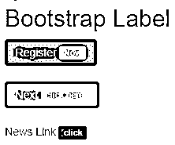
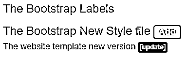

# 引导标签

> 原文：<https://www.educba.com/bootstrap-labels/>


## 引导标签介绍

引导标签是设计灵活的组件，提供关于内容的额外信息。引导标签是布局组件，提供关于主要内容的提示和附加小信息。引导标签用最小的空间和信息突出显示或标记内容。标签是可调整的组件，可根据标签、元素和内容大小进行修改。

**语法**

<small>网页开发、编程语言、软件测试&其他</small>

*   引导标签类大多都带有标签。
*   基本的标签语法如下。

```
 Extra Information 
```

*   在标签中，类标签和上下文标签类总是一起工作。
*   class label 和 class label-primary 放在 span 标记内。
*   标签总是根据内容大小或文本大小进行调整。
*   带标题大小语法的标签如下。

```
<h1> the labels in bootstrap  Extra information 
</h1>
```

*   在

    # 标签中使用了标签，而

    # 标签中的文本和标签——主类放在 span 标签中。 

### 引导标签是如何工作的？

*   为了提供像标签这样的引导组件，我们需要一个 bootstrap3 或 bootstrap4 支持文件。
*   bootstrap 适用于移动设备、笔记本电脑和桌面设备框架。
*   我们在 HTML 文件的 head 部分包含了带有属性的标签。语法如下。

```
<meta name = "viewport" content = "width=device-width, initial-scale = 1">
```

bootstrap3 在 HTML 文件的头部分包含三个支持文件。

```
<link rel= "stylesheet" href= "https://maxcdn.bootstrapcdn.com/bootstrap/3.4.1/css/bootstrap.min.css">
<script src= "https://ajax.googleapis.com/ajax/libs/jquery/3.5.1/jquery.min.js">
</script>
<script src= "https://maxcdn.bootstrapcdn.com/bootstrap/3.4.1/js/bootstrap.min.js">
</script>
```

bootstrap4 在 HTML 文件的头部分包括四个支持文件。

```
<link rel = "stylesheet" href = "https://maxcdn.bootstrapcdn.com/bootstrap/4.5.0/css/bootstrap.min.css">
<script src = "https://ajax.googleapis.com/ajax/libs/jquery/3.5.1/jquery.min.js"> </script>
<script src = "https://cdnjs.cloudflare.com/ajax/libs/popper.js/1.16.0/umd/popper.min.js">
</script>
<script src = "https://maxcdn.bootstrapcdn.com/bootstrap/4.5.0/js/bootstrap.min.js">
</script>
```

引导程序在 HTML 文件的主体部分用所需的标记来标记语法。

```
<h3> The Bootstrap New Style
 Add 
</h3>
```

了解如何在 HTML 文件中汇编文件和标记语法。基本标签示例如下。

```
<!DOCTYPE html>
<html>
<head>
<title> Bootstrap labels Example </title>
<meta name = "viewport" content = "width=device-width, initial-scale=1">
<link rel= "stylesheet" href= "https://maxcdn.bootstrapcdn.com/bootstrap/3.4.1/css/bootstrap.min.css">
<script src = "https://ajax.googleapis.com/ajax/libs/jquery/3.5.1/jquery.min.js">
</script>
<script src = "https://maxcdn.bootstrapcdn.com/bootstrap/3.4.1/js/bootstrap.min.js">
</script>
</head>
<body>
<div class = "container-fluid">
<h3> The Bootstrap Labels </h3>
<h3> The Bootstrap New Style file  Add  </h4>
<h4> The website template new version  update 
</h4>
</div>
</body>
</html>
```

标签警告和标签类放在

### 标题标签内。

label 和 label-primary 类放在

#### heading 标签中。

### 引导标签示例

下面提到了不同的例子:

#### 示例#1

带有标题尺寸示例的基本标签及其输出如下。

**代码:**

```
<!DOCTYPE html>
<html>
<head>
<title>Bootstrap Labels Example</title>
<meta charset="utf-8">
<meta name ="viewport" content ="width=device-width, initial-scale=1">
<link rel ="stylesheet" href ="https://maxcdn.bootstrapcdn.com/bootstrap/3.4.1/css/bootstrap.min.css">
<script src ="https://ajax.googleapis.com/ajax/libs/jquery/3.5.1/jquery.min.js">
</script>
<script src ="https://maxcdn.bootstrapcdn.com/bootstrap/3.4.1/js/bootstrap.min.js">
</script>
</head>
<body>
<div class ="container-fluid">
<h2> Bootstrap Labels </h2>
<h6> the Bootstrap Labels Example  ADD 
</h6>
<h5> the Bootstrap Labels Example  ADD 
</h5>
<h4> the Bootstrap Labels Example  ADD 
</h4>
<h3> the Bootstrap Labels Example  ADD 
</h3>
<h2> the Bootstrap Labels Example  ADD 
</h2>
<h1> the Bootstrap Labels Example  ADD 
</h1>
</div>
</body>
</html>
```

**输出:**




**描述:**

*   span 标记中使用了 label 和 label-primary 类。
*   从

    # 到

    ###### 放置在标题标签内的跨度标签。

*   标签可以根据标题文本大小进行调整。

#### 实施例 2

下面是带有不同上下文类示例及其输出的标签。

**代码:**

```
<!DOCTYPE html>
<html>
<head>
<title> Bootstrap label Example </title>
<meta charset ="utf-8">
<meta name ="viewport" content ="width=device-width, initial-scale=1">
<link rel ="stylesheet" href ="https://maxcdn.bootstrapcdn.com/bootstrap/3.4.1/css/bootstrap.min.css">
<script src ="https://ajax.googleapis.com/ajax/libs/jquery/3.5.1/jquery.min.js">
</script>
<script src ="https://maxcdn.bootstrapcdn.com/bootstrap/3.4.1/js/bootstrap.min.js">
</script>
</head>
<body>
<div class ="container-fluid">
<h2> Bootstrap Contextual Label Classes </h2>
<h4> The Bootstrap Labels Example  Default 
</h4>
<h4> The Bootstrap Labels Example  Primary 
</h4>
<h4> The Bootstrap Labels Example  Information 
</h4>
<h4> The Bootstrap Labels Example  Warning 
</h4>
<h4> The Bootstrap Labels Example  Success 
</h4>
<h4> The Bootstrap Labels Example    Danger 
</h4>
</div>
</body>
</html>
```

**输出:**




**描述:**

*   标签类及其上下文标签类放在

    #### 标签内。

*   有六种上下文标签:默认标签、主要标签、信息标签、警告标签、成功标签和危险标签。
*   上下文标签有不同的颜色。我们可以用它来使用标签突出显示或标记元素。

#### 实施例 3

引导标签示例及其输出如下。

**代码:**

```
<!DOCTYPE html>
<html>
<head>
<title> Bootstrap label Example </title>
<meta charset ="utf-8">
<meta name ="viewport" content ="width=device-width, initial-scale=1">
<link rel ="stylesheet" href ="https://maxcdn.bootstrapcdn.com/bootstrap/3.4.1/css/bootstrap.min.css">
<script src ="https://ajax.googleapis.com/ajax/libs/jquery/3.5.1/jquery.min.js">
</script>
<script src ="https://maxcdn.bootstrapcdn.com/bootstrap/3.4.1/js/bootstrap.min.js">
</script>
</head>
<body>
<div class ="container-fluid">
<h2> Bootstrap Label </h2>
<button type ="button" class ="btn btn-primary"> Register  Now  </button> <br> <br>
<button type ="button" class ="btn btn-success"> Next  click here  </button> <br> <br>
<a href="#"> News Link  click  </a> <br>
</div>
</body>
</html>
```

**输出:**




**描述:**

*   上面例子中按钮标签和 href 链接使用的标签。
*   标签和上下文标签类放在按钮标签内，以提供关于按钮的额外信息。
*   label-warning 和 label 类与它们的链接一起放在

#### 实施例 4

基本引导标签示例及其输出如下。

**代码:**

```
<!DOCTYPE html>
<html>
<head>
<title> Bootstrap labels Example </title>
<meta name = "viewport" content = "width=device-width, initial-scale=1">
<link rel= "stylesheet" href= "https://maxcdn.bootstrapcdn.com/bootstrap/3.4.1/css/bootstrap.min.css">
<script src = "https://ajax.googleapis.com/ajax/libs/jquery/3.5.1/jquery.min.js">
</script>
<script src = "https://maxcdn.bootstrapcdn.com/bootstrap/3.4.1/js/bootstrap.min.js">
</script>
</head>
<body>
<div class = "container-fluid">
<h3> The Bootstrap Labels </h3>
<h3> The Bootstrap New Style file  Add  </h4>
<h4> The website template new version  update 
</h4>
</div>
</body>
</html>
```

**输出:**




### 结论

引导标签是一种更加可调、灵活和用户友好的组件。这提供了少量有助于用户使用 web 应用程序的信息。此外，标签是一个轻量级组件，可以为 web 应用程序提供有意义的额外内容。

### 推荐文章

这是引导标签指南。在这里，我们将讨论引导标签的工作原理、示例以及代码和输出。您也可以看看以下文章，了解更多信息–

1.  [自举余量](https://www.educba.com/bootstrap-margin/)
2.  [引导程序块引用](https://www.educba.com/bootstrap-blockquote/)
3.  [包装引导程序](https://www.educba.com/wrap-bootstrap/)
4.  [自举徽章](https://www.educba.com/bootstrap-badge/)


