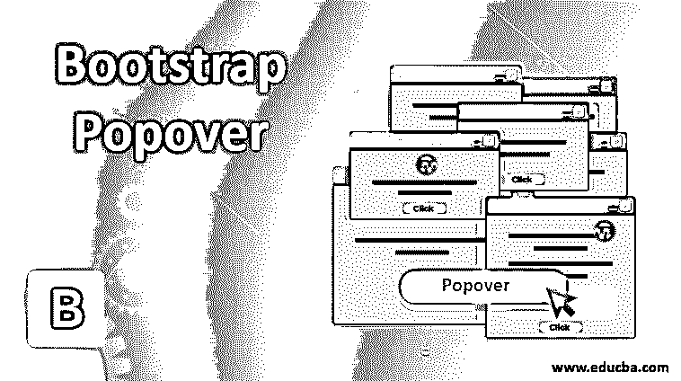
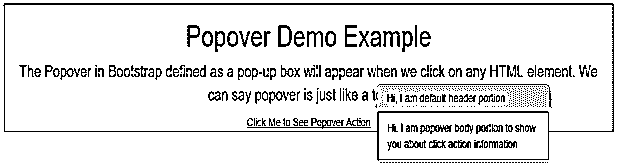
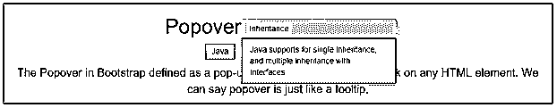
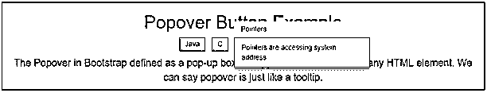
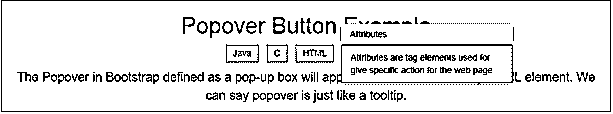
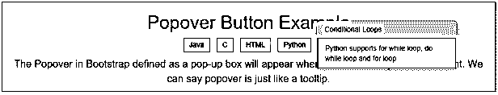
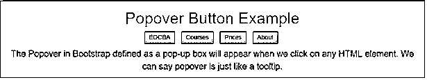
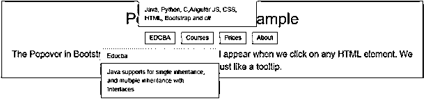
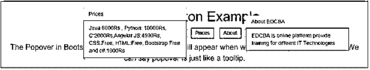

# 引导弹出窗口

> 原文：<https://www.educba.com/bootstrap-popover/>




## 引导 Popover 简介

Bootstrap 中的 Popover 被定义为一个弹出框，当我们点击任何 HTML 元素时，它就会出现。我们可以说 popover 就像一个工具提示。弹出窗口和工具提示的区别在于工具提示比弹出窗口能容纳更多的内容。为了在我们的应用程序中包含 popover 功能，我们必须在 HTML 页面中包含 js 插件。

**实时例子:**假设一个电子商务网站，像 Flipkart、亚马逊、Myntra 等。，必须在更小的空间展示更多的产品。如果他们在下面提供所有的项目细节，产品会占据很大的空间。所以，与其提供一个按钮，当我们点击按钮而不打开页面时显示产品信息。它将节省空间和显示产品信息。在这种情况下，我们使用 popover 功能。

<small>网页开发、编程语言、软件测试&其他</small>

**优势:**

克服空间复杂性。

### popover 在 Bootstrap 中是如何工作的？

Bootstrap popover 可以基于元素的 data-toggle="popover "属性工作。我们可以使用 title 属性指定要弹出的标题，也可以使用 data-content 指定弹出框中的文本

**语法:**

```
<a href="page link" data-toggle="popover" data-content="Specify required content inside popover" title="Title of the Popover" >Popover Demo Example</a>
```

在 jQuery 中初始化 Popover()方法后，popover 功能将会起作用。

**语法:**

```
<script>
$(document).ready(function(){ //calling inbuilt ready function
$('[data-toggle="popover"]').popover(); //calling popover function
});
</script>
```

### 定位爆米花

弹出窗口将显示在 HTML 元素的右侧。

在定位 popovers 时，我们使用了数据放置。数据放置的可用值有

*   顶端
*   底部
*   左边的
*   正确

在我们的应用程序中包含引导功能；我们必须在应用程序中指定一些预定义的库。他们是

**1。包括引导视图**

```
<meta name="viewport" content="width=device-width, initial-scale=1">
```

**2。包括 ajax 和 jQuery 库**

```
<script src="https://ajax.googleapis.com/ajax/libs/jquery/3.4.1/jquery.min.js"></script>
```

**3。包括引导库**

```
<link rel="stylesheet" href="https://maxcdn.bootstrapcdn.com/bootstrap/3.4.1/css/bootstrap.min.css">
```

**4。包括 popper 库**

```
<script src="https://cdnjs.cloudflare.com/ajax/libs/popper.js/1.12.3/umd/popper.min.js" integrity="sha384-vFJXuSJphROIrBnz7yo7oB41mKfc8JzQZiCq4NCceLEaO4IHwicKwpJf9c9IpFgh" crossorigin="anonymous"></script>
```

### 引导弹出窗口示例

下面提到了不同的例子:

#### 1.简单的 popover 演示示例

**代码:**

```
<!DOCTYPE html>
<html lang="en">
<head>
<title>Popover Example</title>
<meta charset="utf-8">
<!-- include bootstrap alignment -->
<meta name="viewport" content="width=device-width, initial-scale=1">
<!-- include bootstrap CSS libraries -->
<link rel="stylesheet"
href="https://maxcdn.bootstrapcdn.com/bootstrap/3.4.1/css/bootstrap.min.css">
<!-- include jQuery library -->
<script
src="https://ajax.googleapis.com/ajax/libs/jquery/3.4.1/jquery.min.js"></script>
<!-- include bootstrap JavScript library -->
<script
src="https://maxcdn.bootstrapcdn.com/bootstrap/3.4.1/js/bootstrap.min.js"></script>
<!-- jQuery Logic -->
<script>
$(document).ready(function() { //calling ready method
$('[data-toggle="popover"]').popover();//calling popper method for popover action
});
</script>
<!-- CSS styles -->
<style type="text/css">
div {
border: 1px solid blue;
}
h1 {
text-align: center;
color: green;
}
.container {
text-align: center;
}
p{
color:brown;
font-size: 20px;
}
</style>
</head>
<body>
<!-- class="container" gives you default bootstrap alignment -->
<div class="container">
<h1>Popover Demo Example</h1>
<p>The Popover in Bootstrap defined as a pop-up box will appear
when we click on any HTML element. We can say popover is just like a
tooltip.</p>
<a href="#" data-toggle="popover"
title="Hi, I am default header portion"
data-content="Hi, I am popover body portion to show you about click action information">Click
Me to See Popover Action</a>
</div>
6</body>
</html>
```

**输出:**




**说明:**

正如您在输出中看到的，单击我查看弹出窗口操作链接显示了一个名为

#### 2.弹出按钮示例

**代码:**

```
<!DOCTYPE html>
<html lang="en">
<head>
<title>Popover Example</title>
<meta charset="utf-8">
<!-- include bootstrap alignment -->
<meta name="viewport" content="width=device-width, initial-scale=1">
<!-- include bootstrap CSS libraries -->
<link rel="stylesheet"
href="https://maxcdn.bootstrapcdn.com/bootstrap/3.4.1/css/bootstrap.min.css">
<!-- include jQuery library -->
<script
src="https://ajax.googleapis.com/ajax/libs/jquery/3.4.1/jquery.min.js"></script>
<!-- include bootstrap JavScript library -->
<script
src="https://maxcdn.bootstrapcdn.com/bootstrap/3.4.1/js/bootstrap.min.js"></script>
<!-- jQuery Logic -->
<script>
$(document).ready(function() { //calling ready method
$('[data-toggle="popover"]').popover();//calling popper method for popover action
});
</script>
<!-- CSS styles -->
<style type="text/css">
div {
border: 1px solid green;
}
h1 {
text-align: center;
color: brown;
}
.container {
text-align: center;
}
p {
color: red;
font-size: 20px;
}
</style>
</head>
<body>
<!-- class="container" gives you default bootstrap alignment -->
<div class="container">
<h1>Popover Button Example</h1>
<!-- class="list-inline"create a list as inline -->
<ul class="list-inline">
<li><button href="#" title="Inheritance" data-toggle="popover"
data-content="Java supports for single inheritance, and multiple inheritance with Interfaces">Java</button></li>
<li><button href="#" title="Pointers" data-toggle="popover"
data-content="Pointers are accessing system address">C</button></li>
<li><button href="#" title="Attributes" data-toggle="popover"
data-content="Attributes are tag elements used for give specific action for the web page">HTML</button></li>
<li><button href="#" title="Conditional Loops"
data-toggle="popover"
data-content="Python supports for while loop, do while loop and for loop">Python</button></li>
</ul>
<p>The Popover in Bootstrap defined as a pop-up box will appear
when we click on any HTML element. We can say popover is just like a
tooltip.</p>
</div>
</body>
</html>
```

**输出:**














**说明:**

正如您在上面的弹出窗口中看到的，默认情况下，内容显示在元素的右侧。

#### 3.定位顶部、左侧、右侧和底部弹出按钮示例

**代码:**

```
<!DOCTYPE html>
<html lang="en">
<head>
<title>Popover Example</title>
<meta charset="utf-8">
<!-- include bootstrap alignment -->
<meta name="viewport" content="width=device-width, initial-scale=1">
<!-- include bootstrap CSS libraries -->
<link rel="stylesheet"
href="https://maxcdn.bootstrapcdn.com/bootstrap/3.4.1/css/bootstrap.min.css">
<!-- include jQuery library -->
<script
src="https://ajax.googleapis.com/ajax/libs/jquery/3.4.1/jquery.min.js"></script>
<!-- include bootstrap JavScript library -->
<script
src="https://maxcdn.bootstrapcdn.com/bootstrap/3.4.1/js/bootstrap.min.js"></script>
<!-- jQuery Logic -->
<script>
$(document).ready(function() { //calling ready method
$('[data-toggle="popover"]').popover();//calling popper method for popover action
});
</script>
<!-- CSS styles -->
<style type="text/css">
div {
border: 1px solid brown;
}
h1 {
text-align: center;
color: lime;
}
.container {
text-align: center;
}
p {
color: blue;
font-size: 20px;
}
</style>
</head>
<body>
<!-- class="container" gives you default bootstrap alignment -->
<div class="container">
<h1>Popover Button Example</h1>
<!-- class="list-inline"create a list as inline -->
<ul class="list-inline">
<li><button href="#" title="Educba" data-toggle="popover"
data-placement="bottom" data-content="Java supports for single inheritance, and multiple inheritance with Interfaces">EDCBA</button></li>
<li><button href="#" title="Courses" data-toggle="popover"
data-placement="top" data-content="Java, Python, C,Angular JS, CSS, HTML, Bootstrap and c#">Courses</button></li>
<li><button href="#" title="Prices" data-toggle="popover"
data-placement="left" data-content="Java:6000Rs , Python: 10000Rs, C:2000Rs,Angular JS:4500Rs, CSS:Free, HTML:Free, Bootstrap:Free and c#:1000Rs">Prices</button></li>
<li><button href="#" title="About EDCBA"
data-toggle="popover" data-placement="right" data-content="EDCBA is online platform provide training for diffeent IT Technologies">About</button></li>
</ul>
<p>The Popover in Bootstrap defined as a pop-up box will appear
when we click on any HTML element. We can say popover is just like a
tooltip.</p>
</div>
</body>
</html>
```

**输出:**










**说明:**

您可以在输出中看到:我们可以使用数据放置属性来设置 popover 内容的位置。

### 结论

Bootstrap 中的 Popover 根据用户需求在顶部、左侧、右侧或底部显示元素内容。

### 推荐文章

这是一个引导 Popover 的指南。在这里，我们讨论 popover 如何在 Bootstrap 中工作，以及示例和代码。您也可以看看以下文章，了解更多信息–

1.  [引导面板](https://www.educba.com/bootstrap-panels/)
2.  引导程序中的[复选框](https://www.educba.com/checkbox-in-bootstrap/)
3.  [自举排版](https://www.educba.com/bootstrap-typography/)
4.  [引导命令](https://www.educba.com/bootstrap-commands/)


