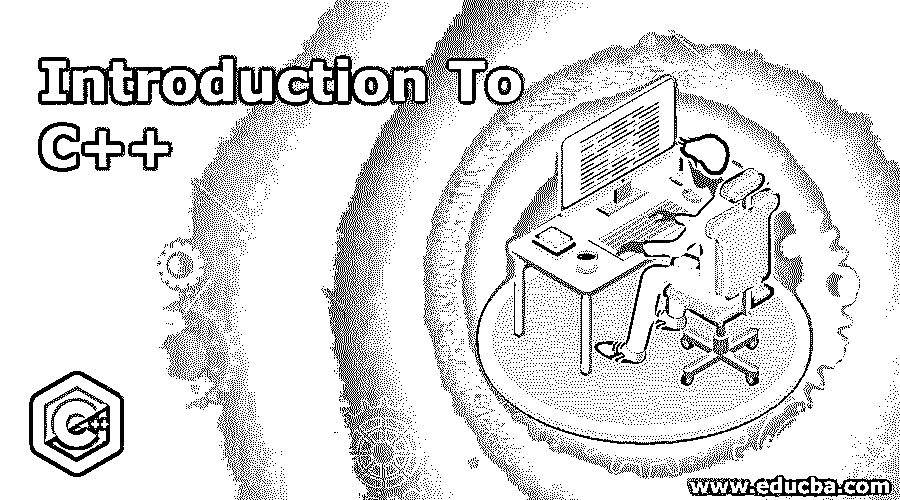
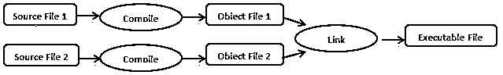
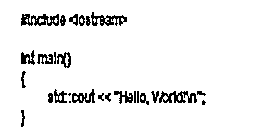
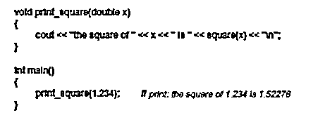
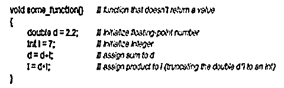
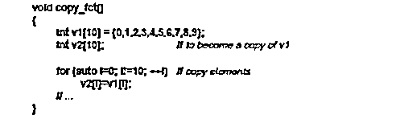
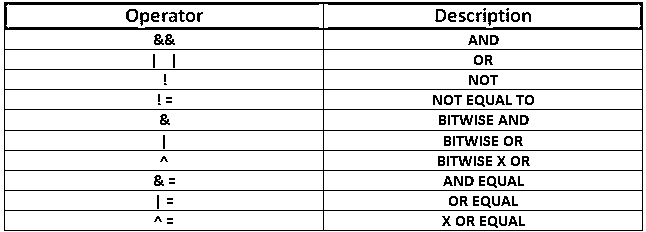

# C++简介

> 原文：<https://www.educba.com/introduction-to-c-plus-plus/>

## C++简介

C++是最灵活和高效的通用编程语言之一，它是 C 编程语言的超集，C 中支持的大多数工具和库也可以在 C++中使用。这篇介绍 c++的文章分为几个部分，从对该语言的概述开始，到它的优点和缺点。

### C++概述

C++的出现发生在 1983 年，当时比雅尼·斯特劳斯特鲁普开始使用“带类的 C ”,后来被重命名为 C++,它几乎没有什么额外的功能，如运算符重载、BCPL 风格的注释等。

<small>网页开发、编程语言、软件测试&其他</small>

C++背后的思想是，它是一种编译语言，这意味着源程序被编译以产生目标文件，目标文件在被链接器组合后产生可执行程序。下图给出了用 C++编译程序的想法。

C++的另一个方面是它的统计类型特性，即任何对象、值或名称都应该预先通知编译器，这有助于确定需要执行的操作集。C++适合有资源限制的应用程序，并且它有利于那些喜欢编写高质量代码的人。尽管引入了几种新的编程语言，C++仍在不断发展，并被不同背景的人使用。

### C++的组件

下面给出了 C++的组件:

#### 1.前件

这个程序中的第一个组件是由 **#include < iostream >** 命令表示的头文件，它包含在本例中用于打印“Hello World”的 **cout** 命令。根据问题的陈述，也可能有其他的头函数。

#### 2.第二成分

第二个组成部分是 **'int main()'** 语句，它是主程序函数，是每个 C++程序在开始执行时拥有主函数的先决条件。main 后面的左括号应该有一个匹配的右括号。“int”是返回类型，表示程序返回的值的类型。

#### 3.第三成分

第三个组成部分是变量的声明，在本例中是“d”和“I”。一个变量被赋予一个名字，它根据这个名字在内存中存储数据。它需要支持 C++内置的数据类型。

变量的声明应遵守以下规则:

*   变量可以是数字、字母或下划线。
*   变量应该以字母开头。
*   它区分大小写，即小写字母和大写字母将被视为不同的变量。
*   C++有几个不能用作变量的保留字。
*   初始值可以在声明变量时赋值，也可以在以后使用' = '操作符赋值。

#### 4.第四部分

程序语句是 C++的另一个组成部分。在这种情况下，for 循环用于将值从一个变量复制到另一个变量。注释也包括在程序中，使用 **"** //。

 **#### 5.第五部分

运算符是 C++的另一个组成部分。

运算符的类型有:

*   逻辑运算符，如&&、||，等等。
*   算术运算符，如+、%
*   关系运算符，如==。!=，等等。

### C++的特点

C++是一种面向对象的编程语言，它具有任何面向对象语言的所有特性——对象、类、封装、继承、多态、动态绑定和消息传递。

*   一个对象是一个实体，我们可以谈论它，也可以用它来创建程序。现实生活中的任何实体，如桌子、木板、掸子等。，可能是一个对象。
*   第二个特性是类，它是一组对象。类由程序中的所有函数和变量组成。
*   封装在内部隐藏了函数的操作。例如，当我们骑自行车时，我们踩下油门，但不知道幕后发生了什么，也不知道发动机是如何工作的。通俗地说，它将数据包装到一个类中，因此只允许函数访问数据。
*   继承赋予类使用其父类的功能和属性的能力。继承的类可以是公共、私有和受保护的类型。此外，新特性也可以添加到子类中。继承可以是单级的、多级的、多重的，甚至是分层的。
*   多态性是一个实体可以有多种形式的属性，这允许对象在不同的情况下有不同的行为。它可以是静态的，也可以是动态的。
*   动态绑定总是在运行时，根据需求或代码，它会调用所需的函数。
*   在运行时，在消息传递接口的帮助下，对象可以通过来回发送数据来相互通信。

### 应用程序

C++由于其灵活性和可靠性，在各个领域得到了广泛的应用。

下面是少数几个可以使用 C++的领域:

*   C++广泛应用于游戏行业。许多公司雇佣懂 C++的人来为他们开发互动游戏。
*   C++的另一个应用是创建图形用户界面，这简化了用户与应用程序的交互。
*   在像 Adobe Photoshop 或 Illustrator 这样的软件中，也使用 C++。
*   我们可以使用 C++创建像 Mozilla Firefox 这样的 web 浏览器和编译器。
*   操作系统也是用 C++编程的。
*   医疗行业使用 C++来构建他们的大部分软件。
*   像 Java 这样的其他编程语言很少是用 C++语言构建的。

### C++的优缺点

下面给出了 C++的优点和缺点:

#### 优势:

*   C++是一种非常高效的语言，既快速又可靠。
*   C++有广泛的用途，因此学习这种语言更容易掌握面向对象的编程概念。
*   C++也使得学习其他编程语言变得更加容易。

#### 缺点:

*   C++通常很难掌握。
*   C++中的错误消息可能会被扩展，并且通常很难调试。
*   甚至可能很难访问 C++中的库。
*   代码可能容易出错，因为 C++不提供类型检查。

### 推荐文章

这是一本介绍 C++的指南。这里我们讨论了 C++的不同组件、特征、优点、缺点和应用。您也可以阅读以下文章，了解更多信息——

1.  [JavaScript 简介](https://www.educba.com/introduction-to-javascript/)
2.  [大数据简介](https://www.educba.com/introduction-to-big-data/)
3.  [C++列表](https://www.educba.com/c-plus-plus-list/)
4.  [c++中的类型转换](https://www.educba.com/type-casting-in-c-plus-plus/)

**