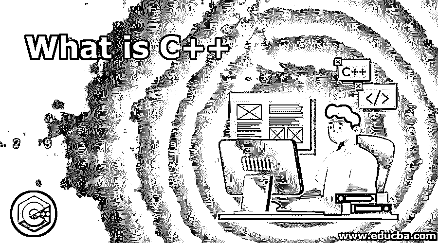
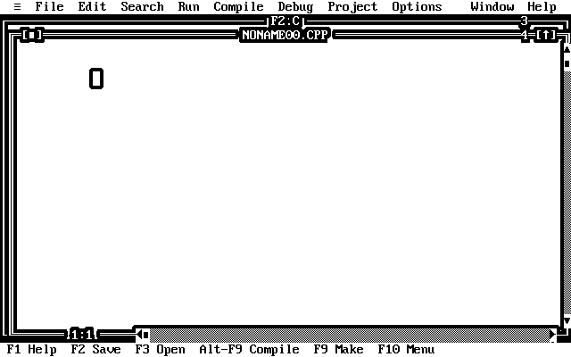

# 什么是 C++

> 原文：<https://www.educba.com/what-is-c-plus-plus/>

## C++简介

C++是一种命令式面向对象编程(OOP)语言，用于应用程序或系统软件、客户端-服务器应用程序驱动程序和嵌入式固件。它是由比雅尼·斯特劳斯特鲁普开发的。它是一种编译语言。它是 C 语言的扩展。因此，C 和 C++的基本语法和代码结构是相同的。

### 谅解

介绍了 OOP ( [面向对象编程](https://www.educba.com/oop-interview-questions/)，无非就是程序的结构。它使用蓝图来创建新的对象。有了这个蓝图，我们可以根据需要创建不同的模块。现有的方法有一些缺陷。OOP 是一个概念，用在 C++中。而且，它不是，特别是对于 C++。如果你看到任何高级编程语言，那些都在使用 OOP 概念。

<small>网页开发、编程语言、软件测试&其他</small>

### C++如何让工作变得如此简单？

OOP 有一些特性。默认情况下，这使得 C++成为一种非常强大且不可替代语言。

*   封装:封装的书生气定义是“将数据包装在一个单元中”。像一个类一样，它将数据成员和方法包装在一个类中。封装是该类最显著的特点。
*   **多态:** Poly 表示许多，morphism 表示形式。多态性意味着采取多种形式的能力。此功能允许根据传递给它的对象使用具有不同功能的相同名称。
*   **继承:**继承是 OOP 的主要方面。这个特性给出了代码可重用性的概念。继承在不修改现有类的情况下增加了额外的功能。它扩展到了类，并提供了使用前一个类的成员的好处。和亲子关系一样。

### 你能用 C++做什么？

*   大多数程序员遇到的任务需要更多的安全性和足够的灵活性，他们选择 C++。它的强大之处在于我们可以在任何地方使用它，比如杀毒、游戏、服务器端编程，最重要的是操作系统。
*   此外，列表并没有在这里结束；我们可以构建编辑器、数据库、编译器、现实生活中的复杂应用程序，这样的例子不胜枚举。

### 使用 C++

使用这种语言很容易。现在有很多方法可以运行你的 C++程序。我们需要一个集成的开发环境来运行我们的代码。可以用 Turbo C++，看起来像下面的截图。

市场上有许多 IDEs。选择任何人并开始编码。

以下是在 Turbo C++中运行程序的步骤:

*   转到文件= >新建
*   它将打开一个新文件。
*   编写代码并保存。
*   你可以在菜单栏看到运行选项；点击它。它将展开，并再次单击“运行于”子菜单或简单地按下键盘上的 CTRL+f9。
*   这将运行您的代码，并在编译器中向您展示。

当你开始学习编程的时候，你应该总是喜欢和代码一起运行。下载 IDE 并开始运行代码。

### 优势

下面是提到的优点:

*   显然，第一个是它是一种面向对象的编程语言(OOP)。
*   它使用了指针概念，这个概念真的很强大。
*   这很容易学。
*   与其他高级语言相比，它的速度相当快。
*   这是独立于平台的。支持多种设备。
*   它具有强大的性能。没有人能就此进行辩论。
*   它有丰富的函数库。

### 所需技能

*   最初，当我们谈论计算机语言时，我的建议是总是从 C++开始作为你的第一语言。这种语言消除了你所有的疑虑。所以，你可以赶上任何语言。
*   要成为一名软件开发人员或学习 C++，你必须知道 OOPs 的概念。计算机不理解我们所说的像英语一样的高级语言。它只知道二进制的 0 和 1。关于语言如何与计算机交流的一些基本知识。计算机的工作方式是一个额外的优势。你也很擅长这个。

### 为什么要用 C++？

*   用 C++找工作的想法已经不是现在人的思维过程了。目前正在找工作或已经在工作的人不会考虑 C++。
*   一个需求来了，真正懂的程序员就少了。这是学习它的主要原因。另一个观点是，正如我多次提到的，它的性能使它在某些方面不可替代。

### 范围

*   它的范围是无限的。因为它也支持图形。如果你找到了深入学习这门语言的正确途径，那么你就会发现为什么这门古老的语言还有存在的空间。
*   在这个领域，我们想要的一切都有时间限制。它可以直接与操作系统对话。用这种语言做的工作非常快。从优化的角度来看，这是最好的选择。

### 我们为什么需要 C++？

*   在非常关键的行动中，我们需要一些强大的东西。不会被病毒感染。
*   此外，它能在几秒钟内完成我们的工作。C++永远有选择和受众。

### 谁是学习 C++技术的合适受众？

*   因此，学习这种语言没有任何限制。但是，如果我们认为要了解今天扮演着重要角色的 IT 的独特要求，那么您可以考虑一下。
*   为什么？C++是一种语言，可用于从事高级安全性和高性能应用程序的特定人员。当我们需要在几分之一秒内完成某件事，而我们不能承受这种延迟时，我们必须考虑 C++。

### 这项技术将如何帮助你的职业发展？

*   作为一名程序员，每个人都喜欢使用易于理解的语言。比如高级语言，包括 JAVA、C#等。但关键是说到性能，没人能打败它。
*   如果你懂 C++，那么你可以在更短的时间内学会任何语言。
*   它让你的职业生涯向前迈进了一步，因为你已经知道这个概念只需要修改一些语法。它会增加你的抓握力。它有助于你不断学习和自我发展。

### 结论

在这一点上，作为一个初学者，我只是想建议你去尝试和学习。你永远不知道你会遇到什么，也不知道小的学习步骤会如何鼓励你。这是一座高峰，一旦到达，你将永远不会在你的旅途中失去目标。

### 推荐文章

这是一个什么是 C++的指南。这里我们分别讨论 C++的工作、技能、范围、职业发展和优势。您也可以浏览我们推荐的其他文章，了解更多信息——

1.  [C++映射](https://www.educba.com/c-plus-plus-map/)
2.  [C++ extern](https://www.educba.com/c-plus-plus-extern/)
3.  [C++映射 at()](https://www.educba.com/c-plus-plus-boost/)
4.  [C++在向量中查找元素](https://www.educba.com/c-plus-plus-find-element-in-vector/)

