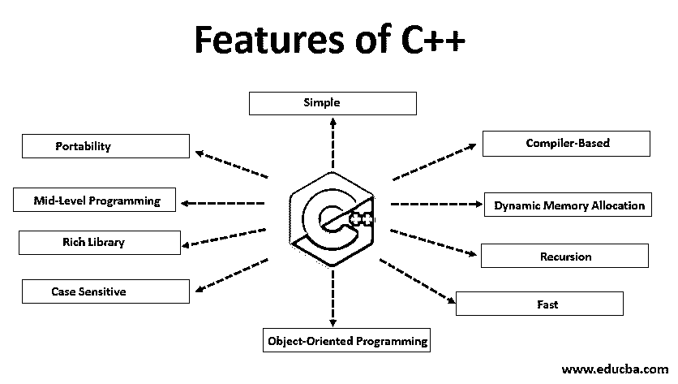

# C++的特性

> 原文：<https://www.educba.com/features-of-c-plus-plus/>

## C++简介

C++是一种编程语言，由比雅尼·斯特劳斯特鲁普于 1979 年在贝尔实验室开发。C++是低级和高级语言功能的结合。所以才是中级语言。C++起源于 C 编程语言。最重要的 C++是面向对象的编程语言，它具有一些有用的特性，有助于开发高性能的应用程序。C++因其惊人的特性而被用来降低项目的总体开发成本。C++非常易学，与 C 和 Java 类似。由于其可移植性，开发的应用程序可以在多种平台上运行。

### C++的 11 大特性

以下是 C++中可用于开发高性能应用程序的最重要特性的列表:

<small>网页开发、编程语言、软件测试&其他</small>

#### 1.简单的

说到编程，C++是最简单的语言之一。它也很容易理解和学习，因为它起源于 C [编程语言](https://www.educba.com/what-is-a-programming-language/)。对于任何类型的项目开发，C++都遵循自底向上的方法，这有助于将大任务分解成大块任务。

#### 2.面向对象编程

C++出名的最重要的特征之一。在 C++中，一切都被视为对象，这就是为什么它被称为面向对象编程。对象用于执行各种功能。它有各种各样的特性，比如多态性和继承，旨在将功能和数据绑定在一个单元中，使应用程序安全高效。

#### 3.轻便

C++不是独立于平台的，但是我们可以说它是足够可移植的，通过添加一些修改或者根本不做修改就可以在不同的机器上运行。在不同的操作系统上，您可以运行相同的代码。只需编写一次代码，并在每次需要特定功能时使用它。我们不能说它完全独立于平台。所以不要把 C++和 Java [混淆，因为 Java](https://www.educba.com/what-is-java/)是完全独立于平台的。例如，您在 Linux 中编写了代码，但希望在 Windows 中运行，这样 C++代码就可以毫无障碍地在两者上运行了！简单直白。

#### 4.中级编程语言

C++编程语言是低级语言和高级语言的特殊功能的集合。它可用于开发基于所需编程语言水平(低或高)的应用程序。

#### 5.丰富的图书馆

C++库充满了内置函数，可以在软件开发过程中节省大量时间。因为它几乎包含了程序员在开发过程中可能需要的所有功能。因此节省了时间并提高了开发速度。

#### 6.区分大小写

由于 C++起源于 C，它也完全区分大小写，这意味着代码中的小写和大写字符将有完全不同的含义，并将被不同地对待。

#### 7.基于编译器的

由于 C++代码中没有解释，所以它被认为是一种基于编译器的语言，这使得它比 Java 等其他编程语言更快。没有编译，你就不能执行任何 C++代码。

#### 8.动态存储分配

因为 C++语言支持指针。内存分配可以很容易地动态完成，而不是静态的。可以使用 free()函数随时释放内存。

#### 9.递归

由于代码的可重用性，我们可以在一个函数中调用任何一个函数，从而节省内存空间，而不必反复编写相同的代码。每个功能都有代码可重用性。

#### 10.快速的

与其他编程语言相比。用 C++语言编写的代码的执行时间和编译时间比任何其他编程语言都要快。

#### 11.两颗北极指极星

众所周知，指针保存另一个变量的地址，我们可以使用概念或指针来访问任何变量的地址，从而提高性能。C++还提供了在软件开发过程中指针的[用法。](https://www.educba.com/pointers-in-data-structure/)

### C++的优势

下面的每个优点都证明了 C++编程语言的稳定性和高效性:

C++是面向对象的语言，而不是过程语言。C++的一些特性使它比任何其他编程语言都更快、更强大。[用 C++库进行机器学习](https://www.educba.com/machine-learning-c-plus-plus-library/)也是使用 C++作为开发过程的编程语言的最佳优势之一。

#### 1.速度

众所周知，C++的速度比其他任何编程语言都要快。并行运行多个代码是它提供的最佳支持之一，直接有助于更快的执行。即使服务器负载很高，也能提供最佳性能。

#### 2.基于硬件的

当软件与硬件紧密结合，并且在软件级别需要一些底层支持时。C++提供了这种支持，因为与任何其他编程语言相比，它更接近于硬件。

#### 3.功能

C++的继承、封装、抽象等特性使得它在软件开发过程中对程序员很有帮助。这些优点结合在一起就产生了一种杰出而高效的产品。C++里效率总是更多。C++支持操作符重载，允许用户定义操作符和[函数重载](https://www.educba.com/function-overloading-in-c-plus-plus/)。

#### 4.范例

C++程序使用多范式编程，范式意味着编程风格，范式关注程序的逻辑、结构和过程，C++程序是多范式的，意味着它遵循泛型、命令式和面向对象三种范式。

**额外优势:**

C++中有异常处理。您不需要为某些情况定义一个异常，因为它们有内置的异常来捕捉并在您的用户输出屏幕上抛出。异常是用 C++编程实现异常处理的类名。不仅如此，你还可以根据你的项目需求来定义你的异常。Try、catch 和 [throw 关键字用于 C++中的异常处理](https://www.educba.com/throw-keyword-in-java/)。在 C++编程中，各种异常都由异常处理程序来处理。在 C++中，变量可以在程序的任何地方声明，但必须在使用之前声明。

### 结论

C++是最高效和最强大的语言，因为它的高级功能。C++的四大支柱是抽象、封装、继承和多态。这些支柱单独地可以在任何软件开发过程中执行动态的任务和功能，它们一起在编程世界中是最强大的。

### 推荐文章

这是 C++特性的指南。在这里，我们讨论基本概念，C++的 11 大特性，如简单、面向对象的编程、可移植性等。以及它的优点。您也可以浏览我们推荐的其他文章，了解更多信息——

1.  [c++中的回文](https://www.educba.com/palindrome-in-c-plus-plus/)
2.  [继续 C++中的语句](https://www.educba.com/continue-statement-in-c-plus-plus/)
3.  [c++中的循环](https://www.educba.com/loops-in-c-plus-plus/)
4.  [投掷 vs 投掷](https://www.educba.com/throw-vs-throws/)

