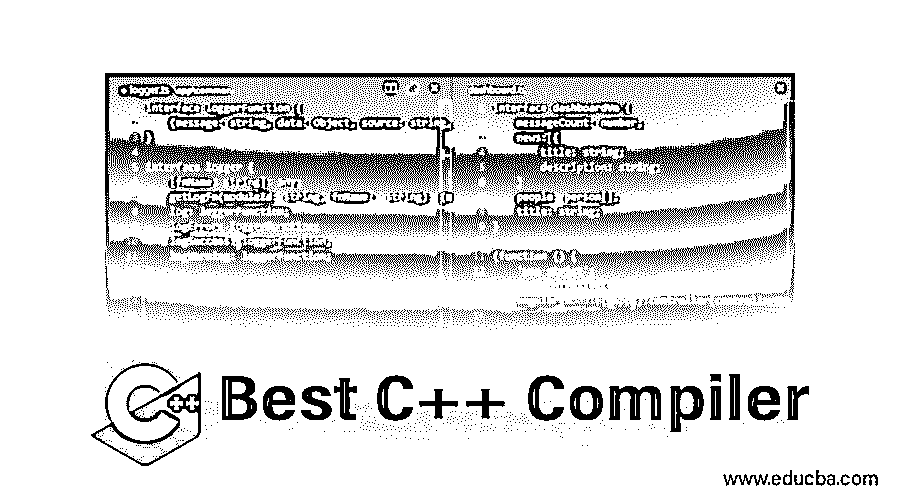

# 最佳 C++编译器

> 原文：<https://www.educba.com/best-c-plus-plus-compiler/>

## 最佳 C++编译器简介

本文解释了与编译器相关的许多特性。这里我们解释编译器如何与 c++语言一起工作。为什么我们需要编译器？我们来看看答案。众所周知，计算机理解由 0 和 1 组合而成的机器语言(指令集)。我们作为源代码写的是高级语言。我们需要一些翻译来理解计算机。与它交互的最简单的方法是通过编译器。每个 c++文件都被编译成一个目标文件。编译器完成的第一步是运行预处理器，然后是编译阶段并给出目标文件。C++代码有数千行带有大量模板的编程。因此，用户有必要实现更高的生产率。

### 前 8 名 C++编译器

C++被称为编译语言是因为编译器做了大量的工作。这是一个 c++编译器的列表，它既适用于 c 也适用于 c++，不同之处在于它们的文件扩展名(对于 c 是。C)扩展，对于 C++来说是。cpp 扩展)。使用编辑器的 C++源文件被生成，编译器被调用以给出可执行文件，最后，文件名被执行以产生结果。下面是不同编译器的列表，允许我们在不同平台上编译源代码:

<small>网页开发、编程语言、软件测试&其他</small>

我们来看看 2019 年排名前 7 的最佳编译器。

*   MinGW /海湾合作委员会
*   Borland c++
*   开发 C++
*   内河码头
*   铿锵
*   Visual C++
*   英特尔 C++
*   码组

我们已经在下面的列表中简要描述了所有的一个。下面是不同编译器的列表。

#### 1.MinGW

这是一个没有第三方要求的开源工具，可以很好地配合微软 windows 的开发。它有 GCC 编译器，包括 C、C++、Fortran 语言编译器。在许多其他工具中，这个编译器是最受用户欢迎的，因为它在 GCC 中具有很高的可移植性，符合 ANSI 标准。Windows 32 或 min32 可以创建一个单独的项目，并添加不同的软件包和许可在他们自己的版本。G++为我们提供了完整的源代码。它的一个主要优点是快速和简单，并且需要 DLL 库。

#### 2.Borland C++

这是最古老和最便宜的编译器，在市场上没有任何竞争对手。Borland 是一个 C++集成开发环境，它在 90 年代得到了最广泛的应用，在 MS-DOS 提示符和 Windows 下运行良好。他们提供简单的编辑功能，使他们的代码更容易和简单。

#### 3.开发 C++

Dev C++结合了 GCC 和 Cygwin 端口作为编译器，帮助编辑和编译资源文件。这是一个开源环境，对于 C++程序的初学者来说已经足够了。这个 IDE 或者编译器是用 [Delphi 写的，附带 DevOps](https://www.educba.com/what-is-devops/) 。它的主要好处是可以在闪存驱动器上安装和执行，使编译器功能齐全。

#### 4.C++ builder 包装器

这是一个用于商业目的的 windows 开源编译器。它支持语言扩展、库、良好的 UI 设计，被认为是一个来自 Windows、IOS、Android 的跨平台。学生可以免费使用它，因为他们已经发布了一个新的命令行编译器。该工具能够在竞争激烈的市场中更快地交付应用程序和不安全的平台。

#### 5.铿锵

Clang 编译器最好是易于理解的编译器，配备前端，具有更快的速度和更少的内存，并配有 BSD 许可证。Clang 的一个很好的特性是它的 GCC 兼容性，它的设计是基于 LLVM 的。它是为了以更快的编译速度更好地分析代码而构建的。编译器的三个阶段包括在前端构建抽象语法树的解析器，第二阶段包括优化器，最后是后端。因此，它们被认为是业界重要的主流编译器。Clang 被认为是一个很好的编译器，可以用来构建工具，也可以重用、集成到其他项目中。

#### 6.Visual C++

微软在 1993 年将 Visual C++的开发转移到了新技术上。Microsoft strategy 通过类库实现了新的功能，从而获得了最高的生产率，并为专业 C++开发人员提供了一个集成的环境。Visual C++的一个关键特性是 MFC 架构的开发，它提供了最快的可执行程序，开发基于 windows 的应用程序。最重要的是，为了获得更好的兼容性，MFC 2.0 被用作 C++的一个很好的子集，以使框架更具可移植性。它们为您提供了一系列产品，并提供了开发 32 位 windows 应用程序的途径，以便在多种硬件和软件上最安全地运行，同时结合了 OLE 开发，减轻了用户编写代码的负担。并且它可以在支持基于组件的软件发展的商业提供的编译器上执行。

#### 7.英特尔 C++

Intel C++或称为 ICC 是由 Intel 公司开发的嵌入式新 Intel 体系结构，该程序编译 C 和 C++并带有商业许可证，其版本 11.0 提供 rpm。它们包含高度有针对性的缓存工作和 SIMD 指令。这个编译器处理作业比 GCC 更快、更有效、更有优势。在其他编译器面对标量指令时，英特尔 C++具有相同的性能。英特尔的关键属性是它们的灵活性，编译器之间的切换很容易，并且很受软件开发人员的青睐。

#### 8.码组

代码块是一个免费的跨平台 c++编译器，支持多平台编译器。它包括调试器、代码中的断点和多编译器等功能。代码块的一个超级好处是它们可以在不同的操作系统上运行，并且不需要为它们的操作翻译语言。

### 结论

总之，在本文中，我们已经看到了编译器如何使用 c++完成这项工作。这将使我们对 c++开发过程有更多的了解。对学习 c， [c++编程语言](https://www.educba.com/what-is-a-programming-language/)感兴趣的代表可以利用这个免费的编译器来构建他们的代码。一个好的编译器的选择基于两个方面，即编译速度和大型项目的编译时间。编译器应该在性能上高效，并且更加努力地给出代码。

### 推荐文章

这是最佳 C++编译器的指南。这里我们详细讨论基本概念以及不同 C++编译器的列表。您也可以浏览我们推荐的其他文章，了解更多信息——

1.  [C#编译器](https://www.educba.com/c-sharp-compilers/)
2.  [最佳 Java 编译器](https://www.educba.com/best-java-compilers/)
3.  [Python 编译器](https://www.educba.com/python-compilers/)
4.  [解释器 vs 编译器](https://www.educba.com/interpreter-vs-compiler/)

