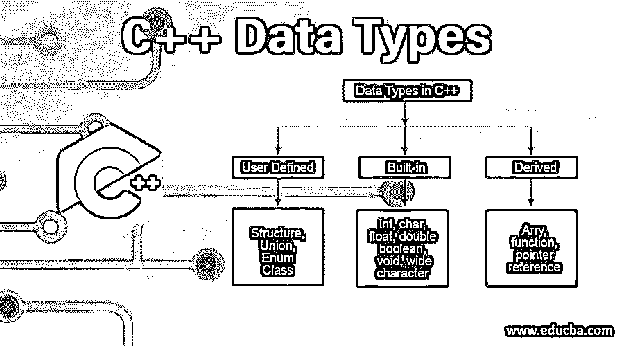
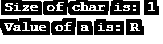
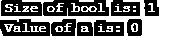
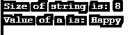
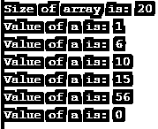
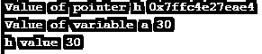
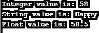

# C++数据类型

> 原文：<https://www.educba.com/c-plus-plus-data-types/>




## C++数据类型简介

以下文章提供了 C++数据类型的概述。在本文中，我们将研究不同的数据类型，如整数、浮点、双精度、字符，或内置数据类型，如联合、枚举、结构，以及数据类型，如函数、指针、数组。数据类型应该在执行之前定义，因为它会通知编译器特定变量保存的数据类型。整数数据类型只能保存整数值，不能保存浮点值或字符串值。

数据类型是为了让变量知道，它是什么类型的元素，并确定变量的内存分配。我们知道每种数据类型都有不同的内存分配。有三种不同的 C++数据类型，即:原始的、派生的和用户定义的。

<small>网页开发、编程语言、软件测试&其他</small>

### C++中的三大数据类型

C++中有三种不同的数据类型，如下所示:

#### 1.原始数据类型

这些是在 c++中预定义的，也称为内置数据类型。我们可以直接用它们来声明变量。

**a .整数:**通常用“int”来定义。我们可以知道分配的内存大小以及变量是如何声明的，如下所示。

**代码:**

```
#include <iostream>
using namespace std;
int main()
{
int a;
cout<< " Size of int is: " << sizeof(a);
}
```

**输出:**


**b .人物:** 通常用“char”来定义。我们可以知道分配的内存大小以及变量是如何声明的，如下所示。

**代码:**

```
#include <iostream>
using namespace std;
int main()
{
char a;
a='R';
cout<< " Size of char is: " << sizeof(a)<<endl;
cout<< " Value of a is: " << a;
}
```

**输出:**




**c .浮点:**通常用“浮点”来定义。我们可以知道分配的内存大小以及变量是如何声明的，如下所示。

**代码:**

```
#include <iostream>
using namespace std;
int main()
{
float a;
a=5.85;
cout<< " Size of float is: " << sizeof(a)<<endl;
cout<< " Value of a is: " << a;
}
```

**输出:**


**d .布尔:**通常用“布尔”来定义。我们可以知道分配的内存大小以及变量是如何声明的，如下所示。

**代码:**

```
#include <iostream>
using namespace std;
int main()
{
bool a;
cout<< " Size of bool is: " << sizeof(a)<<endl;
cout<< " Value of a is: " << a;
}
```

**输出:**




**e .字符串:**通常用“字符串”来定义。我们可以知道分配的内存大小以及变量是如何声明的，如下所示。

**代码:**

```
#include <iostream>
using namespace std;
int main()
{
string a;
a="Happy";
cout<< " Size of string is: " << sizeof(a)<<endl;
cout<< " Value of a is: " << a;
}
```

**输出:**




在这里，我们也有有符号、无符号、短、长的概念。这些是什么？这些被称为数据类型修饰符。事实上，这些决定了任何特定数据类型的实际长度。

有符号的值给出了小于和大于零的数字，既有正的也有负的。而无符号值包含仅是正的数据。简而言之，通过名字本身，我们可以清楚地解释长数据修饰符有能力存储大量的值。事实上，short 是数据类型必须并且将保持这些数值的最小值。

#### 2.派生数据类型

这些是从原始数据类型派生的数据类型；这反过来证明了它的名字。

**a .数组:**这里我们定义一个数列。让我们看看如何在这里做到这一点。

**代码:**

```
#include <iostream>
using namespace std;
int main()
{
int a[5]={1,6,10,15,56};
cout<< " Size of array is: " << sizeof(a)<<endl;
for(int i=0;i<6;i++)
{
cout<< " Value of a is: " << a[i] <<endl;
}
}
```

**输出:**




**b .指针**:这实现了引用调用功能，这些指针在[动态数据结构](https://www.educba.com/data-structure-interview-questions/)中声明或操作数据时发挥了巨大的作用。例如，在创建堆栈、队列、链表时，我们主要使用这些指针。

**代码:**

```
#include <iostream>
using namespace std;
int main()
{
float a = 30;
float *h;
h= &a;
cout << " Value of pointer h "<< h << endl;
cout << " Value of variable a "<< a << endl;
cout << " h value "<< *h ;
}
```

**输出:**




#### 3.用户定义的数据类型

顾名思义，这些是用户可以定义的数据类型。让我们看几个这样的例子。

**a .结构:**在连续的内存位置下存储相似或不同数据类型的组合。正如我们已经看到的，在数组中我们只能存储相似数据类型的项目。但是结构可以存储不同的数据类型。

**代码:**

```
#include <iostream>
using namespace std;
struct First
{
int a = 58;
string r = "Happy";
float y = 58.5;
} ;
int main()
{
struct First f;
cout<< " Integer value is: "<< f.a <<endl;
cout<< " String value is: "<< f.r << endl;
cout<< " Float value is: "<< f.y;
}
```

**输出:**




**b .类:**在[面向对象编程](https://www.educba.com/object-oriented-programming-in-java/)中定义。它有函数、变量，可以通过创建对象来访问。

**代码:**

```
#include <iostream>
using namespace std;
class First
{
public:
string name;
void show()
{
cout << "Name is: " << name;
}
};
int main()
{
First f;
f.name = "My Name";
f.show();
return 0;
}
```

**输出:**


**c. Type Def:** 这个数据类型只是给数据类型一个新的或者不同的[名称。](https://www.educba.com/c-sharp-data-types/)

**代码:**

```
#include <iostream>
using namespace std;
int main()
{
typedef unsigned char THISONE;
typedef unsigned int OTHERONE;
THISONE b1;
OTHERONE b2;
b1 = 'R';
b2 = 10;
cout << " Check this out: " << b1<<endl;
cout << " Check other out: " << b2;
return 0;
}
```

**输出:**


而且，还有很多。甚至堆栈、队列、链表和树也属于不同的数据结构。

**d .枚举:**由“枚举”一词定义。当我们已经知道某个特定变量的一组值并从中选择一个值时，通常会用到这些方法。

**代码:**

```
#include <iostream>
using namespace std;
enum color {Yellow, Red, Green, Blue}col;
int main()
{
col = Green;
cout<<" The color chosen is in the place: "<<col;
return 0;
}
```

**输出:**


### 结论

我们已经涵盖了其中的大部分。我们使用这些不同的数据类型，毫无疑问，这些是任何编程语言的基础。如果不用特定的数据类型声明变量[，我们就无法知道确切的内存分配以及一个程序必须执行哪组指令。使用不同的数据类型](https://www.educba.com/pl-sql-data-types/)和数据修饰符来练习和尝试[,看看它们是如何工作的。](https://www.educba.com/hive-data-types/)

### 推荐文章

这是一本关于 C++数据类型的指南。在这里，我们将讨论 3 种最常见的 C++数据类型，如原始数据、派生数据和用户定义数据，以及示例和代码实现。您也可以阅读以下文章，了解更多信息——

1.  [c++中的字符串数组](https://www.educba.com/string-array-in-c-plus-plus/)
2.  [在 C++中排序](https://www.educba.com/sorting-in-c-plus-plus/)
3.  [C++垃圾收集](https://www.educba.com/c-plus-plus-garbage-collection/)
4.  [在 C++中覆盖](https://www.educba.com/overriding-in-c-plus-plus/)


