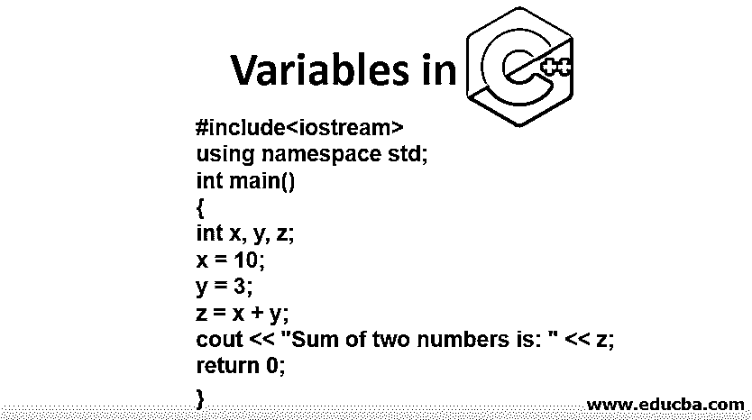

# C++中的变量

> 原文：<https://www.educba.com/variables-in-c-plus-plus/>




## C++中的变量介绍

变量在 C++中起着内存位置的作用，它只不过是存储数据或值的容器或元素的名称，这些数据或值将在程序稍后的执行中使用。它可以使用字母、数字或下划线(_)等特殊符号的组合来定义，也可以使用 char、int、float、double 等数据类型来定义。变量可以是除保留关键字以外的任何内容，变量的第一个字母只能以字母开头。

变量是任何编程语言中最重要的部分。没有变量，任何编程语言都是不完整的。我们也可以说，没有变量，程序就无法运行。像任何其他编程语言一样，C++语言也需要变量来运行程序。变量不用于运行程序，而是用于存储值或字符串。没有存储值，程序就无法运行。因此，变量是编程语言的[主干。在 C++中，除了关键字以外的任何单词都被用作变量。要定义变量，我们需要指定变量的类型。类型可以是 int、double、char、float、long int、short int 等任何类型。int 用于存储整数值，即 5，19，519，1000。Char 用于存储字符或字符串，即。Float 用于存储浮点值，如 2.3、3.679、9.45。Long int 用于存储长整型值。在本文中，我们将讨论如何在 C++语言中初始化和声明变量。以及变量的类型。](https://www.educba.com/what-is-a-programming-language/)

<small>网页开发、编程语言、软件测试&其他</small>

### C++语言中定义变量的规则和规定

*   变量可以是数字、特殊字符如和百分号(&)、下划线(_)或字符串的混合。
*   大写和小写被视为不同的变量，因为 C++是区分大小写的语言。Educba 和 eduCBA 将被视为两个不同的变量。
*   C++变量必须以字符开头。它不会将数字视为第一个字符。6educba 不是有效变量，因为它以数字开头，而 educba6 可以是有效变量，因为它以字符开头。
*   C++语言中的变量不应该是关键字。for、this、if、else、while、do、char、this 等是用于特定目的的关键字。这些关键字在 C++中不能作为变量使用。
*   变量不允许有空格。Edu cba 无效，因为 Edu 和 cba 之间有空格，educba 是有效变量，或者 edu_cba 也是有效变量，因为下划线符号用于连接变量。

### C++语言中变量是如何工作的？

*   变量声明通知编译器程序中将要使用的数据变量的类型。
*   变量名的声明通知编译器用于在程序中存储值的变量名。
*   在声明变量时，我告诉编译器变量需要的存储空间。在声明之前，编译器不必担心存储问题。

### C++语言如何声明变量？

变量可以在程序开始之前先声明。变量声明的语法如下
data _ type variable _ name；
哪里

**data_type:** 定义存储值的数据类型。数据类型可以是 int、char、float、double、short int 等。
**变量名称:**定义了变量的名称。它可以是除关键字以外的任何内容。

比如，
1。int cab
2。浮点 6.9，7.3
举个例子 1，int 是数据类型，cab 是变量名。在第二个例子中，我们声明了两个变量，其中 float 是数据类型，6.9 和 7.3 是变量。
一旦变量被声明，这些变量的存储空间已经被编译器分配，因为它将用于程序。

#### 说明 C++语言中变量声明的程序

```
#include<iostream>
using namespace std;
int main()
{
int x, y, z;
x = 10;
y = 3;
z = x + y;
cout << "Sum of two numbers is: " << z;
return 0;
}
```

### C++语言如何初始化变量？

在 C++中，变量可以通过在声明时赋值来初始化。C++语言中变量初始化的语法是–

```
data_type variable_name = value;
```

举个例子，

1.  int x = 10
2.  坦克 b =-

在示例 1 中，我们用值 10 初始化变量 x。在例 2 中，我们用 eduCBA 值将 b 初始化为一个字符。

#### 说明 C++语言中变量初始化的程序

```
#include<iostream>
using namespace std;
int main()
{
int x = 5, y = 15;
int z = x + y;
cout << "Sum of two numbers is: "<<  z;
return 0;
}
```

### C++语言中的变量类型

C++语言中有以下 5 种类型的变量:

#### 1.局部变量

局部变量是在函数内部声明的。局部变量必须在程序中使用之前声明。在函数内部声明的函数可以改变变量值。外部的函数不能改变局部变量的值。

这里有一个例子

```
int main()
{
int x = 2; //local variable
}
```

#### 2.全局变量

全局变量在函数外部声明。任何函数，即局部函数和全局函数都可以改变[全局变量](https://www.educba.com/python-global-variable/)的值。

例子给出如下:

```
int y = 10; //global variable
int main()
{
int x = 5; //local variable
}
```

#### 3.静态变量

这些变量用单词 static 声明。

例子给出如下:

```
int main()
{
int x = 5; //local variable
static y = 2; //static variable
}
```

#### 4.自动变量

自动变量是用 auto 关键字声明的。函数中声明的所有变量都被默认为自动变量。

例子给出如下:

```
int main()
{
int x = 20; //local variable (Automatic variable)
auto y = 12; //automatic variable
}
```

#### 5.外部变量

通过使用 extern 关键字，可以声明外部变量。

`extern z = 4; //external variable`

### 结论

在本文中，我们已经看到了变量在 C++语言中的重要性，以及如何在示例的帮助下使用变量。此外，我们已经看到了 C++语言中五种不同类型的变量及其示例。我希望这篇文章对你有所帮助。

### 推荐文章

这是一本关于 C++中变量的指南。在这里，我们讨论入门，如何使用变量在 C++与例子。您还可以浏览我们推荐的其他文章——

1.  [c++中的数组](https://www.educba.com/arrays-in-c-plus-plus/)
2.  [c++引用 vs 指针](https://www.educba.com/c-plus-plus-reference-vs-pointer/)
3.  [C++替代品](https://www.educba.com/c-plus-plus-alternatives/)
4.  [JavaScript 中的变量](https://www.educba.com/variables-in-javascript/)


