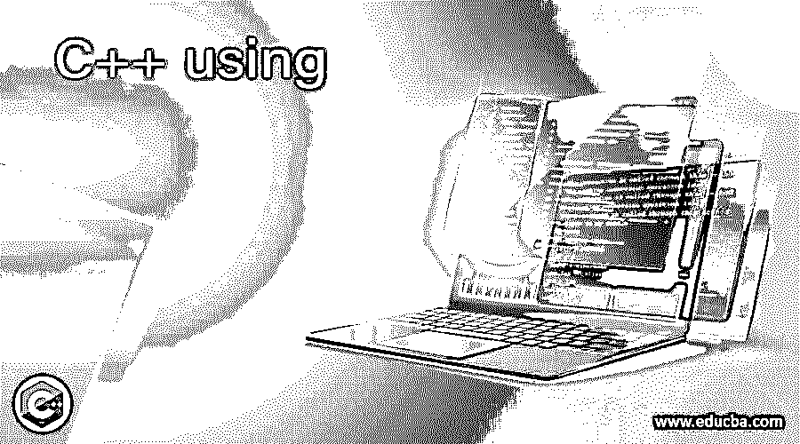
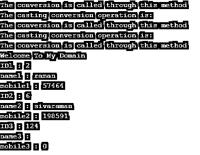
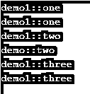

# C++使用

> 原文：<https://www.educba.com/c-plus-plus-using/>




## C++使用简介

C++ using 是关键字之一，用于从命名空间中引入一些特定的成员函数，可以使用关键字启动这些函数。它将是指令，声明性的，甚至其他指令也实现了。我们可以导入旧的和当前的名称空间，以引入一个新的名称来包含最常见的类范围。它将使用某些继承成员的默认访问级别修饰符进行提升。这是一种父子关系，从基类到派生类，用于重载函数作用域以及程序的解析。

**语法**

<small>网页开发、编程语言、软件测试&其他</small>

在 C++中，每个对象、变量和关键字都有自己的语法和属性，用于在编程代码中声明。根据需求，我们将利用编程库中的特殊关键字或保留关键字。using 是其中一个关键字，指令告诉编译器搜索附加的名称空间。

```
#include <iostream>  //import the libraries
#include <string>
#include <cstring>
using namespace std;
data type main()
{
---some programming logics---
}
```

上述代码是在编程逻辑中使用“using”关键字的基本语法。我们可以使用一组不同的结构来利用其他默认的关键字类型；通过使用这些类型的预定义关键字，编译器将获取大量用于声明的数据类型，并编辑单个术语中的名称空间。

### 在 C++中如何使用关键字？

C++有 n 个保留的关键字，它们将提供来自实际名称空间和新名称空间的相同级别的抽象，这已经被程序员用来允许它更多地关注编码概念。它还使编写编程代码和使用 destroy()或任何其他属于垃圾收集的默认方法清理它们变得更加容易，它是销毁不需要的代码和清理内存空间区域的主要区域。它取决于数据类型，并且必须计算对象创建大小，它为大存储数据类型变量和小存储变量分配内存空间。通常情况下，C++声明指令用于不同类型的内存空间，如堆内存和堆栈内存。命名空间声明和定义将是标准的类型声明。它带来了所有类型的成员，函数被转换成当前和未来的作用域。

关键字通常用于相同类型的文档，同时指示包括在编程上下文中的特定变量 via 的数量，该变量 via 也可以包括在具有变量成员的必要表达式和具有一些单位度量的函数中。我们可以将 using 与简化变量、方法声明一起用于某些复合类型，如 struct、union 等。或者，即使我们在语法中包含了一些指针类型，而我们在关键字中使用了指针，它也会通过编译器创建特定的内存存储，并且会记录每个变量的地址，这些变量在新旧名称空间中都发生了变化。

我们还可以在包含单级语句的声明和指令的多个场景的编程中使用不同类型的指针，即使指针包含在或不包含在 structures 类型中。类成员还指定，使用前面代码行数的关键字将被重写为父类和子类，以便访问这些方法。这将减少代码的长度和复杂性。函数声明会更隐晦，它清楚地显示了参数或类型的接受，它将返回变量。类型别名和其他别名模板也用于在 C++中声明 using 关键字。

### 使用 C++的示例

下面提到了不同的例子:

#### 示例#1

**代码:**

```
#include <iostream>
#include <string>
#include <cstring>
using namespace std;
typedef struct example
{
int id;
char name[14];
int mobile;
}s;
class demo {
int a;
public:
demo(int a_i = 1)
: a{a_i }
{
cout << "The conversion is called through this method" << endl;
}
operator string()
{
cout << "The casting conversion operation is:" << endl;
return to_string(a);
}
};
int main()
{
s j, k, l;
demo b(4);
string s = b;
b = 32;
string s1 = static_cast<string>(b);
b = static_cast<demo>(34);
j.id = 2;
strcpy(j.name,"siva");
j.mobile = 82202;
k.id = 4;
strcpy(j.name,"raman");
j.mobile = 57464;
k.id = 6;
strcpy(k.name,"sivaraman");
k.mobile = 198591;
cout << "Welcome To My Domain" << endl;
cout << "ID1 : " << j.id << endl;
cout << "name1 : " << j.name << endl;
cout << "mobile1 : " << j.mobile << endl;
cout << "ID2 : " << k.id << endl;
cout << "name2 : " << k.name << endl;
cout << "mobile2 : " << k.mobile << endl;
cout << "ID3 : " << l.id << endl;
cout << "name3 : " << l.name << endl;
cout << "mobile3 : " << l.mobile << endl;
return 0;
}
```

**输出:**




#### 实施例 2

**代码:**

```
#include <iostream>
struct demo {
virtual void one(int) { std::cout << "demo::one\n"; }
void two(char)        { std::cout << "demo::two\n"; }
void three(int)         { std::cout << "demo::three\n"; }
protected:
int a;
typedef int val;
};
struct demo1 : demo {
using demo::a;
using demo::val;
using demo::one;
void one(int) { std::cout << "demo1::one\n"; }
using demo::two;
void two(int) { std::cout << "demo1::two\n"; }
using demo::three;
void three(int) { std::cout << "demo1::three\n"; }
};
int main()
{
demo1 i;
demo& d = i;
i.a = 3;
i.one(3);
i.one(3);
i.two(2);
i.two('k');
i.three(3);
i.three(3);
}
```

**输出:**




#### 实施例 3

**代码:**

```
#include <iostream>
#include <string>
#include <cstring>
using std::string;
int main()
{
string s = "Welcome To My Domain";
using std::cout;
cout << s;
}
```

**输出:**


### 结论

在结论部分，C++有许多特性，包括作为库中特殊保留关键字的特性之一。它有许多预定义的功能，用于实现应用程序中的逻辑。在这里，我们使用这些关键字来减少代码行和内存区域，以提高应用程序的性能。

### 推荐文章

这是一个 C++使用指南。在这里，我们讨论了在 C++中如何使用关键字，并给出了代码和输出的例子。您也可以看看以下文章，了解更多信息–

1.  [C++静态转换](https://www.educba.com/c-plus-plus-static_cast/)
2.  [C++可变](https://www.educba.com/c-plus-plus-mutable/)
3.  [C++多集](https://www.educba.com/c-plus-plus-multiset/)
4.  [C++线程池](https://www.educba.com/c-plus-plus-thread-pool/)


