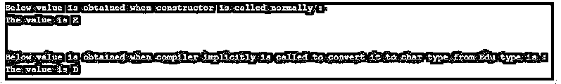
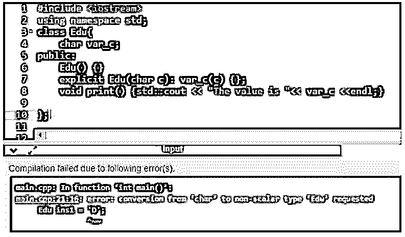
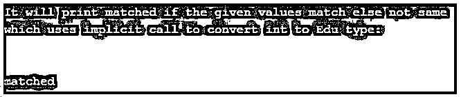
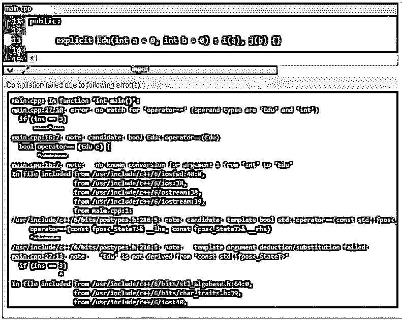

# C++显式

> 原文：<https://www.educba.com/c-plus-plus-explicit/>


## C++显式简介

在 C++中，explicit 是在构造函数之前使用的关键字，定义为通过指定关键字 explicit 使构造函数不进行任何隐式转换。当一个类包含一个单参数构造函数时，这是为了避免很少的隐式转换，编译器通常认为它是一个转换构造函数或隐式转换，这可能会导致一些不需要的输出。为了避免这样的结果，我们必须在构造函数名称前定义一个显式关键字。一般来说，显式构造函数是在我们不能使用隐式构造函数的地方声明的，这样的显式构造函数总是有一个或多个参数。

### C++中显式关键字的使用及实例

在本文中，我们将看到在不能使用隐式构造函数的地方使用 explicit 关键字来构造函数。在 C++中，我们知道构造函数主要用于初始化或创建类的对象，默认情况下由编译器提供，我们可以使用这样的构造函数进行类型转换，如类声明中的构造函数的隐式或显式转换。这个 explicit 关键字是可选的，它总是只接受一个参数，这样的构造函数可以在类型转换中使用。

<small>网页开发、编程语言、软件测试&其他</small>

如果隐式转换是不可控的，那么我们需要为类声明中的构造函数指定一个关键字 explicit declaration，但是我们应该注意一点，我们不能为默认的构造函数使用这个 explicit 关键字。一般来说，我们可以说，将 explicit 关键字指定为构造函数的函数说明符，并在类声明中使用一个或多个参数，是为了防止类进行不必要的类型转换；否则，如果没有这个显式关键字，它将是一个转换构造函数。

让我们考虑下面的例子，看看在 C++中为什么以及在哪里使用 explicit 关键字:

#### 示例#1

**代码:**

```
#include <iostream>
using namespace std;
class Edu{
char var_c;
public:
Edu() {}
Edu(char c): var_c(c) {};
void print() {std::cout << "The value is "<< var_c <<endl;}
};
void disp(Edu u)
{
u.print();
}
int main()
{
Edu ins('E');
Edu ins1 = 'D';
cout<<"Below value is obtained when constructor is called normally :" << endl;
disp(ins);
cout<<"\n" <<endl;
cout<<"Below value is obtained when compiler implicitly is called to convert it to char type from Edu type is : " << endl;
disp(ins1);
return 0;
}
```

**输出:**




在上面的程序中， 我们可以看到，首先我们声明了一个类“Edu ”,其中我们声明了一个字符类型变量 var_c，我们创建了一个零参数的默认构造函数和另一个具有类名和单参数的构造函数，变量 c 为 char 类型，我们正在打印传递给该函数的值，我们必须记住，我们只能传递 char 类型的值，但我们可以在 main()中看到 函数我们创建了第一个类 Edu 对象“ins ”,其中我们将“E”字母传递给 disp()函数，该函数有一个“Edu”类型的参数，因此它会在正常调用构造函数时打印值，但是当我们创建另一个类 Edu 的对象“ins1”和 disp()函数时，我们传递的是类类型“Edu”参数，因此当我们调用 disp()时 函数，并尝试将 char 类型的“D”字母分配给“Edu”类型的 ins1 对象，因此这里编译器会隐式地将“Edu”类型的变量转换为 char 类型的变量，并给出带有 char 值的输出，如上面的屏幕截图所示，这有时是不正确的，因此为了避免这种隐式调用，我们必须将“explicit”关键字添加到带有单个参数的构造函数中，例如“explicit edu(char c):var _ c(c){ }；” 因此，当我们更改上述代码时，我们会得到如下截图所示的错误。




这是输出结果。我们可以看到，从 char 类型到 Edu 的转换是非标量的，这不是一个合法的调用，所以在这种情况下或者在任何有机会进行隐式构造函数转换的地方使用 explicit 关键字是一个好的实践。所以在上面的代码中，我们用一个 char 类型的参数为“Edu”构造函数编写了关键字“explicit”。

现在让我们看一个有两个参数的例子；我们将看看显式函数是否适用于两个参数的构造函数。

#### 实施例 2

**代码:**

```
#include <iostream>
using namespace std;
class Edu
{
private:
int i;
int j;
public:
Edu(int a = 0, int b = 0) : i(a), j(b) {}
bool operator== (Edu e) {
return (i == e.i && j == e.j)? false : true;
}
};
int main()
{
Edu ins(3, 4);
cout << "It will print matched if the given values match else not same which uses implicit call to convert int to Edu type:" <<endl;
cout<< "\n" <<endl;
if (ins == 3)
cout << "matched";
else
cout << "No match";
return 0;
}
```

**输出:**




在上面的程序中，我们可以看到这也是和上面一样的代码，但是我们在构造函数中使用了两个参数。当只有一个参数构造函数时，最好应用或使用 explicit，因为两个或多个参数构造函数可能会导致在 main 函数中调用它们时出现混淆。所以在上面的例子中，它又是这样工作的，构造函数被编译器隐式调用，而这不是合法或正确的获取输出的形式。因此，为了避免这种可能产生输出的不希望的程序执行，从逻辑上来说，转换类型是不正确的，所以我们对构造函数使用 explicit 关键字。在上面的代码中，我们也可以在类中声明构造函数之前用一个显式关键字重写代码，例如“显式 Edu(int a = 0，int b = 0): i(a)，j(b) {}”，因此输出将类似下面的屏幕截图。




### 结论

在本文中，我们可以得出结论，在 C++中，explicit 关键字通常用于在类声明中创建类对象的构造函数。在本文中，我们看到 explicit 关键字仅用于构造函数，当我们希望避免编译器进行隐式调用时，通常会将构造函数作为转换构造函数，将变量从一种类型转换为另一种类型，这样做是不正确或不合法的。在这种情况下，最好总是使用 explicit 关键字，因为它会给出一个错误，说明类型是非标量类型；我们在上面的文章中看到了例子。

### 推荐文章

这是一个 C++显式指南。这里我们分别用实例来讨论 C++中 explicit 关键字的引入和使用。您也可以看看以下文章，了解更多信息–

1.  [C++数组长度](https://www.educba.com/c-plus-plus-length-of-array/)
2.  [C++静态转换](https://www.educba.com/c-plus-plus-static_cast/)
3.  [C++ push_back](https://www.educba.com/c-plus-plus-push_back/)
4.  [C++ Lambda 表达式](https://www.educba.com/c-plus-plus-lambda-expressions/)


