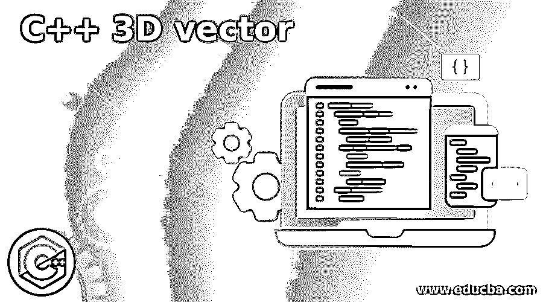
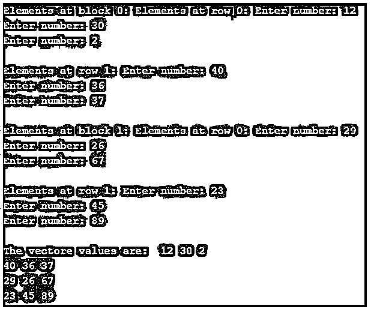

# C++ 3D 矢量

> 原文：<https://www.educba.com/c-plus-plus-3d-vector/>




## C++ 3D 矢量简介

3D 向量是向量的向量，类似于 3D 数组。它在三维空间中存储元素。它可以像 3D 矩阵一样进行声明和赋值。3D 矢量是动态的，当要插入或删除元素时，它具有自动调整自身大小的能力。3D 矢量存储由容器自动处理。在这个主题中，我们将学习 C++ 3D vector。

**语法**

<small>网页开发、编程语言、软件测试&其他</small>

C++中 3D 向量的声明语法:

```
std :: vector< std :: vector< std :: vector< data_type > > > vectName;
```

C++中 3D 向量的初始化语法:

```
vectName[index1][ index2][ index3] = value;
```

或者

C++中同时声明和初始化 3D 矢量的语法:

```
std :: vector< std :: vector< std :: vector< data_type > > > vectName( size, std :: vector< std :: vector<data_type> > ( size, std :: vector< data_type  >( size, value)));
```

**参数:**

*   **数据类型:**指定我们想要创建的矢量类型。因此，数据类型可以是 int、float、string 等。
*   **size:** 这指定了我们想要创建的向量的大小；在向量的每一维中，它可以相同，也可以不同。
*   **value:** 指定矢量元素的初始化值，所有元素都用这个值初始化。

### C++中三维矢量的处理

*   3D 向量实际上是一个动态的 3D 数组，可以通过调整自身大小来插入和删除元素。与 3D 数组一样，3D 向量也定义了它的类型，这样我们就可以创建 int 类型、string 类型、float 类型和所有不同类型的 3D 向量。
*   3D 向量以块大小、行大小和列大小这三个维度存储元素，这通过使用三个不同的下标来表示。
*   通过使用这些下标或索引，我们可以将值存储到 3D 矢量中，并且还可以访问存储在矢量中的值。

### 例子

创建 3D 向量的示例，向量的所有元素的值都为 1。

接下来，我们编写 C++代码，通过下面的示例更清楚地理解 3D 向量，其中 3D 向量的大小为 2*2*3，并用值 1 初始化所有元素。

#### 示例#1

**代码:**

```
#include <iostream>
// for 3D vector
#include <vector>
using namespace std;
int main()
{
// Initializing 3D vector "vect3d" with
// values 1
//here creating the vector of 1D of 2 size, 2D of 2 size and 3D of 3 size
std::vector<std::vector<std::vector<int> > > vect3d(2, std::vector<std::vector<int> > (2, std::vector<int>(3,1)));
// Displaying the 3D vector by using 3 iterators
for (int i = 0; i < vect3d.size(); i++) {
cout << "Elements at block "
<< i << ": ";
// Displaying element at each column,
// 0 is the starting iterator,
// size() is the ending iterator
for (int j = 0; j != vect3d[i].size(); j++) {
cout << "Elements at row "
<< j << ": ";
for (int k = 0; k != vect3d[i][j].size(); k++) {
// use all indexes to get the values store in the vector
cout << vect3d[i][j][k]<< ' ';
}
cout << endl;
}
}
return 0;
}
```

**输出:**


在上面的程序中，3D 向量被声明为每个维度具有不同的大小，块大小为 2，行大小为 2，列大小为 3，因此该向量中的元素数将是 12 个元素。在声明的时候，向量的所有 12 个元素都用值 1 初始化，正如我们在输出中看到的。

使用用户输入的值创建 3D 矢量的示例。

接下来，我们编写 c++代码来理解 3D 向量，其中我们将创建 2*2*3 大小的 3D 向量，并将用户提供的值存储到向量中。

#### 实施例 2

**代码:**

```
#include <iostream>
// for 3D vector
#include <vector>
using namespace std;
int main()
{
// Initializing 3D vector "vect3d" with
// user provided values
//here creating the vector of 1D of 2 size, 2D of 2 size and 3D of 3 size
std::vector<std::vector<std::vector<int> > > vect3d(2, std::vector<std::vector<int> > (2, std::vector<int>(3)));
// Inserting elements into the vector
for (int i = 0; i < vect3d.size(); i++) {
cout << "Elements at block "
<< i << ": ";
// Inserting element at each column,
// 0 is the starting iterator,
// size() is the ending iterator
for (int j = 0; j != vect3d[i].size(); j++) {
cout << "Elements at row "
<< j << ": ";
for (int k = 0; k != vect3d[i][j].size(); k++) {
cout<<"\nEnter number: ";
// use all indexes to insert the values into the vector
cin >> vect3d[i][j][k];
}
cout << endl;
}
}
// Displaying the 3D vector by using 3 iterator
cout << "The vectore values are: " <<" ";
for (int i = 0; i < vect3d.size(); i++) {
// Displaying element at each column,
// 0 is the starting iterator,
// size() is the ending iterator
for (int j = 0; j != vect3d[i].size(); j++) {
for (int k = 0; k != vect3d[i][j].size(); k++) {
// use all indexes to get the values store in the vector
cout << vect3d[i][j][k]<< ' ';
}
cout << endl;
}
}
return 0;
}
```

**输出:**




和上面的程序一样，3D 向量是用不同的尺寸声明的，块尺寸为 2，行尺寸为 2，列尺寸为 3。在代码的后面，用户提供的值在三个索引或迭代器的帮助下存储到向量中，同样，向量在三个索引的帮助下显示。

### 结论

vector 是 C++内置的序列容器，在<vector>头中定义。3D 向量是向量中的向量，就像 3D 数组一样，通过使用迭代器，我们可以访问向量元素。</vector>

### 推荐文章

这是一个 C++三维矢量指南。在这里，我们讨论的介绍，工作的三维向量在 C++与例子，分别。您也可以看看以下文章，了解更多信息–

1.  [C++ ofstream](https://www.educba.com/c-plus-plus-ofstream/)
2.  [C++数组长度](https://www.educba.com/c-plus-plus-length-of-array/)
3.  [C++读取文件](https://www.educba.com/c-plus-plus-read-file/)
4.  [C++ shuffle()](https://www.educba.com/c-plus-plus-shuffle/)


