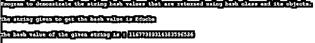
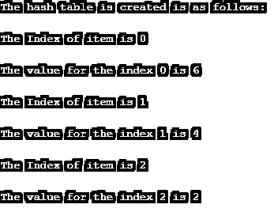

# C++哈希

> 原文：<https://www.educba.com/c-plus-plus-hash/>


## C++哈希简介

在 C++中，hash 是一个用于创建哈希表的函数。当这个函数被调用时，它将为散列函数中给出的每个键生成一个地址。而如果哈希函数返回唯一的哈希数，那么这个哈希函数就叫做通用哈希函数。C++的标准库，它提供了一个名为 hash class 的类，可以在不传递任何参数的情况下构造这个类，所以一般来说，hash 函数用于散列，它将把键映射到一些值，这些值形成一个哈希表，这是一个数据结构，这个函数将计算一个数组的索引。

### C++中 hash 函数的使用及实例

在本文中，我们将看到在 C++标准库中定义为 std::hash 的哈希类，它允许用户创建一个哈希类，该哈希类可以在不初始化值和参数的情况下构造对象，也可以说是一个哈希类作为模板类。因此，使用哈希的主要目的是使搜索更快，这是通过使用位于内存中的每个值的索引来完成的，哈希函数在内存中有键(index)，它指向位于内存中的值的地址，在内存中使用它的键可以更快地获取该值。在 C++中，散列函数是一个键指向一个地址值的函数；当这个函数被调用时，它使用哈希表中字母和数字的组合，可以用于数据的排列。

<small>网页开发、编程语言、软件测试&其他</small>

指向相同值的两个或多个关键字可能会发生冲突，这可以通过使用链式散列来避免，链式散列将指向链接列表记录，因为散列表中具有相同值的每个单元格都具有散列关键字映射到散列函数值的相同值。因此，在实时情况下，我们可以将这个哈希函数或哈希表与电话号码簿相关联，在电话号码簿中，每个姓名都是一个键，而电话号码作为键的值，也就是姓名。

hash 类可以使用 C++中的 STL 库来定义，STL 库用于获取传递给它的参数的哈希值，所以让我们看看下面的语法:

**语法:**

```
template <class key> struct hash;
```

在上面，我们可以看到我们有一个语法来编写或创建一个哈希类，然后我们可以使用下面的语法在 std::hash 类中创建一个对象:

**语法:**

```
hash<class template> obj_name ;
```

因此，要在哈希表中添加一些项，我们需要一个使用给定键的哈希索引的哈希函数，这必须使用哈希函数来计算，如“hash_inx = key % num_of_slots(哈希表的大小)”，例如，哈希表的大小是 10，键值(项)是 48，则哈希函数= 43% 10 = 3；因此，散列码将是 3，这意味着 43 个项目被放置在散列表中的索引 3 处。有时，可能会发生将项目放置在相同索引处的冲突。假设如果我们有键值 63，那么它将再次只产生与键值 43 冲突的哈希代码，因此为了避免这种类型的冲突或解决这种类型的问题，我们可以使用开放式哈希或独立链接，其实现类似于链表，另一种解决方法是使用线性探测，其允许所有条目存储在哈希表本身中，以及许多其他方法来解决这种冲突问题。

因此，哈希表是一个具有特定大小的数组，该数组具有从对象映射到哈希表中的项目的哈希函数，这些对象被放置在哈希表中，这就像一个数组，每个对象都有一个索引，它将通过哈希函数拥有索引，可以计算为 index = h(object ),因此这样的数组称为哈希表。这个 hash 类只有一个名为 operator()的成员函数，它返回参数传递给成员函数的散列值。所以在下面，让我们用简单的程序使用各种对象为给定的相应散列函数获取散列值。

**举例:**

```
#include <iostream>
#include <string>
using namespace std;
void strhashing()
{
string h1 = "Educba";
cout <<"The string given to get the hash value is "<< h1 <<"\n"<<endl;
hash<string> hash_obj;
cout << "The hash value of the given string is : " << hash_obj(h1)<< endl;
}
int main()
{
cout<<"Program to demonstrate the string hash values that are returned using hash class and its objects."<<"\n"<<endl;
strhashing();
}
```

**输出:**




在上面的程序中，我们可以看到我们正在定义函数 strhashing()，其中我们声明了一个字符串“h1”，我们试图获取给定字符串“Educba”的哈希值，首先我们将创建一个哈希对象“hash_obj ”,并将给定字符串作为参数传递给所创建的哈希对象，该对象将演示字符串哈希，给定字符串“Educba”的哈希值为 11677389314383596536，如上面的屏幕截图所示。因此，除了字符串数据类型之外，还有许多其他数据类型可以使用散列函数来散列每种数据类型的值，例如 char、vector、Boolean、float、double、long 等。

现在，让我们试着在下面的例子中用 C++编程语言创建一个哈希表。

**举例:**

```
#include <iostream>
#include <list>
using namespace std;
class hash_table{
```

**私人:**

```
list<int> *tbl;
int all_ele;
int fetch_hash(int k){
return k % all_ele;
}
```

**公共:**

```
hash_table(int a){
all_ele = a;
tbl = new list<int>[all_ele];
}
void inst_ele(int k){
tbl[fetch_hash(k)].push_back(k);
}
void disp(){
for(int i = 0; i < all_ele; i++){
cout << "The Index of item is " << i << "\n " <<endl;
for(int j : tbl[i])
cout <<"The value for the index "<<i << " is " << j << endl;
cout << endl;
}
}
};
int main() {
hash_table kh(3);
int a[] = {2, 4, 6};
for(int i = 0; i < 3; i++)
kh.inst_ele(a[i]);
cout << "The hash table is created is as follows: " << "\n"<< endl;
kh.disp();
return 0;
}
```

**输出:**




在上面的程序中，我们可以看到我们声明了一个数组，并尝试将每一项插入到哈希表中，在那里我们首先计算哈希函数，这为我们提供了可用于放置项的索引值。因此，在上面的屏幕截图中，我们可以看到我们已经将项目放置在特定的索引中，如输出所示。

### 结论

在本文中，我们得出结论，C++中的 hash 是一个用于创建哈希表的函数，对于轻松快速地搜索任何项目非常有用。在本文中，我们看到了使用 hash 类的语法创建 hash 类对象的语法。在本文中，我们还看到了一个获取数据类型变量的哈希值的示例。在本文中，我们还了解了如何创建哈希表以及如何在哈希表中插入元素。

### 推荐文章

这是一个 C++ hash 的指南。在这里，我们讨论 C++中散列函数的工作原理，以及输出的例子。您也可以阅读以下文章，了解更多信息——

1.  [C++ Max](https://www.educba.com/c-plus-plus-max/)
2.  [C++ ofstream](https://www.educba.com/c-plus-plus-ofstream/)
3.  [C++数组长度](https://www.educba.com/c-plus-plus-length-of-array/)
4.  [C++线程()](https://www.educba.com/c-plus-plus-thread/)


