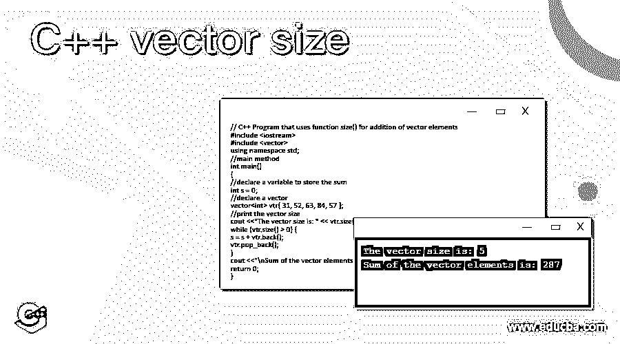
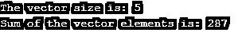

# C++向量大小

> 原文：<https://www.educba.com/c-plus-plus-vector-size/>




## C++向量大小简介

在 C++中，向量被称为动态数组，当一个项目被插入或移除时，它可以自动调整自己的大小，其存储由容器自动控制。向量项保存在相邻存储中，借助迭代器很容易访问和遍历。此外，在末尾插入项目，这可能需要一些时间，因为在某些情况下需要扩展数组。有几个函数支持向量操作，size()就是这样一个函数，它有助于返回容器的向量大小或容器中可用项目的数量。在这个主题中，我们将学习 C++向量的大小。

### 句法

在学习编程语言中的新概念时，您必须理解相同的基本语法。那么，让我们看看 vector 中 size()函数的语法。

<small>网页开发、编程语言、软件测试&其他</small>

```
vec.size()
```

这里，vec 是向量的名称

**功能参数:**

与其他函数不同，此函数不传递任何参数。

**返回值:**

容器中的项目计数。

**异常和错误**

*   不保证异常抛出。
*   当传递参数时，会引发错误。

### C++中如何求向量的大小？

正如我已经提到的，size()是一个向量函数，它有助于返回容器的向量大小或容器中可用项目的数量。

例如，考虑如下所述的矢量 vtr。

```
vector<int> vtr{31, 52, 63, 84, 57 };
```

由此，我们可以看到向量中有 5 个元素。所以，当我们调用 size()函数时，结果会将向量的大小显示为 5。

它可以在向量中执行加法运算时使用。可以使用 size()函数来代替大小。

### C++向量大小的示例

现在，为了更好的理解，让我们看一些关于 C++中 vector 的大小函数的示例程序。

#### 示例#1

演示在 vector 中实现 size()函数的 CPP 程序

**代码:**

```
// C++ Program to demonstrate the implementation of the function size()
#include <iostream>
#include <vector>
using namespace std;
//main method
int main()
{
//declare a vector
vector<int> vtr{ 31, 52, 63, 84, 57 };
//print the vector size
cout <<"The vector size is: " << vtr.size();
return 0;
}
```

**输出:**


首先，这个程序导入所有必要的头文件，比如<iostream>和<vector>。在这之后，用很少的元素声明一个向量。在执行代码时，使用 size()函数打印出向量的大小。</vector></iostream>

#### 实施例 2

CPP 程序在 vector 中使用 size()函数来添加所有的 vector 元素。

**代码:**

```
// C++ Program that uses function size() for addition of vector elements
#include <iostream>
#include <vector>
using namespace std;
//main method
int main()
{
//declare a variable to store the sum
int s = 0;
//declare a vector
vector<int> vtr{ 31, 52, 63, 84, 57 };
//print the vector size
cout <<"The vector size is: " << vtr.size();
while (vtr.size() > 0) {
s = s + vtr.back();
vtr.pop_back();
}
cout <<"\nSum of the vector elements is: " << s;
return 0;
}
```

**输出:**




在这个程序中，用很少的元素声明了一个向量，还声明了一个变量 s 来存储元素的和。在执行代码时，使用 size()函数打印向量的大小，使用 for 循环打印元素的总和。

#### 实施例 3

对字符串向量使用 size()函数的 CPP 程序

**代码:**

```
// C++ Program to demonstrate the implementation of the function size() in string vector
#include <iostream>
#include <vector>
using namespace std;
//main method
int main()
{
//declare a vector
vector<string> vtr{ " Do not give up " , " Your miracle " , " on the ", " way "} ;
//variable to store the vector size
int s = vtr.size() ;
//print the vector size
cout <<"The vector size is: " << s ;
return 0;
}
```

**输出:**


与上面的程序不同，在这个程序中，向量是用字符串元素声明的。但是，size()函数打印向量的大小。

#### 实施例 4

CPP 程序创建一个空向量并打印大小

**代码:**

```
// C++ Program to create empty vector and print size
#include <iostream>
#include <vector>
using namespace std;
//main method
int main()
{
//declare a vector
std::vector<int> vtr;
//variable to store the vector size
int s = vtr.size() ;
//print the vector size
cout <<"The vector size is: " << s ;
return 0;
}
```

**输出:**


在这个程序中，一个没有元素的向量被声明，在执行代码时，向量的大小将显示为 0。

#### 实施例 5

CPP 程序，声明一个矢量添加元素和打印尺寸

**代码:**

```
#include <iostream>
#include <vector>
using namespace std;
//main method
int main()
{
//declare a vector
std::vector<int> vtr;
//add the elements to the vector
for (int i=0 ; i<5 ; i++)
{
vtr.push_back(i);
}
//variable to store the vector size
int s = vtr.size() ;
//print the vector size
cout <<"The vector size is: " << s ;
return 0;
}
```

**输出:**


此程序中声明了一个空向量，并使用 for 循环将元素添加到该向量中。然后，使用 size()函数打印向量的大小。

#### 实施例 6

CPP 程序，将元素插入到矢量末端和打印尺寸

**代码:**

```
#include <iostream>
#include <vector>
using namespace std;
//main method
int main()
{
//declare a vector
std::vector<int> vtr;
//add the elements to the vector
vtr.insert ( vtr.end() , 5, 50 );
//variable to store the vector size
int s = vtr.size() ;
//print the vector size
cout <<"The vector size is: " << s ;
return 0;
}
```

**输出:**


在这个程序中，首先声明一个空向量，然后使用 insert()将元素添加到向量的末尾。然后，使用 size()函数打印向量的大小。

### 结论

size()是一种帮助返回容器的向量大小或向量中可用项目数的方法。在本文中，将详细解释 size()函数的语法、工作原理和示例等不同方面。

### 推荐文章

这是一个 C++矢量大小的指南。这里我们讨论如何在 C++中找到向量工作的大小，以及代码和输出的例子。您也可以阅读以下文章，了解更多信息——

1.  [C++ 2D 向量](https://www.educba.com/c-plus-plus-2d-vector/)
2.  [C++空指针](https://www.educba.com/c-plus-plus-void-pointer/)
3.  [C++线程池](https://www.educba.com/c-plus-plus-thread-pool/)
4.  [C++可变](https://www.educba.com/c-plus-plus-mutable/)


