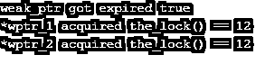
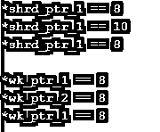

# C++ weak_ptr

> 原文：<https://www.educba.com/c-plus-plus-weak_ptr/>


## C++ weak_ptr 简介

C++ weak_ptr 是标准库的一部分，用于保存由另一个名为 shared_ptr 的标准库指针管理的任何对象的弱引用，这意味着 weak_ptr 用于将它最终转换为 shared_ptr。从 weak_ptr 最终转换的 shared_ptr 用于访问被引用对象。一旦 weak_ptr 被转换成 shared_ptr，它就失去了永久驻留的能力，这意味着它的存在是暂时的。访问 weak_ptr 然后提供访问引用对象的能力并不是推荐的方式。

**语法**

<small>网页开发、编程语言、软件测试&其他</small>

```
template< class T > class weak_ptr;
```

C++ weak_ptr 的语法流是这样的，作为类 T 传递的参数用于由弱指针控制的类型。

### weak_ptr 在 C++中如何工作？

任何高级语言中的每个指针主要用于对象引用，然后访问数组中以某种有组织的格式出现的元素。C++中的 weak_ptr 也是类似的情况。整个类模板描述了 weak_ptr 的工作流程:

*   最初用于引用对象的 weak_ptr 不是实际的指针，因为在对象引用和赋值方面，它被认为是临时指针。
*   但是一旦 weak_ptr 获得了 share_ptr 的最终控制权或权限，那么在对象访问和引用方面就变得容易和简单了。
*   这种共享和协调，或者说，在用于访问和引用的 weak_ptr 和 share_ptr 之间切换，主要用于避免数据结构中的长周期。
*   当 share_ptr 在管理资源的分配和分析时承担全部责任时，Weak_ptr 失去所有控制并被删除。
*   weak_ptr 从不提供直接访问元素的能力；相反，它通过调用名为 lock 的成员函数，通过拥有整个代码的 shared_ptr 对象来利用需要使用资源的代码。
*   一旦调用锁或 weak_ptr 进行资源分配和控制任何块，就会创建一个空的 weak_ptr 对象。
*   一旦锁或弱 ptr 被大多数 shared_ptr 对象相互引用或持有，一个完整的周期就完成了。
*   在 share_ptr 的帮助下，它突出地利用了所有资源，而不是使用唯一的 weak_ptr，它是任何指针概念中指针的整个工作格式的一部分。
*   获取锁和 weak_ptr 的行为指向 weak_ptr 释放终端资源，然后 shared_ptr 与 release 一起使用它。
*   一旦提到的所有资源都被释放，那么列表及其相关节点也将很容易被破坏和区分，从而形成一种优化的分析和格式调整方式。
*   有许多测试和方法是整个循环的一部分，包括 expired()方法，用于测试所有权是否已经过期。
*   Lock()用于获得对资源的独占和单独的锁定，以便其他资源在试图获取资源时不会锁定目标并发生冲突。
*   owner () before 用于测试 weak_ptr 的指向，如果指向正确，则返回 true。
*   Reset()用于在整个周期内释放所拥有的资源。
*   当两个 weak_ptr 都作用于对象时，那么它就叫做 swap()方法。
*   use_count()方法用于统计和跟踪 shared_ptr 对象的数量。
*   Operator=是用于替换最初拥有的资源的方法。

### C++ weak_ptr 示例

下面是 C++ weak_ptr 的例子:

#### 示例#1

这个程序演示了作为构造函数使用的 weak_ptr，其中作为构造函数传递的参数用于获取锁并给出相应的值，如输出中所示。

**代码:**

```
#include <memory>
#include <iostream>
int main()
{
std::weak_ptr<int> wptr_0;
std::cout << "weak_ptr got expired " << std::boolalpha
<< wptr_0.expired() << std::endl;
std::shared_ptr<int> shrd_ptr1(new int(12));
std::weak_ptr<int> wptr_1(shrd_ptr1);
std::cout << "*wptr_1 acquired the_lock() == "
<< *wptr_1.lock() << std::endl;
std::weak_ptr<int> wptr_2(wptr_1);
std::cout << "*wptr_2 acquired the_lock() == "
<< *wptr_2.lock() << std::endl;
return (0);
}
```

**输出:**




#### 实施例 2

这个程序演示了 owner_before 方法，该方法在 weak_ptr 的帮助下，明确地告诉我们使用布尔值获取的值，然后像前面一样重置该值，并给出如输出中所示的输出。

**代码:**

```
#include <memory>
#include <iostream>
int main()
{
std::shared_ptr<int> shrd_ptr(new int(14));
std::weak_ptr<int> wk_ptr(shrd_ptr);
std::cout << "acquire weak_ptr in the lock: == " << *wk_ptr.lock() << std::endl;
std::cout << "weak_ptr got expired == " << std::boolalpha
<< wk_ptr.expired() << std::endl;
wk_ptr.reset();
std::cout << "After reset weak ptr fot expired*wk_ptr.lock()() == " << std::boolalpha
<< wk_ptr.expired() << std::endl;
return (0);
}
```

**输出:**


#### 实施例 3

这个程序演示了 weak_ptr 的计数，它用于管理要访问的元素的顺序，如输出所示。

**代码:**

```
#include <memory>
#include <iostream>
int main()
{
std::shared_ptr<int> shrd_ptr_1(new int(8));
std::weak_ptr<int> wk_ptr(shrd_ptr_1);
std::cout << "count the numner_of_weak_ptr : "
<< wk_ptr.use_count() << std::endl;
std::shared_ptr<int> shrd_ptr_2(shrd_ptr_1);
std::cout << "count the number_of_weak_ptr : "
<< wk_ptr.use_count() << std::endl;
return (0);
}
```

**输出:**


#### 实施例 4

这个程序演示了 swap()方法，用于在需要获取所需资源时交换 weak_ptr，如输出所示。

**代码:**

```
#include <memory>
#include <iostream>
int main()
{
std::shared_ptr<int> shrd_ptr_1(new int(8));
std::shared_ptr<int> shrd_ptr_2(new int(10));
std::cout << "*shrd_ptr_1 == " << *shrd_ptr_1 << std::endl;
shrd_ptr_1.swap(shrd_ptr_2);
std::cout << "*shrd_ptr_1 == " << *shrd_ptr_1 << std::endl;
swap(shrd_ptr_1, shrd_ptr_2);
std::cout << "*shrd_ptr_1 == " << *shrd_ptr_1 << std::endl;
std::cout << std::endl;
std::weak_ptr<int> wk_ptr_1(shrd_ptr_1);
std::weak_ptr<int> wk_ptr_2(shrd_ptr_2);
std::cout << "*wk_ptr_1 == " << *wk_ptr_1.lock() << std::endl;
wk_ptr_1.swap(wk_ptr_2);
std::cout << "*wk_ptr_2 == " << *wk_ptr_2.lock() << std::endl;
swap(wk_ptr_1, wk_ptr_2);
std::cout << "*wk_ptr_1 == " << *wk_ptr_1.lock() << std::endl;
return (0);
}
```

**输出:**




### 结论

C++ weak_ptr 在获取和访问链表节点中的元素时起着关键的作用。此外，shared_ptr 与 weak_ptr 相互协调，有助于创建访问元素的优化循环。一旦 shared_ptr 选择了，那么它通常被认为是一个永久的操作。C++ weak_ptr 在很多方面有助于高效地获取资源。

### 推荐文章

这是一个 C++ weak_ptr 的指南。这里我们讨论 weak_ptr 在 C++中是如何工作的，并给出了代码和输出的例子。您也可以阅读以下文章，了解更多信息——

1.  [C++ 2D 向量](https://www.educba.com/c-plus-plus-2d-vector/)
2.  [C++ memcpy](https://www.educba.com/c-plus-plus-memcpy/)
3.  [c++中的反射](https://www.educba.com/reflection-in-c-plus-plus/)
4.  [C++格式化程序](https://www.educba.com/c-plus-plus-formatter/)


