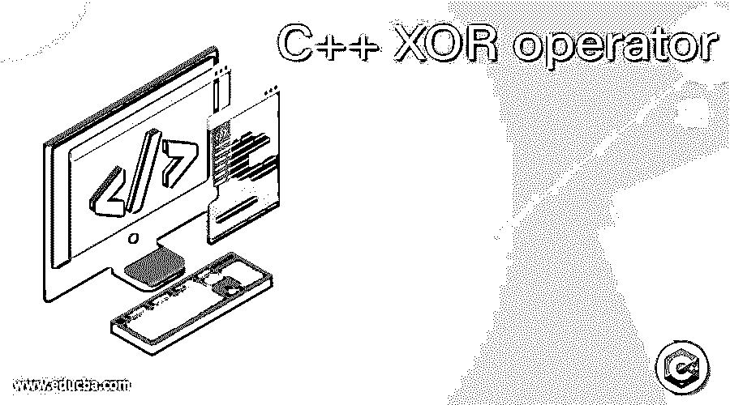
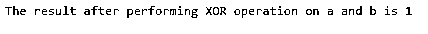
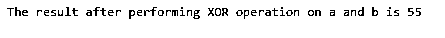
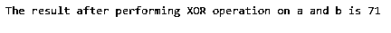

# C++异或运算符

> 原文：<https://www.educba.com/c-plus-plus-xor-operator/>




## C++异或运算符简介

XOR 运算符是 C++中的一种按位运算符，它将两个运算符作为操作数，并对两个操作数的每一位进行 and 运算。执行 XOR 运算，并且对两个操作数的给定两位进行 XOR 运算的结果为零。如果给定的两个操作数的两个位是零，并且如果给定的两个操作数的两个位是一，则对给定的两个操作数的两个位的 XOR 运算的结果是零，并且如果给定的两个操作数的两个位中的一个是零或一，而另一个是一或零，则结果是一。

**c++中 XOR 运算符的语法**

<small>网页开发、编程语言、软件测试&其他</small>

```
variable1 ^ variable2
```

其中变量 1 是包含必须对其位执行 XOR 运算的第一个操作数的第一个变量，

^符号代表异或运算

变量 2 是包含第二个操作数的第二个变量，必须对第二个操作数的位执行 XOR 运算。

### C++中异或运算符的使用

*   XOR 运算符是 C++中的一种按位运算符，它采用两个运算符作为操作数，并对两个操作数的每一位执行 XOR 运算。
*   如果给定的两个操作数的两个位为零，则对两个操作数的给定的两个位进行 XOR 运算的结果为零。
*   如果给定的两个操作数的两个位是 1，则对两个操作数的给定的两个位的 XOR 运算的结果是 0。
*   如果给定的两个操作数的两个位中的一个是 0 或 1，另一个是 1 或 0，则对给定的两个操作数的两个位进行 XOR 运算的结果是 1，即如果给定的两个操作数的两个位不同，结果是 1。

### C++ XOR 运算符示例

不同的例子如下:

#### 示例#1

C++程序，演示用 C++中的 XOR 运算符对给定的两个操作数执行 XOR 运算并显示结果:

**代码:**

```
//The header iostream is included to be able to make use of cin and cout statements
#include <iostream>
using namespace std;
//main method is called
int main()
{
//an integer variable called a is defined to store the first integer value
int a = 5;
//an integer variable called b is defined to store the second integer value
int b = 4;
//an integer variable called c is defined to store the result of XOR operation on the two values stored in the variables a and b
int c = a ^ b;
cout << "The result after performing XOR operation on a and b is " << c;
return 0;
}
```

**输出:**




在上面的程序中，我们已经使用 cin 和 cout 语句在程序中包含了头文件 iostream。然后调用 main 方法，在该方法中定义了两个整型变量 a 和 b 来存储将要对其位执行 XOR 运算的两个整数值。然后定义整数变量 c 来存储 XOR 运算的结果，该结果作为输出显示在屏幕上。

#### 实施例 2

C++程序，演示用 C++中的 XOR 运算符对给定的两个操作数执行 XOR 运算并显示结果:

**代码:**

```
//The header iostream is included to be able to make use of cin and cout statements
#include <iostream>
using namespace std;
//main method is called
int main()
{
//an integer variable called a is defined to store the first integer value
int a = 20;
//an integer variable called b is defined to store the second integer value
int b = 35;
//an integer variable called c is defined to store the result of XOR operation on the two values stored in the variables a and b
int c = a ^ b;
cout << "The result after performing XOR operation on a and b is " << c;
return 0;
}
```

**输出:**




在上面的程序中，我们已经使用 cin 和 cout 语句在程序中包含了头文件 iostream。然后调用 main 方法，在该方法中定义了两个整型变量 a 和 b 来存储将要对其位执行 XOR 运算的两个整数值。然后定义整数变量 c 来存储 XOR 运算的结果，该结果作为输出显示在屏幕上。

#### 实施例 3

C++程序，演示用 C++中的 XOR 运算符对给定的两个操作数执行 XOR 运算并显示结果:

**代码:**

```
//The header iostream is included to be able to make use of cin and cout statements
#include <iostream>
using namespace std;
//main method is called
int main()
{
//an integer variable called a is defined to store the first integer value
int a = 100;
//an integer variable called b is defined to store the second integer value
int b = 35;
//an integer variable called c is defined to store the result of XOR operation on the two values stored in the variables a and b
int c = a ^ b;
cout << "The result after performing XOR operation on a and b is " << c;
return 0;
}
```

**输出:**




在上面的程序中，我们已经使用 cin 和 cout 语句在程序中包含了头文件 iostream。然后调用 main 方法，在该方法中定义了两个整型变量 a 和 b 来存储将要对其位执行 XOR 运算的两个整数值。然后定义整数变量 c 来存储 XOR 运算的结果，该结果作为输出显示在屏幕上。

### 推荐文章

这是一个 C++异或运算符的指南。在这里，我们通过 XOR 运算符的定义、语法和用法，并通过编程实例及其输出来讨论 C++中 XOR 运算符的概念。您也可以阅读以下文章，了解更多信息——

1.  [C++绝对值](https://www.educba.com/c-plus-plus-absolute-value/)
2.  [C++ Max](https://www.educba.com/c-plus-plus-max/)
3.  [C++线程池](https://www.educba.com/c-plus-plus-thread-pool/)
4.  [C++格式化程序](https://www.educba.com/c-plus-plus-formatter/)


