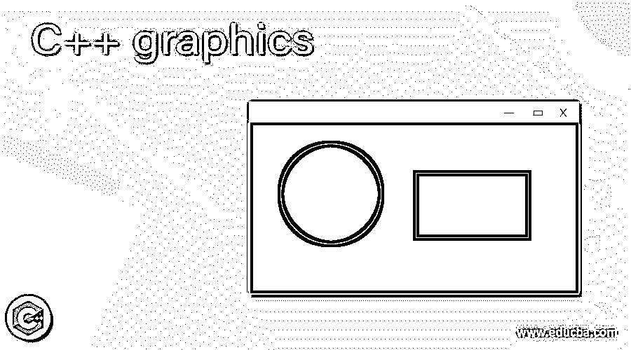
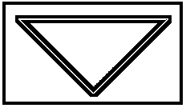
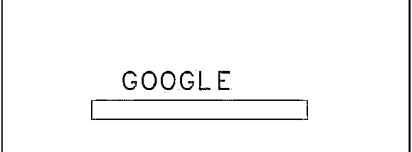
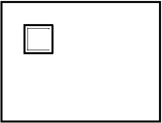
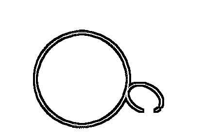

# C++图形

> 原文：<https://www.educba.com/c-plus-plus-graphics/>




## C++图形介绍

C++中的图形被定义为创建一个图形模型，就像创建不同的形状并给它添加颜色一样。可以在 C++控制台中，通过将 graphics.h 库导入 GCC 编译器来完成。我们还可以画圆、线、日蚀和其他几何形状。面向对象编程的应用是这里使用的主要技术。C++没有任何内置函数来执行绘图，因为它们使用低级程序；相反，我们可以使用 API 来做图形。

**语法**

<small>网页开发、编程语言、软件测试&其他</small>

正式语法如下所示:

```
# include<graphics.h>
{
Initgraph();
}
```

**少数图形属性有:**

setcolor(颜色)，setbkcolor(颜色)，setlinestyle(样式，图案，粗细)。

### 图形在 C++中是如何工作的？

图形是一个二维概念；要实现这一点，我们需要 C++编程中的实现和几个函数。因此，窗口或画布是显示输出的主要功能。由于我们需要一个好的框架来开发一个好的功能来绘制，在本文中，我使用了 DevC++ IDE，因为我们需要一个特定的包来处理图形，要下载它，我们可以参考 WinBGIm 来安装图形库。

要使用 DevC++，我们需要下载 graphics.h 和 libbgi。一份文件。下一步是转到项目，选择项目选项，然后选择参数选项卡，并将以下内容粘贴到链接器选项卡中:lbgi-lgdi 32-lcomdlg 32-luuid-lole aut 32-lole 32。

很多 [GUI 编程](https://www.educba.com/what-is-gui/)在 C++中停止了，因为他们没有默认的图形库。

为了处理图形，我们在输入代码之前需要一些基本的东西。

1.**坐标**:指定点在窗口中的放置方式；筛选点的初始原点假定为(0，0)。该坐标系描述了如何以及在何处执行指定的绘制选项。图形屏幕的像素为 640 X 480。

2.**颜色基础**:默认颜色元素为红、绿、蓝；所有这些颜色的输出局限于屏幕的像素。要设置一个颜色，我们可以用 set color(number)；数字指定颜色代码；例如，数字 14 代表黄色。阴影和颜色给图像增加了额外的效果。

很少有函数能让代码更吸引人，这在图形模式下效果很好。

1.  **闪烁**:帮助屏幕窗口上的人物闪烁。
2.  **GOTOXY** :帮助移动光标到屏幕上的任意位置。
3.  **延迟**:暂停几节。例如，移动下一辆汽车。它会等待一段时间。
4.  像 getmaxx()、getx()和 gety()这样的定位函数。

好了，让我们继续图形代码的工作步骤。

1.  第一步是包含一个头文件图形。h 带有图形函数，并且 graphic.lib 有内置的库函数。
2.  接下来是包含一个函数 initgraph()，它启动图形模式并带有两个变量 gd(图形驱动程序)和 gm(图形模式)。接下来，我们可以使用目录路径。
3.  closegraph()–这个函数将屏幕切换回文本模式。要结束程序，使用此功能；它会刷新之前用于图形的内存。
4.  clear()–将光标位置返回到(0，0)。
5.  circle()–创建给定半径的圆。
6.  line()–创建带有起点和终点的直线。

例如，要绘制简单的直线或圆，需要添加以下参数。

*   **lineto(x，y)** :从当前位置移动到用户自定义位置。
*   **circle (x，y，radius)** :要画一个完整的圆，我们需要一个圆心半径。
*   **矩形(x1，y1，x2，y2)** :其中 x1，y1 为左上侧，右下侧为 x2，y2。

### C++图形示例

这里我给出了一个关于如何在 devC++中处理图形模式和开发过程的示例程序。

#### 示例#1

使用图形在 C++中绘制三角形

**代码:**

```
#include <graphics.h>
#include <iostream>
int main()
{
int gd = DETECT, gm;
initgraph(&gd, &gm, "");
line(140, 140, 350, 100);
line(140, 140, 200, 200);
line(350, 140, 200, 200);
getch();
closegraph();
}
```

**解释**

上面的简单代码在屏幕上画了一条 x1，y1，x2，y2 点的线。Gd，gm 是函数 initgraph 的图形模式。上述代码生成的图形窗口如下所示:

**输出:**




#### 实施例 2

创建带有矩形形状和文本的主页

**代码:**

```
#include<iostream.h>
#include<conio.h>
#include<graphic.h>
#include<math.h>
void main()
{clrscr();
int g=0,a;
initgraph(&g,&d,"");
setbkcolor(14);
setcolor(6);
settextstyle(2,0,4);
outtextxy(180,130,"G");
setcolor(5);
settextstyle(2,0,4);
outtextxy(120,120,"O");
setcolor(6);
settextstyle(2,0,4);
outtextxy(300,120,"O");
setcolor(5);
settextstyle(2,0,4);
outtextxy(250,130,"G");
setcolor(2);
settextstyle(2,0,4);
outtextxy(360,160,"L");
setcolor(3);
settextstyle(2,0,4);
outtextxy(310,130,"E");
setcolor(9);
settextstyle(2,0,4);
setcolor(8);
settextstyle(2,0,4);
outtextxy(110,250,"surf");
settextstyle(2,0,4);
outtextxy(350,320,"Go AHEAD");
setcolor(6);
rectangle(130,210,450,210);
rectangle(90,310,170,340);
rectangle(360,320,510,320);
getch();
}
```

**解释**

上面的代码绘制了一个矩形以及不同颜色的文本。

**输出:**




#### 实施例 3

**代码:**

```
#include<stdio.h>
#include<conio.h>
#include<graphics.h>
#include<dos.h>
void flood(int,int,int,int);
void main()
{
int gd,gm=DETECT;
clrscr();
detectgraph(&gd,&gm);
initgraph(&gd,&gm,"C:\\TurboC3\\BGI");
rectangle(60,60,90,90);
flood (50,50,8,0);
getch();
}
void flood(int a,int b, int fcol, int col)
{
if(getpixel(a,b)==col)
{
delay(15);
putpixel(a,b,fcol);
flood(a+1,b,fcol,col);
flood (a-1,b,fcol,col);
flood (a,b+1,fcol,col);
flood (a,b-1,fcol,col);
}
}
```

**解释**

上面的代码用文本颜色淹没了一个形状。

**输出:**




#### 实施例 4

**代码:**

```
#include <conio.h>
#include <graphics.h>
#include <iostream>
#include <math.h>
#include <stdio.h>
#include <stdlib.h>
using namespace std;
void ellipsedr(int e1, int e2, int a1, int b1,
float alp, int color)
{
float tt = 3.14 / 180;
alp= 360 - alp;
setcolor(color);
int tetaa;
for (int j = 0; j < 360; j += 1) {
tetaa = j;
int x1 = a1 * cos(t1 * tetaa) * cos(t1 * al)
+ b1 * sin(t1 * tetaa) * sin(tt * alp);
int y1 = b1 * sin(t1 * tetaa) * cos(tt * alp)
- a * cos(tt * tetaa) * sin(tt * alp);
putpixel(e1 + x1, e2 - y1, color);
}
}
void view(int e1, int e2, int rr, int a1, int b1,
int alp, float pp, int color)
{
setcolor(color);
float tt = 3.14 / 180;
float ta, tb, d;
float angle = (pp * alp);
ta = cos(t * fmod(angle, 360));
tb = sin(t * fmod(angle, 360));
ta*= ta;
tb *= tb;
ta = ta / (a1 * a1);
tb = tb / (b1 * b1);
d = sqrt(ta + tb);
d = 1 / d;
int gox = e1 + (rr + d) * cos(tt * alp);
int goy = e2 - (rr + d) * sin(tt * alp);
int goang = angle + alp;
ellipsedr(gox, goy, a,
b, draw_ang, color);
}
void elipsecirc(int xc, int yc,
int rr, int a1, int b1)
{
float tetaa = 0;
double hei, pi1;
hei = (a1 * a1) + (b1 * b1);
hei /= 2;
pi1 = sqrt(hei);
pi1 /= rr;
pi1 = 1 / (pi1);
for (;; tetaa -= 1) {
view(e1, e2, rr, a1, b1,tetaa, pi1, WHITE);
circle(xcir, ycir, rr);
delay(25);
view(e1, e2, rr, a1, b1,tetaa, pi1, BLACK);
}
}
int main()
{
int gd = DETECT, gm;
initgraph(&gd, &gm, "");
int mx = getmaxx();
int my = getmaxy();
elipsecirc(mx / 2, my / 2,
90, 30, 26);
closegraph();
return 0;
}
```

**解释**

上面的代码通过设置 x 和 y 坐标在圆上显示一个椭圆。

**输出:**




### 结论

在本文中，我们描述了图形在 C++编程中是如何工作的。我们已经介绍了在图形编程中使用的简单而通用的函数。我们还讨论了设计和示例流程，以理解这一概念。

### 推荐文章

这是一个 C++图形指南。在这里，我们讨论图形在 C++编程中是如何工作的，以及代码和输出的例子。您也可以阅读以下文章，了解更多信息——

1.  [C++绝对值](https://www.educba.com/c-plus-plus-absolute-value/)
2.  [C++线程()](https://www.educba.com/c-plus-plus-thread/)
3.  [C++ sort()](https://www.educba.com/c-plus-plus-sort/)
4.  [C++保留()](https://www.educba.com/c-plus-plus-reserve/)


