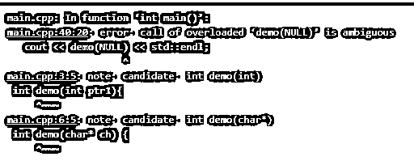
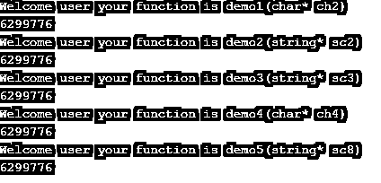
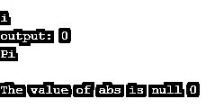

# C++ nullptr

> 原文:# t0]https://www . educba . com/c-plus-zero tr/


## C++ nullptr 简介

C++ nullptr 被定义为主要使用空指针值表示的关键字。每当创建对象时，只要需要它就调用它，对象就用一些不同的类型来处理，如内部指针或本机指针类型，它们不使用 C++ nullptr 指向任何特定的对象。它还表示 C++编译器发出的托管代码或一些本机代码，这些代码使用一些适当的指令集，这些指令集用于使用空指针值的托管代码和本机代码。有时 nullptr 很难在编译器中找到值。

### 句法

nullptr 关键字用于指针变量中的空值。在 C++编程语言中，它有自己的语法和表示。让我们看看下面的语法代码。

<small>网页开发、编程语言、软件测试&其他</small>

```
#include<iostream>
using namespace std;
return type function name(data type* variable name)
{
--some C++ logics---
}
return type main()
{
function name(NULL);
--some logics we will return based on the requirements----
}
```

上面提到的代码，我们可以创建函数和传递指针参数。同样的函数会在 main 函数中被调用，空值会在那个函数中被传递。

### nullptr 在 C++中是如何工作的？

通常，关键字 nullptr 在变量和函数中都使用指针文字来表示。它也称为 std::nullptr_t 类型的 prvalue 使用这些功能；我们可以调用 nullptr 和 null 值作为参数。因此，它存在于隐式和显式会话中，并且主要在从关键字 nullptr 到空指针值的隐式转换中指出，它包括任何指针类型，并且还转换为指向其他成员类型的任何指针。类似地，对于任何空指针值常量，都存在指针转换，它包括任何类型的值，如 type std::nullptr_t 以及与 null 相同的宏级别值。

此外，我们可以在编码部分的任何区域检查 nullptr，而 NULL 值在某些场景中会出现不止一次。同样，空值和指针也可以转换成任何指针类型，因此在 nullptr 区域中更有可能进行类型转换。但这对于隐式转换为整型值是不可能的；它将集中在整数级别类型值的显式转换区域。与空值相比，nullptr 具有第 0 个<sup>个</sup>内存引用索引。该值指定 void 数据类型为空，也是 null。nullptr 仅使用指针概念定义，主要是 null ptr 变量的内存引用为 0，也使用指针类型来考虑类型。而 Null 是内存地址的第零个值，该值被视为整数数据类型。

### C++ nullptr 的例子

以下是下面提到的例子

#### 示例#1

**代码:**

```
#include <iostream>
using namespace std;
int main()
{
nullptr_t pi1, pi2, pi3;
if (pi1 >= pi2)
{
cout << "The pointer 1 is greater than the pointer 2 value" << endl;
}
else if(pi2 >= pi3)
{
cout << "The pointer 2 is greater than the pointer 3 value" << endl;
}
else
{
cout << "The pointer 3 is greater than the pointer 2 value" << endl;
}
char *ch = pi1;
if (ch == nullptr)
cout << "The ch pointer variable has null value with 0th addresss reference" << endl;
else
cout << "The ch pointer variable is not null valee it has some value with address reefernce" << endl;
return 0;
}
```

**输出:**


#### 实施例 2

**代码:**

```
#include<iostream>
using namespace std;
int demo(int ptr1){
cout << "Welcome user your function is demo(int ptr1)" << std::endl;
}
int demo(char* ch) {
cout << "Welcome user your function is demo(char* ch)" << std::endl;
}
int demo1(int ptrs2) {
cout << "Welcome user your function is demo1(int ptrs2)" << std::endl;
}
int demo1(char* ch2) {
cout << "Welcome user your function is demo1(char* ch2)" << std::endl;
}
int demo2(long ptrs3) {
cout << "Welcome user your function is demo2(long ptrs3)" << std::endl;
}
int demo2(string* sc2) {
cout << "Welcome user your function is demo2(string* sc2)" << std::endl;
}
int demo3(long ptrs4) {
cout << "Welcome user your function is demo3(long ptrs4)" << std::endl;
}
int demo3(string* sc3) {
cout << "Welcome user your function is demo3(string* sc3)" << std::endl;
}
int demo4(int ptrs3) {
cout << "Welcome user your function is demo4(int ptrs3)" << std::endl;
}
int demo4(char* ch4) {
cout << "Welcome user your function is demo4(char* ch4)" << std::endl;
}
int demo5(short ptrs6) {
cout << "Welcome user your function is demo5(short ptrs6)" << std::endl;
}
int demo5(string* sc8) {
cout << "Welcome user your function is demo5(string* sc8)" << std::endl;
}
int main() {
cout << demo(NULL) << std::endl;
cout << demo1(nullptr) << std::endl;
cout << demo2(nullptr) << std::endl;
cout << demo3(nullptr) << std::endl;
cout << demo4(nullptr) << std::endl;
cout << demo5(nullptr) << std::endl;
}
```

**输出:**




删除代码后，即 cout < < demo(NULL)< < STD::endl；




#### 实施例 3

**代码:**

```
#include <iostream>
#include <typeinfo>
using std::string;
int main()
{
std::cout << std::endl;
int p= 0;
int* q= 0;
auto r= 0;
std::cout << typeid(r).name() << std::endl;
auto output= p+q+r;
std::cout << "output: " << output << std::endl;
std::cout << typeid(output).name() << std::endl;
std::cout << std::endl;
int  *abs = NULL;
std::cout << "The value of abs is null " << abs ;
return 0;
}
```

**输出:**




在上面的三个例子中，我们在不同的场景中使用了 nullptr。在第一个和第三个例子中，我们使用了带有值的指针变量，并且我们可以使用 nullptr 来验证变量。在第二个示例中，我们可以比较 null 和 nullptr 的差异。在 demo()函数中使用的 null 值显示错误，而我们称之为 nullptr 的函数像 deom1(nullptr)到 demo5(nullptr)一样显示输出，并且在输出屏幕上显示 nullptr 内存地址引用。

### 结论

nullptr 引用的变量在内存中指针变量的特定地址中没有更多的值。变量的引用始终是第 0 个<sup>到第</sup>个索引，变量值为 0，但变量的索引始终是内存位置中的保留区域。我们可以在不同的领域和 C++函数一起被称为 nullptr 关键字。

### 推荐文章

这是一个 C++ nullptr 的指南。在这里，我们讨论 nullptr 在 C++中是如何工作的，以及代码和输出的例子。您也可以看看以下文章，了解更多信息–

1.  [C++ memcpy](https://www.educba.com/c-plus-plus-memcpy/)
2.  [C++线程 _ 本地](https://www.educba.com/c-plus-plus-thread_local/)
3.  [C++静态](https://www.educba.com/c-plus-plus-static/)
4.  [C++绝对值](https://www.educba.com/c-plus-plus-absolute-value/)


