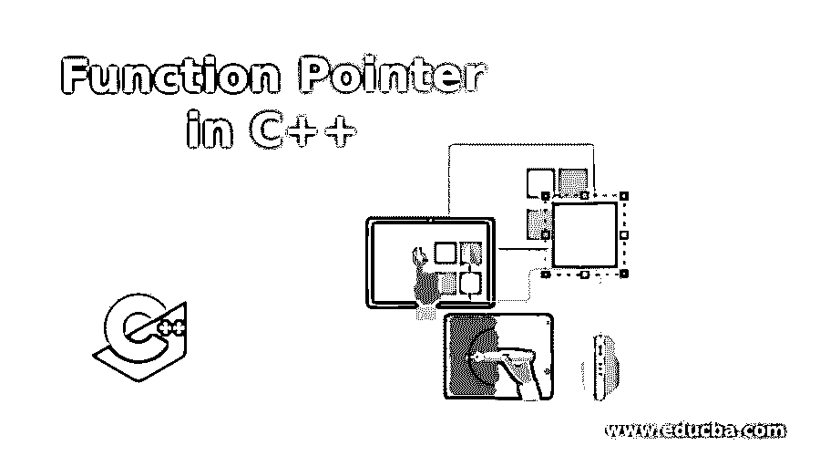
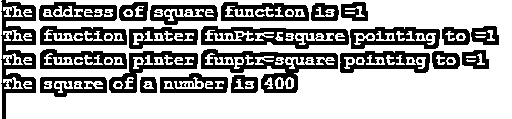
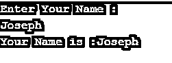

# C++中的函数指针

> 原文：<https://www.educba.com/function-pointer-in-c-plus-plus/>




## C++中函数指针的介绍

C++中的函数指针是一个存储函数地址的变量。我们知道指针是一个变量，它存储另一个变量的地址，类似地，函数指针存储一个函数的地址，这个函数稍后可以通过函数指针调用，甚至我们可以通过函数指针将变量或指针作为参数传递给函数。甚至函数指针可以作为参数传递，也可以从另一个函数返回。函数指针的应用有回调、在事件驱动的应用中、在数组中存储函数等。

函数指针指向代码，而不是函数的数据。它存储可执行代码的起始地址。

<small>网页开发、编程语言、软件测试&其他</small>

### C++中函数指针的语法

下面是函数指针的声明、初始化和调用的语法。

```
void myFunc(int x)
{
//some code of myFun() function
}
int main()
{
//declare function pointer
void (*funcPtr)(int);
/*Initialize function pointer(which stores the address of myFunc function)*/
funcPtr = &myFunc;
//call myFunc(note that no need to call (*foo)(2))
funcPtr( 4 );
//also can be called as
(*funcPtr)( 4 );
return 0;
}
```

在上面的语法中声明了一个函数。我们知道函数不是简单的作为变量，所以函数指针有参数列表和作为函数的返回类型。如上面声明的语法“void(* funPtr)(int)；”首先，我们提供返回类型，然后是由括号括起来的指针名(如 funcPtr ),括号后面是指针符号(*)。然后，以(int)的形式提供参数列表。

如上面初始化的语法是“funcPtr = &myFunc;”，函数指针(funcPtr)由函数(myFun)的地址初始化。

如上面调用函数的语法是“funcPtr(4)；”或“(* funcPtr)(4)；”，其中函数指针(funcPtr)被调用为 funcPtr(4)并传递参数 4。

### C++中函数指针的使用及实例

接下来，我们编写 C++代码，以便更清楚地理解函数指针的工作方式，在下面的示例中，我们使用函数指针通过指针间接调用函数，如下所示

#### 示例#1

**代码:**

```
#include<stdio.h>
#include<iostream>
using namespace std;
void square(int x)
{
cout<<"The square of a number is "<<x*x<<endl;
}
int main()
{
// declare funPtr pointer
void (*funPtr)(int);
// initialize funPtr pointer
funPtr = &square;
// the above two line is equivalent to void (*fun_ptr)(int) = &fun;
funPtr(20);
return 0;
}
```

**输出:**


如上述代码所示，函数指针被声明为 void (*funPtr)(int)，然后通过将 square()函数的地址存储在 funPtr 中进行初始化，这意味着 funPtr 指向函数 square()。因此，通过使用 funPtr(函数指针),我们可以调用 square 函数，如代码 funPtr(20)所示。

接下来，我们编写 C++代码，以便更清楚地理解函数指针的工作方式，我们使用函数指针指向或存储函数的地址，并通过函数指针调用函数，方法同上，如下所示

#### 实施例 2

**代码:**

```
#include<stdio.h>
#include<iostream>
using namespace std;
void square(int x)
{
cout<<"The square of a number is "<<x*x<<endl;
}
int main()
{
// declare funPtr pointer
void (*funPtr)(int);
// initialize funPtr pointer
funPtr = &square;
cout<<"The address of square function is ="<<&square<<endl;
cout<<"The function pinter funPtr=&square pointing to ="<<funPtr<<endl;
//also initialize as
funPtr = square;
cout<<"The function pinter funptr=square pointing to ="<<funPtr<<endl;
funPtr(20);
return 0;
}
```

**输出:**




如上面的代码所示，显示了 square()函数的地址。一个 square()函数的地址，打印时提到函数名，由&处理，也由函数指针打印。如果我们在输出中看到，两个地址是相同的。因此 funPtr 指向 square()函数。

接下来，我们编写 C++代码，以便更清楚地理解函数指针的工作方式，我们使用函数指针指向一个函数，并通过函数指针传递数组来调用函数，如下所示

#### 实施例 3

**代码:**

```
#include<stdio.h>
#include<iostream>
using namespace std;
void disp(char *str)
{
cout << "Your Name is :" <<str<< endl;
}
int main()
{
char array[50];
// declare funPtr pointer
void (*funPtr)(char*);
// initialize funPtr pointer
funPtr = &disp;
cout<<"Enter Your Name : "<<endl;
cin>>array;
funPtr(array);
return 0;
}
```

**输出:**




与上面的代码一样，disp()函数被定义为接受参数作为 char 指针。在 main()函数中，函数指针 funPtr 被声明为“void (*funPtr)(char*)”，并将 disp()函数的地址指定为 funPtr=&disp。因此，通过使用 funPtr，我们可以像在代码 funPtr(array)中那样调用 disp()函数，并将数组作为参数传递。

接下来，我们编写 C++代码，以便更清楚地理解函数指针的工作方式，我们使用函数指针指向一个函数，并通过将函数指针作为参数传递来调用函数，如下所示

#### 实施例 4

**代码:**

```
#include<stdio.h>
#include<iostream>
using namespace std;
void dispFun(char *str)
{
cout << "Your Name is :" <<str<< endl;
}
void disp(void (*funPtr)(char*)) // declare funPtr pointer and initialize funptr
{
char array[50];
cout<<"Enter Your Name : "<<endl;
cin>>array;
funPtr(array);
}
int main()
{
disp(dispFun);
return 0;
}
```

**输出:**


在上面的代码中，定义了两个函数，dispFun()函数接受参数作为 char 指针，disp()函数接受 funPtr 作为“void disp(void (*funPtr)(char*)”的函数指针。在 main()函数中，disp()函数被调用为“disp(dispFun)”，这意味着 dispFun()函数的地址被赋值或传递给 funPtr 函数指针参数。

### 结论

C++中的函数指针是一个变量，可以用来存储函数的地址，当需要调用函数时，我们可以通过函数指针间接调用。

### 推荐文章

这是一个 C++函数指针的指南。这里我们讨论 C++中函数指针的工作原理和例子，以及编程例子。您也可以看看以下文章，了解更多信息–

1.  [在 C++中插入排序](https://www.educba.com/insertion-sort-in-c-plus-plus/)
2.  [c++中的宏](https://www.educba.com/macros-in-c-plus-plus/)
3.  [C++结构构造函数](https://www.educba.com/c-pluse-pluse-struct-constructor/)
4.  [c++中的选择排序](https://www.educba.com/selection-sort-in-c-plus-plus/)


