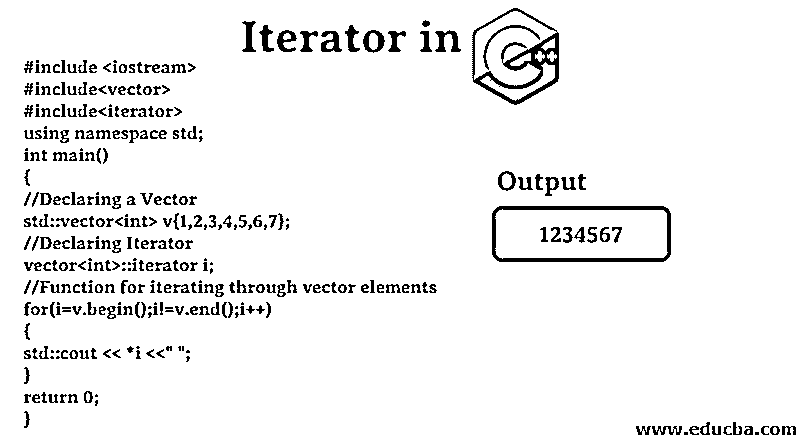
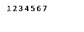
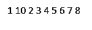

# C++中的迭代器

> 原文：<https://www.educba.com/iterator-in-c-plus-plus/>




## C++中迭代器的介绍

遍历存储在不同类型容器(如数组、向量等)中的高度复杂的数据。，在最小的执行时间是可能的，因为在 C++中的迭代器，一个标准模板库(STL)的组件。不用担心；它只是一个像对象一样的指针，但它很聪明，因为它与你使用的容器无关；它将为所有类型的容器提供一个公共接口，就像算法和容器之间的桥梁一样，使你的算法独立于容器类型。迭代器不仅降低了程序的复杂性，反而使执行时间更快。

例如，sort()算法有两个参数，结束迭代器和开始迭代器，它将[按顺序执行排序](https://www.educba.com/sorting-in-c-plus-plus/),而不管您使用的是什么类型的容器。迭代器允许将通用算法应用于数据结构。数据结构可以使用迭代器来公开一系列元素。

<small>网页开发、编程语言、软件测试&其他</small>

### 使用迭代器的操作

*   **begin():** 这个函数将返回一个迭代器，指向容器的第一个元素。
*   **end():** 这个函数将返回一个迭代器，指向过去容器的最后一个元素。
*   **advance():** 这个函数将迭代器位置递增到指定的参数。
*   **next():** 这个函数将返回新的迭代器，迭代器将在递增自变量中的位置后指向该迭代器。
*   **previous():** 这个函数将返回新的迭代器，迭代器将在递减参数中的位置后指向该迭代器。
*   **inserter():** 这个函数将元素插入到容器中的任意位置。

### 实际实施

实际实现如下:

#### 1.实现迭代器的 C++代码

**代码:**

```
#include <iostream>
#include<vector>
#include<iterator>
using namespace std;
int main()
{
//Declaring a Vector
std::vector<int> v{1,2,3,4,5,6,7};
//Declaring Iterator
vector<int>::iterator i;
//Function for iterating through vector elements
for(i=v.begin();i!=v.end();i++)
{
std::cout << *i <<" ";
}
return 0;
}
```

**输出:**




#### 2.显示迭代器功能的 C++代码

**代码:**

```
#include <iostream>
#include<vector>
#include<iterator>
using namespace std;
int main()
{
//Declaring a Vector
vector<int> v{1,2,3,4,5,6,7,8};
//Declaring Iterator
vector<int>::iterator i;
//Function
v.insert(v.begin()+1,10);
for(i=v.begin();i!=v.end();i++)   {
cout << *i <<" ";
}
return 0;
}
```

**输出:**




### 迭代器类别

从 C++ 17 开始，有 5 种不同类型的迭代器，可以根据功能类型进行分类，如下图所示:

*   **输入迭代器(stdin)** :由于功能有限，它们是所有具有只读和前移功能的迭代器中最弱的。它不能修改容器值。取消引用运算符(*)，不等于运算符(！=)、增量运算符(++)和等于运算符(==)可以用作输入迭代器。此外，对于顺序输入操作。
*   **输出迭代器(stdout)** **:** 迭代器仅用于存储，只写迭代器用于修改容器的值。它们的功能也非常有限。迭代器无法访问元素。赋值运算符(=)和增量运算符(++)可以用作输出迭代器，但只能在单遍算法中使用。
*   **正向迭代器(单链表):**这个迭代器同时包含了输入迭代器和输出迭代器的功能。它可以一步一步地朝某个方向前进。读写容器是最首选的迭代器，它支持重用和保存。它支持上述所有运算符。
*   **双向迭代器(双向链表):**顾名思义，双向迭代器比上面的迭代器更强大。它还支持读写容器。它支持减量运算符(–)。
*   **随机访问迭代器(数组):最强的**迭代器是最强大的迭代器，因为它可以随机读取、写入和访问。类似指针的功能，如指针加法和减法。

### C++中迭代器的优缺点

下面是优点和缺点。

#### 优势

如果你需要从一个元素开始，迭代器当前指向另一个元素，这个元素可能离你当前的迭代器有 n 步远。层次结构中的前四个将花费线性时间来完成，而随机访问迭代器可以在恒定时间内完成，这更有趣，因为这样可以节省时间。这是迭代器提供的最重要的特性。下面还会提到更多。

*   **代码效率:**如果我们有 P 种容器的数据和 Q 件我们想用它们做的事情，那么我们最终会写出 P * Q 个算法。如果数据也有 R 种不同的类型，那么我们可能会使用 P * Q * R 算法。所以通过使用迭代器的[，我们可以在 P + Q 算法中实现它。我们节省了 90%的时间和工作。将代码的效率提升到一个新的水平。效率背后的概念是源序列上的输入迭代器和目标序列上的输出迭代器不必是同一类型。](https://www.educba.com/iterator-in-java/)
*   **动态处理:**迭代器具有动态功能，比如在同一个容器中进行[交换](https://www.educba.com/swapping-in-c-plus-plus/)，可分配副本，递增，解引用，递减。迭代器提供了向容器中移除和动态添加元素的功能。因为所有迭代器都可以递增，所以输入迭代器可以与一个值进行比较和解引用。双向迭代器可以递减。主要方面是编写一个函数，并将其用于任何容器。

#### 不足之处

*   你不能以某种复杂的方式同时从一种数据结构转移到另一种数据结构。迭代器在那种情况下不起作用。
*   如果你正在处理一个链表，忘记了一些东西，现在你想返回，你不能这样做，因为迭代器不会以那种方式工作。
*   如果您需要在遍历期间更新结构，您也不能这样做，因为存储其位置的迭代方式。

### 结论

当[使用迭代器](https://www.educba.com/iterators-in-c-sharp/)时，为了提高代码效率，请记住这两点。总是将迭代器传递给函数，而不是容器。你不应该返回容器，而应该返回或传递迭代器。您可以使用迭代器获取任何元素[，取消引用，并将一对迭代器传递给算法。](https://www.educba.com/iterators-in-python/)

### 推荐文章

这是一个 C++中迭代器的指南。这里我们讨论迭代器中的操作，类别，代码和输出的优点和缺点。您也可以浏览我们的其他相关文章，了解更多信息——

1.  [c++中的数组](https://www.educba.com/arrays-in-c-plus-plus/)
2.  [什么是 C++](https://www.educba.com/what-is-c-plus-plus/)
3.  [C++数组函数](https://www.educba.com/c-plus-plus-array-functions/)
4.  [c++中的循环](https://www.educba.com/loops-in-c-plus-plus/)


