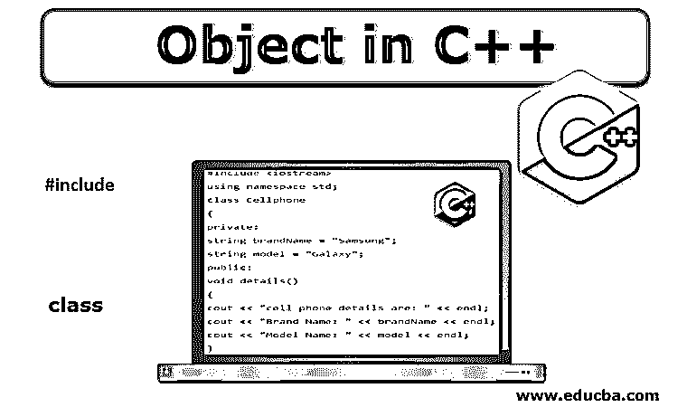

# C++中的对象

> 原文：<https://www.educba.com/object-in-c-plus-plus/>




## C++中的对象介绍

C++是面向对象的[编程语言](https://www.educba.com/what-is-a-programming-language/)；其中的一切都与类和对象相关联。该类将对应于类似于现实生活中的实体的蓝图，并且它将定义它。对象可以被认为是蓝图的实际实体。对象在 C++语言中起着非常重要的[作用](https://www.educba.com/what-is-c-plus-plus/)；编程时几乎在任何地方都会用到它。C++里的一切都是围绕着对象玩的；因此有必要理解 C++中的对象。

### 如何在 C++中创建一个对象？

在我们创建一个实际的对象之前，有必要先创建它的类。如上所述，一个类就像一个蓝图，一个对象将使用该类进行实例化。一个类将定义对象中的内容。基本上，这个类定义了两个主要的东西。首先是属性或一个事物可以表达为一些数量或任何东西；在 C++类比中称为数据成员。第二个被定义的东西是某种动词或动作，或者任何我们可以执行的东西；这就是所谓的成员函数。成员函数(第二项)将作用于类中定义的数据成员(第一项)。

<small>网页开发、编程语言、软件测试&其他</small>

现在我们来看看如何在 C++中创建一个对象。

首先，让我们看看定义简单类的例子。

```
#include <iostream>
using namespace std;
class Cellphone
{
private:
string brandName = "Samsung";
string model = "Galaxy";
public:
void details()
{
cout << "cell phone details are: " << endl;
cout << "Brand Name: " << brandName << endl;
cout << "Model Name: " << model << endl;
}
};
```

例如，可以看到，我们定义了一个名为手机的类。

让我们创建一个这个类的对象；对象是一个类的实际实例。下面是一个创建对象的例子。创建一个类的对象非常简单。

```
int main()
{
Cellphone obj; //defining an object of type Cellphone
return 0;
}
```

该类是用户定义的数据类型，在我们的例子中，它是一部手机。如您所见，定义对象的语法在某种程度上很简单。它以我们为其创建对象的类名开始，后面是用户选择的对象名。在这个例子中，我们在 main 方法中定义了名为 obj 的类 cellular 的对象。我们也可以在程序中作用域后面的任何地方定义对象。

### C++中对象的属性

在上面的部分中，我们说我们在定义一个类的同时定义了两件事；第一个是属性。这些在类中明确声明的属性或值被称为“属性”。每个类或对象都有与之相关的相应属性。在我们的手机类示例中，我们已经定义了 brandName 和 model 属性。属性将与类相关；这使得理解代码变得容易。

让我们在示例中再添加一个名为 cellNo 的属性。

```
class Cellphone
{
private:
string brandName = "Samsung";
string model = "Galaxy";
int cellNo = 123;
public:
void details()
{
cout << "cell phone details are: " << endl;
cout << "Brand Name: " << brandName << endl;
cout << "Model Name: " << model << endl;
}
};
```

如您所见，我们添加了一个新的属性 cellNo，其数据类型为 Integer。

属性实现了数据封装和数据隐藏。由于属性对应于数据，我们将它包装到定义的类中，这意味着数据被封装。在我们的例子中，我们在私有修饰符中声明了数据字段；因此，这个类之外的任何人都不能访问定义的字段。这实现了 C++中的数据隐藏。

### C++中对象的方法

我们在课堂上声明的第二件事是方法。任何与动作或活动相关的东西都可以在类的方法中定义。在我们的例子中，我们定义了一个名为 details 的方法。这是一个打印手机详细信息的公共方法。方法只不过是定义在类中的函数。方法用于执行与该类特别相关的操作。我们可以按照方法中的要求执行任何事情。类方法可以访问公共和私有定义的数据成员。

让我们在示例中再添加一个方法。这种方法将显示手机的手机号码。

```
#include<iostream>
using namespace std;
class Cellphone
{
private:
string brandName = "Samsung";
string model = "Galaxy";
int cellNo = 123;
public:
void details()
{
cout << "cell phone details are: " << endl;
cout << "Brand Name: " << brandName << endl;
cout << "Model Name: " << model << endl;
}
void cellNumber()
{
cout << "Cell Number: " << cellNo << endl;
}
};
```

我们添加了一个新方法 cellNumber()。该方法将在屏幕上显示单元格编号。因为我们已经声明了一个对象，所以我们将调用这两个方法，并将看到输出。使用对象调用方法[是一项简单的任务。](https://www.educba.com/object-in-python/)

```
int main()
{
Cellphone obj; // defining an object of type Cellphone
obj.details(); // call method details() of class
obj.cellNumber(); // call method cellNumber() of class
return 0;
}
```

**输出** **:**

手机详情如下:

品牌名称:三星

型号名称:银河

单元格编号:123

### 结论

所以，对象在 C++中起着重要的作用。C++中的一切都围绕着一个对象。要声明一个对象，必须定义它的类。每个对象都有两种类型的字段属性和方法。属性与数据变量/成员相关，方法与作用于数据成员的函数相关。数据成员和方法一起很容易提供数据封装和数据隐藏功能。

### 推荐文章

这是一个 C++对象指南。这里我们讨论如何在 C++中用对象的属性和方法创建一个对象。您也可以看看以下文章，了解更多信息–

1.  [c++中的重载](https://www.educba.com/overloading-in-c-plus-plus/)
2.  [c++中的迭代器](https://www.educba.com/iterator-in-c-plus-plus/)
3.  [c++中的平方根](https://www.educba.com/square-root-in-c-plus-plus/)
4.  [c++中的构造函数和析构函数](https://www.educba.com/constructor-and-destructor-in-c-plus-plus/)


