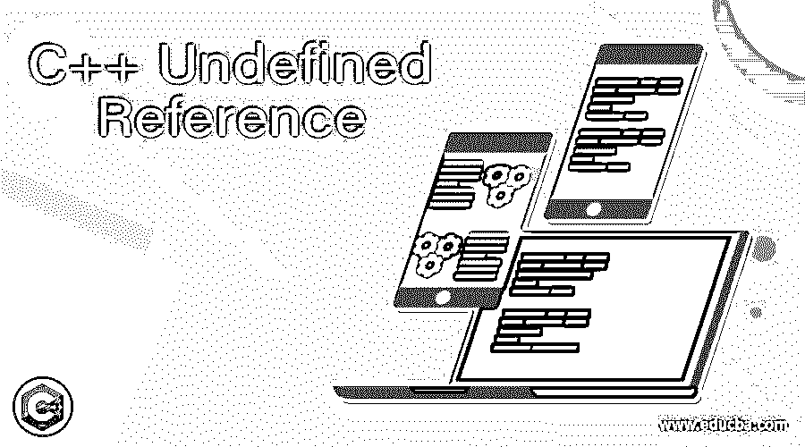
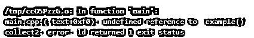
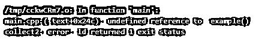

# C++未定义的引用

> 原文：<https://www.educba.com/c-plus-plus-undefined-reference/>




## C++未定义引用简介

在 C++中，未定义引用是一种错误，当我们必须创建任何类型的对象引用(如类、函数、变量， 枚举创建后，它将在任何需要的地方使用链接器将找不到它的定义，但它可用于搜索被引用的对象，包括文件和库。如果链接器找不到它对创建的对象的定义，那么将会出现问题，并抛出名为“未定义的引用错误”的错误。该错误将出现在 C++代码中对象创建和链接阶段的不同阶段。

**语法:**

<small>网页开发、编程语言、软件测试&其他</small>

在 C++中，每个对象、变量、关键字和函数都有自己的语法和属性，用于在编程代码中声明。根据需求，我们将利用编程库中的特殊关键字、变量、数据类型和函数。未定义的引用是函数的预定义错误之一，每当方法的格式没有正确链接到代码的对象创建时，它就被用来调用。

```
#include<iostream>
using namespace std;
data type function name();
data type main()
{
function name();
--some c++ coding logics--
}
data type function name(parameters)
{
--some c++ coding logics—
}
```

在上面的代码中，我们使用一些参数声明了函数 name()，但是在 main 方法中，调用函数时没有参数，所以当编译代码时，它会产生未定义的引用错误。

### C++中未定义引用是如何工作的？

C++有 n 个保留的关键字、函数，这些函数将从实际的名称空间以及新的库提供某种程度的抽象，这些新的库已经被程序员使用，以允许它更多地关注编码概念。它还使编写编程代码和使用相同的方法(如 destroying()或任何其他属于垃圾收集的默认方法)清理代码变得更加容易，它是销毁不需要的代码和清理内存空间区域的主要区域。它取决于数据类型，必须计算对象创建大小，并且它为大存储数据类型变量和小存储变量分配内存空间。通常情况下，C++声明和指令是与某种内存空间一起使用的，这些内存空间是为函数分配的，用于将它存储在 RAM 中。函数声明和定义将成为协议的标准类型，它将所有类型的成员和函数都计算在当前和未来的范围内。

每当我们使用方法或函数时，它将被称为 main()方法，它必须用于在堆内存中创建实例。函数将是有效的它必须是函数的参数或非参数被调用的函数作为链接文件和库的引用对象链接器有时不能从对象定义中获取引用。这些必须是应该包括的各种有效类型的原因，即使编码者也忘记在 main 方法中定义对象，这是在编译时收到未定义引用错误的原因。函数声明有时也会错误地从一种方式定义到另一种方式，因为我们在代码中使用了任何类型的对象，但定义与我们在方法中实际调用的不同。文件在编译时也使用了不止一个源文件，但实际上，这些文件是单独编译的，所以对象没有正确链接，所以也产生了未定义的引用错误。

### 例子

下面是几个演示未定义引用的例子。

#### 示例#1

**代码:**

```
#include <iostream>
using namespace std;
struct demo {
virtual void one(int) { std::cout << "demo::one\n"; }
void two(char)        { std::cout << "demo::two\n"; }
void three(int)         { std::cout << "demo::three\n"; }
protected:
int a;
typedef int val;
};
struct demo1 : demo {
using demo::a;
using demo::val;
using demo::one;
void one(int) { std::cout << "demo1::one\n"; }
using demo::two;
void two(int) { std::cout << "demo1::two\n"; }
using demo::three;
void three(int) { std::cout << "demo1::three\n"; }
};
int example();
int main()
{
demo1 i;
demo& d = i;
int m;
i.a = 3;
i.one(3);
i.one(3);
i.two(2);
i.two('k');
i.three(3);
i.three(3);
cout<<"Please enter your number:";
cin>>m;
if(m>=0)
cout<<"Welcome User the absolute value of your input is:"<<m;
else
cout<<"Thank you User your absolute value of the input is"<<-(m);
example();
return 0;
}
```

**输出:**




#### 实施例 2

**代码:**

```
#include <iostream>
#include <string>
#include <cstring>
using namespace std;
bool demo(char a)
{
return (a >= '0' && a <= '9')
? true
: false;
}
int demo1(char* s)
{
if (*s == '\0')
return 0;
int b = 0;
int s1 = 1;
int p = 0;
if (s[0] == '-') {
s1 = -1;
p++;
}
for (; s[p] != '\0'; ++p) {
if (demo(s[p]) == false)
return 0;
b = b * 10 + s[p] - '0';
}
return s1 * b;
}
int example();
int example(int eg)
{
cout<<"Welcome To My Domain";
}
int main()
{
char c[] = "-987654";
int output = demo1(c);
printf("%d ", output);
int m = -3;
long n = -87645;
int l = abs(m);
long w = abs(n);
cout << "abs(" << m << ") = |" << m << "| = " << l << endl;
cout << "abs(" << n << ") = |" << n << "| = " << w << endl;
example();
return 0;
}
```

**输出:**




#### 实施例 3

**代码:**

```
#include <iostream>
#include <string>
using namespace std;
extern int a;
extern void demo();
void demo1() {
++a;
demo();
}
int main() {
cout<<"Welcome To My Domain";
demo1();
demo();
}
```

**输出:**

**T2】**


 **### 结论

一般来说，编程代码是用一些逻辑编写的，这些逻辑有时会产生 bug。但是程序员在编译期间写完代码后面临错误，所以它探索所有的持续时间，包括分段错误、未解决的一些外部操作符或符号，以及任何时候代码中未定义的引用错误。

### 推荐文章

这是一个 C++未定义引用的指南。这里我们讨论一下 C++中未定义引用的介绍和工作原理？并分别给出了几个例子。您也可以看看以下文章，了解更多信息–

1.  [C++可变](https://www.educba.com/c-plus-plus-mutable/)
2.  [C++保留()](https://www.educba.com/c-plus-plus-reserve/)
3.  [C++ shuffle()](https://www.educba.com/c-plus-plus-shuffle/)
4.  [C++ push_back](https://www.educba.com/c-plus-plus-push_back/)


**