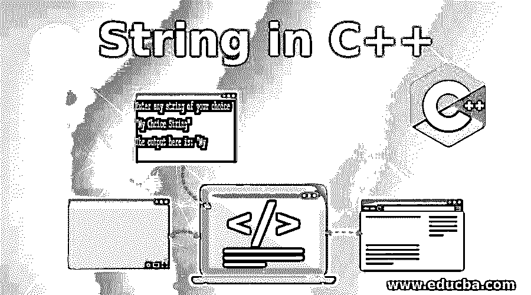
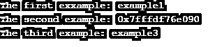
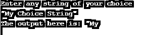
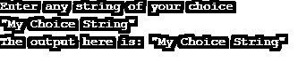
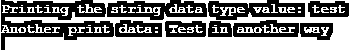
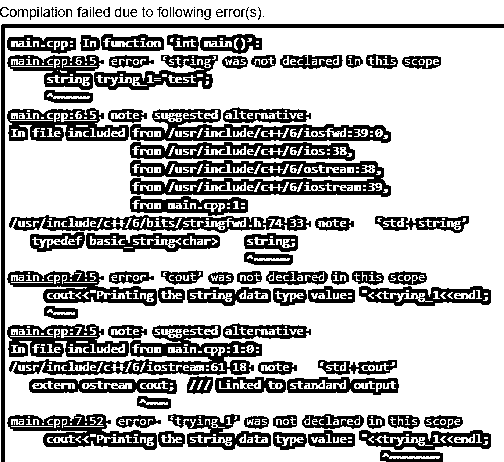
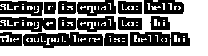

# C++中的字符串

> 原文：<https://www.educba.com/string-in-c-plus-plus/>




## C++中的字符串介绍

String 是 C++中的一个库函数，它帮助执行程序中所有与字符串相关的操作。还有一种“字符串”数据类型，它被分配给包含一组字符的变量，这些字符用双引号括起来。赋给变量的任何连续字符称为字符串变量。在这里，我们来看看 C++编程语言中字符串数据类型的用法。

**语法:**

<small>网页开发、编程语言、软件测试&其他</small>

以下是字符串数据类型的语法:

```
string (data type ) trying (variable) = "Test" (Value assigned to variable)
```

**解释:**在上述语法中，括号内的文字是关于如何理解该语法的。根据上述语法，用“字符串”数据类型表示的变量成为字符串变量，并且字符串变量被赋值。将变量赋值的这一部分称为初始化。

**Note:** That the data type of string is with alphabet ’s’ not ‘S’ (Notice the case).

**语法:**

```
string (data type) trying_2 (variable) ("Test in another way") à (value assigned to variable);
```

在上面的表示中，数据类型和变量被赋给值，而没有再次使用括号和引号的“等于”赋值运算符。

### 规章制度

关于 C++字符串必须要做的主要观察是“字符串”也是一个处理任何 C++函数的库。

在 C++中，两种类型的字符串表示格式是可行的。一种方法是使用 C 编程语言中使用的“char”数据类型，另一种方法是使用 string 数据类型本身。“char”数据类型用于表示数组。但是建议使用“字符串”数据类型，因为“字符”数组本质上是静态的。如果内容值小于所表示的数组的大小，那么多余的空间就被浪费了。另一方面，“弦”本质上是动态的。

在给“字符串”赋值和初始化时必须小心。如果我们通过数组的方式将值初始化为字符串，肯定会产生错误。所以我们需要使用“char”数据类型。下面是同样的例子:

**代码:**

```
#include <iostream>
using namespace std;
int main()
{
string ex1="example1";
string ex2[]="example2";
char ex3[]="example3";
cout<<"The first exxample: "<<ex1<<endl;
cout<<"The second example: "<<ex2<<endl;
cout<<"The third example: "<<ex3<<endl;
```

**输出:**




*   根据输出，数组声明将给出存储的值的位置的输出。

**Note:** That in declaring and initializing strings, there can be any number of words.

**代码:**

```
#include <iostream>
using namespace std;
int main()
{
string big="I am writing many words";
cout<<"The output here is: "<<big;
```

**输出:**


*   现在，让我们看看如何改变给定字符串中的字符。

**代码:**

```
#include <iostream>
using namespace std;
int main()
{
string h="Happy";
cout<<"The output here is: "<<h<<endl;
h[1]='A';
cout<<"The output here is: "<<h;
}
```

**输出:**


*   现在让我们给出字符串作为用户输入值，这显然是简单易行的。

**代码:**

```
#include <iostream>
using namespace std;
int main()
{
string r;
cout<<"Enter any string of your choice"<<endl;
cin>>r;
cout<<"The output here is: "<<r;
```

**输出:**




*   这里得到的输出只是在编译器遇到一个空格之前。
*   现在，要获得用户输入的整行内容，可以执行以下操作:

**代码:**

```
#include <iostream>
using namespace std;
int main()
{
string r;
cout<<"Enter any string of your choice"<<endl;
getline(cin,r);
cout<<r;
}
```

**输出:**




*   使用“getline”函数，我们可以在输出下得到完整的用户给定输入。
*   “cstring”库帮助我们使用该库中内置的不同函数。其中一些是 strcat、strcmp、strcpy、strlen 等，它们分别处理字符串连接、比较、复制和查找字符串长度。

### C++中的字符串示例

让我们看下面这个与字符串相关的例子:

#### 示例#1

**代码:**

```
#include <iostream>
using namespace std;
int main()
{
string trying_1="test";
string trying_2 ("Test in another way");
cout<<"Printing the string data type value: "<<trying_1<<endl;
cout<<"Another print data: "<<trying_2;
```

**输出:**




#### 实施例 2

现在让我们接受一个没有名称空间声明的条件。

**代码:**

```
#include <iostream>
//using namespace std;
int main()
{
string trying_1="test";
cout<<"Printing the string data type value: "<<trying_1<<endl;
```

**输出:**




#### 实施例 3

现在，如果我们使用之前的 std 函数并检查输出，会怎么样:

**代码:**

```
#include <iostream>
//using namespace std;
int main()
{
std::string trying_1="test";
std::cout<<"Printing the string data type value: "<<trying_1<<std::endl;
```

**输出:**


#### 实施例 4

让我们用一个小程序详细说明一个字符串库的 char 数据类型:

**代码:**

```
#include <iostream>
using namespace std;
#include <cstring>
int main()
{
char r[10]="hello";
char e[5]=" hi";
cout<<"String r is equal to: "<<r<<endl;
cout<<"String e is equal to: "<<e<<endl;
strcat(r,e);
cout<<"The output here is: "<<r;
```

**输出:**




现在，通过将数据类型保持为 string 而不是 char 来进行同样的尝试，并分析输出。所以在这里，这不仅适用于“字符串”函数或数据类型，而且使用名称空间声明也很重要，否则我们必须在每个声明前面使用“std”以使其更有效。

**Note:** As an exercise try practicing different ways of handling strings and its functions by doing them all by yourself.

### 结论

至此，我们已经了解了 C++编程语言中与字符串相关的不同模块。字符串在任何编程语言中都是一个非常重要的概念，因为它处理分析和实现连续字符。在编写任何不同的完整程序时，学习如何使用它们是必要的。坚持练习，享受学习 C++的乐趣。

### 推荐文章

这是一个 C++中的字符串指南。在这里，我们讨论了 c++中字符串的介绍、语法和各种示例，以及适当的代码和输出。您也可以阅读以下文章，了解更多信息——

1.  [Java 中的字符串](https://www.educba.com/string-in-java/)
2.  [在 Java 中反转字符串](https://www.educba.com/reverse-string-in-java/)
3.  [c++中的 ifstream](https://www.educba.com/ifstream-in-c-plus-plus/)
4.  [c++中的 size()](https://www.educba.com/size-in-c-plus-plus/)


