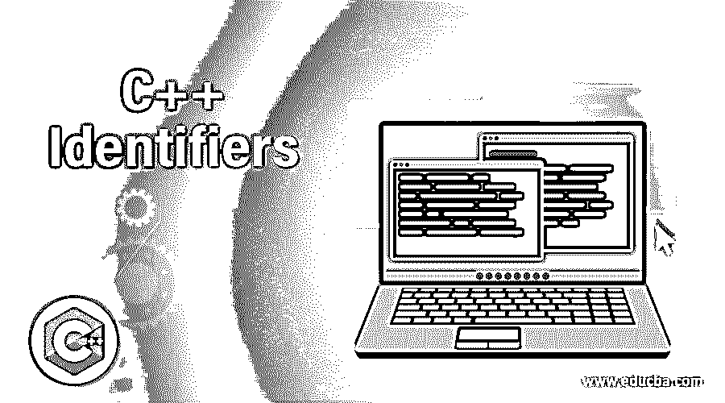
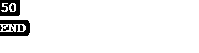
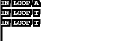
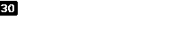
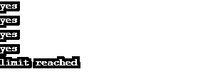
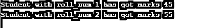
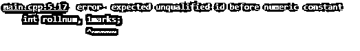

# C++标识符

> 原文：<https://www.educba.com/c-identifiers-plus-plus/>




## C++标识符简介

标识符是指字母和数字的唯一组合，可以是简短的，也可以是描述性的，用于唯一地标识编程语言中的变量、方法、类或任何其他对象。C++中的标识符可以包含任意长度的字符。这些字符可以是字母数字，即可以包含字母、数字、下划线、空格和特殊字符，如@、#、！等等都是不允许的。这些标识符必须以字母或下划线开头，并且区分大小写，因此关键字不能用作标识符。

### 解释所有 C++标识符

标识符用于表示各种对象，例如:-

<small>网页开发、编程语言、软件测试&其他</small>

*   1.常数
*   2.变量
*   3.功能
*   4.标签
*   5.定义的数据类型

#### 声明标识符的规则

让我们理解一些规则来声明它们，否则编译器会抛出一个错误。

*   **规则 1** :可以是字母、数字或下划线的组合，不能有#、$、！标识符名称中允许有@字符。
*   **规则二**:第一个字符可以是字母，也可以是下划线(_)。这意味着如果我们使用 digit 作为标识符(如 1num)名称的第一个字符，它将不会被视为有效名称，因此编译器将抛出一个错误。
*   规则 3 :区分大小写，这意味着 NUM1 和 num1 不是同一个标识符。
*   **规则 4** :关键字不能作为标识符使用。C++库有一个不同用途的关键字列表，如 if、else、long、int、float、goto 等。这些变量不能用作标识符名称，因为这个词在 C++库中有保留的含义。

### C++标识符是如何工作的？

让我们了解如何在中使用标识符

#### 1.常数

常量是在程序执行过程中其值不能改变的变量。这些可以使用#或 const 关键字声明。

##### 常数的例子

**常量的有效标识符示例**

1.  常数 int _sum
2.  常量浮动测试 1
3.  车辆数量限制
4.  #定义编号 10

**无效标识符示例**

1.  常量浮点 2 数据 1
2.  常量字符名称-1
3.  常数 int else

让我们通过下面的例子来理解它，在这个例子中，我们用#define 声明了常量。此处 1My-Char 已被注释，因为标识符名称不能包含“-”，并且必须以字母或(_)开头。

**代码:**

```
#include <iostream>
#define NUM1 10
#define NUM2  5
#define MyChar1 'E'
#define MyChar2 'N'
#define MyChar3 'D'
//#define 1My-Char
using namespace std;
int main()
{
int  mul;
mul = NUM1 * NUM2;
cout<<mul;
cout<< '\n';
cout<< MyChar1;
cout<< MyChar2;
cout<< MyChar3;
return 0;
}
```

**输出:**




#### 2.变量

这些名称用于保存在程序执行期间将要更改的值。声明变量的语法是

**语法:**

```
data_typevariable_name1 =value1
```

**有效变量标识符**

1.  int num1 =30
2.  float val2 = 40
3.  char name = 'A '

**无效标识符**

1.  int 1num =30
2.  char my-var = ' r '的缩写形式

在下面的例子中，我们声明了遵循标识符规则的 mul，my_Charvariable 标识符。

**代码**

```
#include <iostream>
using namespace std;
int main()
{
int  mul;
char my_Char='A';
int i=0;
for(i=0;i<3;i++){
cout<<"IN LOOP"<<'\t'<<my_Char<<'\n';
my_Char='T';
}
return 0;
}
```

**输出:**




#### 3.功能

这是指一组旨在执行一个独立任务的语句，必须给它们一个可以识别的名称。这里使用了标识符。

**有效功能标识符**

```
int myFun1(){
//group of statments
}
```

**无效标识符**

```
int  my-Fun1(){
// - is not allowed in identifier’s name
}
```

让我们理解这个例子，看看作为函数名使用的标识符。

**代码:**

```
#include <iostream>
using namespace std;
int sum4(int a,int b){
return a*b;
}
int main()
{
int res;
res=sum4(5,6);
cout<<res;
return 0;
}
```

**输出:**




#### 4.标签

它们用于标记程序中的一行，与 goto 关键字一起使用，将程序执行的控制权直接传递给该语句。

有效的标识符名称-

1.  myLabel:
2.  m2344:

无效的标识符名称–

1.  我的标签:
2.  常数:

下面是一个使用标签标识符的例子。

**代码:**

```
#include <iostream>
using namespace std;
int main()
{
int i;
for(i=0;i<6;i++){
if(i==4){
goto label1;
}
else cout<<"yes"<<'\n';
}
label1: cout<<"limit reached";
}
```

**输出:**




#### 5.用户定义的数据类型

这些是用户定义的数据类型，用于将不同数据类型的值存储在一起。C++中允许 3 种用户定义的数据类型

1.  结构
2.  列举型别
3.  联盟

这些数据类型的名称是使用标识符给出的。

**有效标识符**

```
structStudent
{
introll_name;
int marks ;
}
```

**无效标识符**

```
Struct Student-1{
int 3roll_name;
}
```

下面是一个使用标识符作为用户数据定义的数据类型的例子。

**代码**:

```
#include <iostream>
using namespace std;
struct Student
{
int roll_num, marks;
};
int main()
{
int i;
struct Student s1 = {1,45};
struct Student s2 = {2,55};
cout<<"Student with roll_num "<<s1.roll_num <<" has got marks "<<s1.marks;
cout<<'\n';
cout<<"Student with roll_num "<<s2.roll_num <<" has got marks "<<s2.marks;
return 0;
}
```

**输出:**




让我们看一个例子，如果我们使用的标识符不符合上述规则:-

**代码:**

```
#include <iostream>
using namespace std;
struct Student
{
int rollnum, 1marks;
};
int main()
{
int i;
}
```

**输出:**




### 结论

标识符是数字、字母和下划线(_)的组合，以字母或下划线开头，可用作变量、常量、函数名或用户数据类型变量。所有标识符都必须遵循一些规则，否则编译器将无法识别，并会抛出错误，并且不能是 C++库中定义的关键字之一。

### 推荐文章

这是一个 C++标识符的指南。在这里，我们详细讨论了 5 个 C++标识符是如何工作的，包括使用的规则和用代码和输出实现的例子。您也可以浏览我们的其他相关文章，了解更多信息——

1.  [C++结构构造函数](https://www.educba.com/c-pluse-pluse-struct-constructor/)
2.  [C++数据类型](https://www.educba.com/c-plus-plus-data-types/)
3.  [C++标准模板库](https://www.educba.com/c-plus-plus-standard-template-library/)
4.  [C++算法](https://www.educba.com/c-plus-plus-algorithm/)


