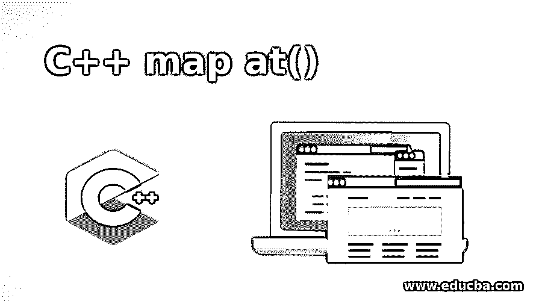
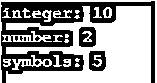
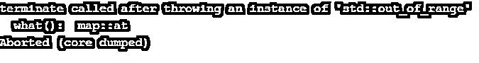
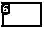
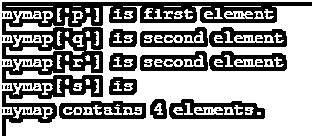
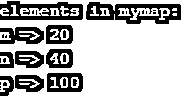

# 位于()的 C++映射

> 原文：<https://www.educba.com/c-plus-plus-map-at/>




## 位于()的 C++ map 简介

映射是与容器中存在的元素相关联的容器，在某种程度上是以映射的方式设计的。每个元素都有自己的映射，映射包含一个键值和一个映射值。如果一个映射中的任意两个值相同，那么它们永远不能被映射。Mapped at()意味着关联的 at()函数将被用作引用元素，用于引用映射到作为 at()函数的参数给出的键值的元素，并且将返回带有该定义元素的字符串。在本主题中，我们将学习位于()的 C++ map。

### 句法

```
Map_name.at(key_value)
```

语法流是以这样的方式安排的:映射用某个名称命名，然后键值是将用于获取映射到该元素的键值的参数。返回值是指向给定键值的直接引用的元素。有些值或元素以及可能发生错误和异常的条件会导致错误和异常，例如，如果键不在定义的范围内，它将抛出异常，如 out_of_range。除了保证抛出异常，没有其他强异常。

<small>网页开发、编程语言、软件测试&其他</small>

### C++ map at()函数是如何工作的？

每一个函数都有自己的工作模式，C++ map at()函数也是如此，让我们围绕它的工作方式展开。

与 C++映射相关联的 At()函数首先检查容器的范围，然后明确地抛出异常，指出元素不在范围内，而另一方面，operator 不检查容器的范围，并且每当元素不在范围内时显示未定义的行为，以同时访问序列中的元素。此外，实际的 map at()函数和前面提到的操作符(operator)之间只有一点不同，操作符从不检查某个已定义范围内的元素，而是在访问不在该范围内的元素时给出一个未定义的行为。

一个键值与 at 函数相关联，该函数试图访问映射中定义的元素。一旦键值位于范围内，并且满足数据名称和 at()函数之后的所有条件，则返回必要的键值。此外，数据映射中的键是否令人满意在很大程度上取决于映射的范围。如果不是，那么在执行期间还有机会返回一些异常或错误，说超出范围或不在定义的范围内。

如果 map 对象被定义为常量，那么该函数返回对映射元素或数据结构的引用。如果这个条件也得到满足，那么再次回忆映射的类型元素将是返回类型。

它的时间复杂度也被定义为其大小的对数值。迭代器的有效性没有变化。并且存在的数据或元素依赖于在执行时进行的竞争，以这样的方式，让我们说容器包含数据结构中的一组元素，如 Map。在访问该容器的条件下，就像常量或常量版本都不能被修改一样，则被访问的映射值可能被调用者修改。同时访问或修改其他元素是非常安全的。

对于异常或无错误函数，不应该在容器中执行任何更改，否则它将抛出一个超出范围的错误或作为错误的异常。

地图运算符和地图查找是地图功能的一部分，不同于地图 at()功能的工作方式。

### ()中的 C++映射示例

下面是实现下面提到的 C++ map at()函数的例子。

#### 示例#1

这个程序演示了 Map at()函数，其中 at()是一个与 Map 相关联的函数，以一些数字作为输入。

**代码:**

```
#include <iostream>
#include <string>
#include <map>
int main ()
{
std::map<std::string,int> mymap = {
{ "integer", 0 },
{ "number", 0 },
{ "symbols", 0 } };
mymap.at("integer") = 10 ;
mymap.at("number") = 2;
mymap.at("symbols") = 5;
for (auto& x: mymap) {
std::cout << x.first << ": " << x.second << '\n';
}
return 0;
}
```

**输出:**




#### 实施例 2

程序演示定义的地图元素超出范围时的错误和异常，异常和错误为超出范围**。**

**代码:**

```
#include <iostream>
#include <map>
#include <string>
using namespace std;
int main()
{
map<string, int> mymap;
mymap["welcome"] = 1;
mymap["to"] = 2;
mymap["the"] = 3;
mymap["educba learning platform"] = 4;
cout << mymap.at("thanks for visiting");
return 0;
}
```

**输出:**




#### 实施例 3

程序演示元素访问与数字可访问性的数字作为一个元素定义。

**代码:**

```
#include <iostream>
#include <map>
#include <string>
using namespace std;
int main()
{
map<string, int> mymap;
mymap["hi"] = 5;
mymap["welcome"] = 6;
mymap["to"] = 7;
mymap["portal"] = 8;
cout << mymap.at("welcome");
return 0;
}
```

**输出:**




#### 实施例 4

演示 map 操作符()的程序，它的功能与 map at()函数有些相似，只是有所不同。

**代码:**

```
#include <iostream>
#include <map>
#include <string>
int main ()
{
std::map<char,std::string> mymap;
mymap['p']="first element";
mymap['q']="second element";
mymap['r']=mymap['q'];
std::cout << "mymap['p'] is " << mymap['p'] << '\n';
std::cout << "mymap['q'] is " << mymap['q'] << '\n';
std::cout << "mymap['r'] is " << mymap['r'] << '\n';
std::cout << "mymap['s'] is " << mymap['s'] << '\n';
std::cout << "mymap contains " << mymap.size() << " elements.\n";
return 0;
}
```

**输出:**




#### 实施例 5

这个程序演示了 map find()函数，它的功能与 map at()函数有些相似，只是有一点不同。

**代码:**

```
#include <iostream>
#include <map>
int main ()
{
std::map<char,int> mymap;
std::map<char,int>::iterator it;
mymap['m']=20;
mymap['n']=40;
mymap['o']=80;
mymap['p']=100;
it = mymap.find('o');
if (it != mymap.end())
mymap.erase (it);
std::cout << "elements in mymap:" << '\n';
std::cout << "m => " << mymap.find('m')->second << '\n';
std::cout << "n => " << mymap.find('n')->second << '\n';
std::cout << "p => " << mymap.find('p')->second << '\n';
return 0;
}
```

**输出:**




### 结论

Map at()函数在 C++中是一个非常有用的函数，因为它让元素的可访问性及其函数在运行函数时返回明确的异常或描述幕后事实的错误。它与其他运算符功能(如地图运算符和地图查找)有很大不同。

### 推荐文章

这是位于()的 C++映射指南。这里我们讨论实现 C++ map at()函数的语法和例子，以及它是如何工作的。您也可以看看以下文章，了解更多信息–

1.  [c++中的宏](https://www.educba.com/macros-in-c-plus-plus/)
2.  [c++中的矩阵乘法](https://www.educba.com/matrix-multiplication-in-c-plus-plus/)
3.  [c++中的文件处理](https://www.educba.com/file-handling-in-c-plus-plus/)
4.  [c++中的 2D 数组](https://www.educba.com/2d-arrays-in-c/)


