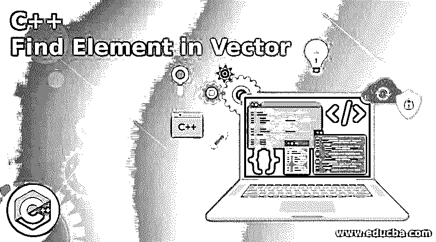
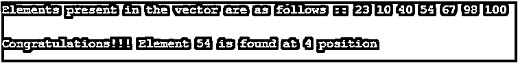

# C++在向量中查找元素

> 原文：<https://www.educba.com/c-plus-plus-find-element-in-vector/>




## 向量中 C++查找元素的定义

C++提供了在向量的给定元素范围内查找元素的功能。这是由 find()函数完成的，该函数在比较 vector 元素范围[first，last 中的第一个元素和 val(要搜索的值)时返回一个迭代器。如果在该范围内没有找到要搜索的 val，则该函数返回 last。这个函数最大的优点是，一旦在列表中找到第一个要搜索的元素，它就停止搜索并遍历整个范围。

**语法:**

<small>网页开发、编程语言、软件测试&其他</small>

下面给出了使用 find()函数在 vector 中搜索元素的基本语法:

```
InputIterator(InputIterator first, InputIterator last, val_search)
```

在哪里，

*   **first:** 向量序列[first，last 范围内元素的第一个/初始位置。
*   **last:**vector 序列[first，last]范围内元素的最后/最后位置。
*   **val_search:** 向量序列范围内要搜索的值。
*   **返回值:**如果在范围[first，last]中找到该元素，则返回该元素第一次出现的迭代器，如果在序列中没有找到该元素，则返回' last'。

**Note:** C++ find() function uses the == operator in order to compare the elements with the value ‘val’ to be searched.

### C++中如何求向量中的元素？

如前所述，在 C++中，find()函数用于查找 vector 中的元素，它查找序列中第一个出现的具有线性时间复杂度的元素。它接受 3 个参数作为输入，即 first、last 和需要搜索的元素。下面提到的是在 vector 中查找元素的一系列步骤:

*   它从范围中元素的初始位置开始。
*   使用==运算符将每个元素与程序员给定的元素值“val”进行比较，并使用循环进一步迭代，直到最后一个。
*   一旦找到元素的第一次出现，它就停止执行并返回指向它的迭代器。
*   否则，如果在序列中没有找到该元素，则返回“last”。

### 实现 C++在 Vector 中查找元素的例子

让我们借助 C++示例让事情变得更清楚:

#### 示例#1

使用 find()函数只是为了检查元素是否存在。

**代码:**

```
#include <iostream>
#include <vector>
#include <algorithm>
using namespace std;
intmain()
{
// Initializing the vector elements
vector<int>vec = { 100, 200, 300, 400, 500, 600, 700 };
//Inputting the element to be searched in vector
intsearch_element = 500;
//creating an iterator ‘it’ to store the result
vector<int>::iterator it;
//using the find() function and storing the result in iterator ‘it’
it = find(vec.begin(), vec.end(), search_element);
//checking the condition based on the ‘it’ result whether the element is present or not
if (it != vec.end())
cout<< "Congratulations!!! element " <<search_element<< " is present in Vector ";
else
cout<< "Sorry the element " <<search_element<< " is not present in Vector" ;
return 0;
}
```

**输出:**


**说明:**在上面的例子中，我们使用了 3 个不同用途的头文件，分别是 std: :cout 的 iostream，std : :vector 的 vector，std : :find 的 algorithm。向量“vec”被初始化为其元素，并且要搜索的元素在变量“search_element”中给出。iteratot“it”用于存储 find()函数的结果。find()函数提供了 3 个参数，即元素的第一个、最后一个位置和要搜索的元素。然后使用 if 和 else 语句检查 find()函数条件。如果“it”保存的值不等于“last”元素的位置，则在序列中找到该元素，否则不找到。

#### 实施例 2

使用 find()函数搜索元素并在 vector 中找到它的索引。

**代码:**

```
#include<iostream>
#include <vector>
#include <algorithm>
using namespace std;
int main ()
{
//Initializing the vector elements
vector<int> vec_1 { 23, 10, 40, 54, 67, 98, 100 };
// Inputting the Element that is to be searched in vector
intval = 54;
// Printing the original vector elements
cout<< "Elements present in the vector are as follows ::";
for (int j=0; j<vec_1.size(); j++)
cout<< " " << vec_1[j] ;
cout<< "\n";
cout<< "\n";
// using the find function to search the element proving all the parameters
auto res = find (vec_1.begin(), vec_1.end(), val);
//checking if the variable 'res' has index of 'last' or not
if (res != vec_1.end())
{
cout<< "Congratulations!!! Element " <<val<<" is found at ";
cout<< res - vec_1.begin() + 1 << " position \n" ;
}
else
cout<< "Sorry the given element is not found in Vector.";
return 0;
}
```

**输出:**




**说明:**在上面的代码中，整数类型的 vector‘vec _ 1’用其中的值初始化。要搜索的元素存储在变量“val”中。首先，使用“for”循环将所有向量元素打印在控制台上。vec_1.size()、vec_1.begin()、vec_1、end()等基本函数用于查找向量的大小、向量中元素的初始位置和最终位置。find()函数用于提供所有 3 个参数，即初始位置、最终位置和要搜索的元素。结果存储在迭代器“res”中，然后根据 find()函数条件对其进行检查。如果其值不等于最终向量位置，则在向量中找到该元素，否则在向量序列中找不到该元素。

程序中需要注意的一件重要事情是找到被搜索元素的索引。因为变量“res”保存找到的元素的第一个出现的索引，所以从“vec_1.begin()中减去它，这是向量“vec_1”中第一个元素的位置。由于索引从 0 开始，所以在最后添加 1，以根据用户的视点显示确切位置。

### 结论

上面的描述清楚地解释了 find()函数以及如何在 C++ vector 程序中使用它来搜索序列中的一个元素。std : : count 也用于相同的目的，但 std::find 被认为是最有效的方法，因为 count 用于遍历整个列表，而 find 则在找到元素后停止。C++还提供了 std : : find_if、std : :none_of 等函数，这些函数用于查找序列中的元素。

### 推荐文章

这是一个 C++矢量查找元素的指南。这里我们讨论 c++中向量的定义和如何求元素？以及不同的示例及其代码实现。您也可以看看以下文章，了解更多信息–

1.  [c++中的 malloc()](https://www.educba.com/malloc-in-c-plus-plus/)
2.  [C++ push_back](https://www.educba.com/c-plus-plus-push_back/)
3.  [C++读取文件](https://www.educba.com/c-plus-plus-read-file/)
4.  [C++ endl](https://www.educba.com/c-plus-plus-endl/)


