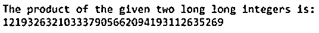
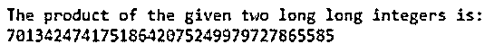
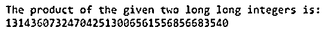

# C++ Boost

> 原文：<https://www.educba.com/c-plus-plus-boost/>


## C++ Boost 简介

对伪随机数生成、线性代数、正则表达式、多线程、单元测试等任务和结构的支持。是用 C++编程语言通过使用一组称为 161 个独立库的 boost 的库来提供的。这是一个方便的库，广泛用于不同的领域，有大量的应用程序。使用数据类型为大整数的 boost 库，可以轻松获得 1024 的精度。使用 boost 库的一个例子是当我们在 C++中处理范围跨越 long double 数据类型的非常非常长的数字时。

**c++中 Boost 库的语法:**

<small>网页开发、编程语言、软件测试&其他</small>

```
(Big_integer_datatype) firstlargenum * secondlargenum;
```

其中，Big_integer_datatype 可以是 int128_t、int256_t、int512_t 或 int1024_t 数据类型，firstlargenum 和 secondlargenum 是两个要相乘的长整型数。

```
cpp_int_datatype variablename;
```

其中 cpp_int_datatype 是任意精度的数据类型，当我们不确定将来需要什么精度时，就使用它。

### 在 C++中使用 Boost 库

*   对伪随机数生成、线性代数、正则表达式、多线程、单元测试等任务和结构的支持。，是用 C++编程语言通过使用一组称为 boost 的库提供的。
*   C++中的 boost 库由 161 个独立的库组成。这是一个方便的库，广泛用于不同的领域，有大量的应用程序。
*   在使用具有大整数数据类型的 boost 库时，很容易获得 1024 的精度。
*   当我们不确定将来需要什么精度时，boost 库可以用于任意精度的数据类型。

### C++ Boost 示例

以下是 C++ Boost 的示例:

#### 示例#1

这是一个 C++程序，演示了 boost 库将两个范围跨越 C++中 double 数据类型范围的大数相乘。

**代码:**

```
//the iostream and boost libraries are included to be able to make use of cin, cout and  multiply very very long integers
#include <iostream>
#include <boost/multiprecision/cpp_int.hpp>
using namespace boost::multiprecision;
using namespace std;
//main method is called
int main()
{
//two very very long integers are stored in two respective variables called first and second  and then multiplied with each other and stored in a variable of type big data integer type  prod and then their product is displayed as the output on the screen
long long first = 123456789987654321;
long long second=987654321123456789;
int128_t prod = (int128_t) first * second;
cout << "The product of the given two long long integers is:" << "\n" << prod;  return 0;
}
```

**输出:**




在上面的程序中，包含了 iostream 和 boost 库，以便能够利用 cin、cout 和乘以非常非常长的整数。然后调用 main 方法，在该方法中，两个非常长的整数存储在两个分别称为 first 和 second 的变量中，然后彼此相乘并存储在 big data integer 类型 prod 的变量中，然后它们的乘积作为输出显示在屏幕上。

#### 实施例 2

这是一个 C++程序，演示了 boost 库将两个范围跨越 C++中 double 数据类型范围的大数相乘。

**代码:**

```
//the iostream and boost libraries are included to be able to make use of cin, cout and  multiply very very long integers
#include <iostream>
#include <boost/multiprecision/cpp_int.hpp>
using namespace boost::multiprecision;
using namespace std;
//main method is called
int main()
{
//two very very long integers are stored in two respective variables called first and second  and then multiplied with each other and stored in a variable of type big data integer type  prod and then their product is displayed as the output on the screen
long long first = 567894321432156789;
long long second= 123498765123498765;
int128_t prod = (int128_t) first * second;
cout << "The product of the given two long long integers is:" << "\n" << prod;  return 0;
}
```

**输出:**




在上面的程序中，包含了 iostream 和 boost 库，以便能够利用 cin、cout 和乘以非常非常长的整数。然后调用 main 方法，在该方法中，两个非常长的整数存储在两个分别称为 first 和 second 的变量中，然后彼此相乘并存储在 big data integer 类型 prod 的变量中，然后它们的乘积作为输出显示在屏幕上。

#### 实施例 3

这是一个 C++程序，演示了 boost 库将两个范围跨越 C++中 double 数据类型范围的大数相乘。

**代码:**

```
//the iostream and boost libraries are included to be able to make use of cin, cout and  multiply very very long integers
#include <iostream>
#include <boost/multiprecision/cpp_int.hpp>
using namespace boost::multiprecision;
using namespace std;
//main method is called
int main()
{
//two very very long integers are stored in two respective variables called first and second  and then multiplied with each other and stored in a variable of type big data integer type  prod and then their product is displayed as the output on the screen
long long first = 1023847560192837465;
long long second= 128374651029384756;
int128_t prod = (int128_t) first * second;
cout << "The product of the given two long long integers is:" << "\n" << prod;  return 0;
}
```

**输出:**




在上面的程序中，包含了 iostream 和 boost 库，以便能够利用 cin、cout 和乘以非常非常长的整数。然后调用 main 方法，在该方法中，两个非常长的整数存储在两个分别称为 first 和 second 的变量中，然后彼此相乘并存储在 big data integer 类型 prod 的变量中，然后它们的乘积作为输出显示在屏幕上。

### 推荐文章

这是一个 C++ Boost 的指南。这里我们分别讨论 boost 库在 C++中的介绍、工作以及例子。您也可以看看以下文章，了解更多信息–

1.  [C++静态](https://www.educba.com/c-plus-plus-static/)
2.  [C++静态转换](https://www.educba.com/c-plus-plus-static_cast/)
3.  [C++ sort()](https://www.educba.com/c-plus-plus-sort/)
4.  [C++ push_back](https://www.educba.com/c-plus-plus-push_back/)


