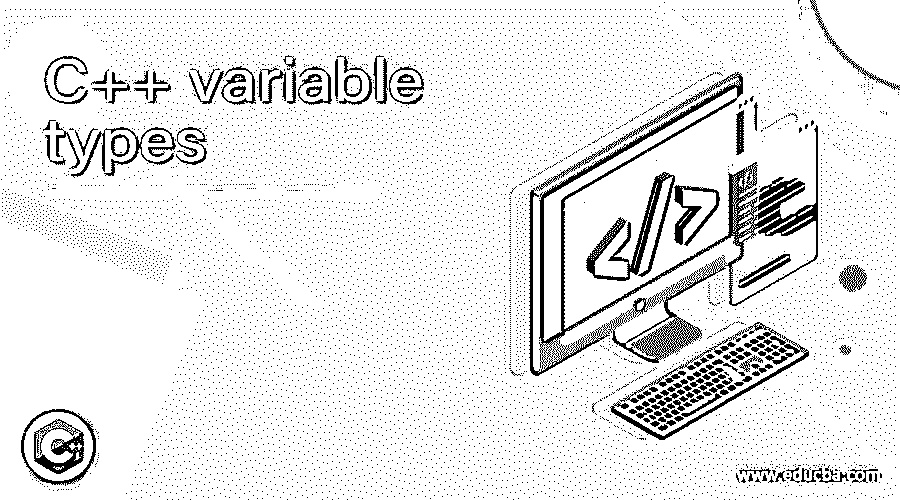
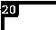
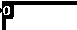

# C++变量类型

> 原文：<https://www.educba.com/c-plus-plus-variable-types/>




## C++变量类型介绍

以下文章提供了 C++变量类型的概述。C++变量作为一个容器来存储所需数据的值，然后可以很容易地操作这些带有存储的变量。每个变量都有一个特定的数据类型，它决定了变量内存的整体布局和大小，变量内存中存储了一些值和一组操作。变量的名称会相应地变化，并且可以相应地定义和操作它们。C++中有各种类型的变量用于处理，比如 bool、int、char、double、float、wchar_t 和 void。

**c++变量类型的语法**

<small>网页开发、编程语言、软件测试&其他</small>

C++中定义变量有一个特定的语法流，表示如下:

```
Type_variable = value;
```

其中变量的创建必须需要一些值来分别指定类型和赋值。

在上面的表示中，Type 表示 C++类型之一，可以是 int、double、char 等。，后跟变量名 then =表示正在创建内存，并且变量已准备好将输入作为 Type_variable 中的值。

某些工作条件在 C++变量中很普遍，比如这些变量首先需要初始化、定义，然后声明。

*   变量基本上是任何内存位置的名称，它被认为是内存分配器和存储任何程序或值的基本单元。
*   对变量执行的操作会影响内存位置，而不仅仅是变量本身。
*   它被要求在执行时调用或使用所有变量之前声明它们。
*   变量名可以由大写和小写字母、数字和带有某些字符的下划线组成，但决不能以整数开头。
*   有时在变量声明和变量定义之间会出现混淆，而前面提到的变量声明需要在执行时被另一个变量使用之前完成。
*   另一方面，变量定义负责分配任何内存位置和值。通常，变量声明和变量定义是同时进行的。
*   根据 C++中变量的作用域，有三种类型的变量:局部变量、实例变量和静态变量。
*   局部变量支持所有数据类型，因为范围仅限于局部变量。它不检查存在于变量局部范围之外的其他方法。
*   这种类型的局部变量只能在块内访问，不能在方法或块外访问。
*   实例变量是 C++中的变量类型，它们是非静态变量，在方法或任何其他构造函数或块之外的类中声明。如前所述，这些类型的变量不能访问任何局部变量。
*   静态变量是 C++中的变量类型，也称为类变量，这些变量的行为有点像实例变量，唯一的区别是静态变量是在类内和任何方法或构造函数外用关键字 Static 声明的。
*   根据需求，任何静态变量都只有一个静态变量的副本，而不管要创建多少个对象。这种变量是在程序执行时创建的，一旦执行完成，就会被销毁。
*   如果声明这些类型的变量时没有各自的关键字，它们将在执行时抛出编译错误。

### C++变量的类型

下面提到了不同类型的 c++变量:

#### 1.（同 Internationalorganizations）国际组织

C++中的 Int 变量具有机器内部整数内存分配的自然大小。

**举例:**

这个程序演示了根据需求使用的整型变量，它只对输出中显示的整型变量有效。

```
#include <iostream>
using namespace std;
int main()
{
int int_var = 20;
cout << int_var;
return 0;
}
```

**输出:**




#### 2.线

字符串类型变量用于保存文本形式或混合字符形式的任何变量，以及作为输入给出的文本类型的值。

**举例:**

这个程序演示了一个变量声明，它仅以字符串的形式保存值，如输出所示。

```
#include <iostream>
using namespace std;
int main()
{
string str_txt = "Welcome_Everyone.";
cout << str_txt;
return 0;
}
```

**输出:**


#### 3.两倍

该变量负责保存双精度浮点值。

**举例:**

这个程序演示了保存双浮点类型值的变量，也就是说，它可以保存输出中显示的带小数的浮点值。

```
#include <iostream>
using namespace std;
int main()
{
double m_float_nm = 6.20;
cout << m_float_nm;
return 0;
}
```

**输出:**


#### 4.茶

该变量负责保存与字符相关的值，以单个八位字节(一个字节，也是整数类型)的形式保存。

**举例:**

这个程序演示了在变量中保存任意字符类型值的变量，如输出所示。

```
#include <iostream>
using namespace std;
int main()
{
char m_char = 'P';
cout << m_char;
return 0;
}
```

**输出:**


#### 5.弯曲件

这种类型的变量负责保存数据类型为布尔格式的值。它将值 0 表示为假，将 1 表示为满足真的任何值。

**举例:**

这个程序演示了输出中显示的带有假或真值的布尔值。

```
#include <iostream>
using namespace std;
int main()
{
bool m_bool = false;
cout << m_bool;
return 0;
}
```

**输出:**




### 结论

C++变量和 C++中的变量类型在实现和执行任何程序中起着至关重要的作用。因为它是任何程序集的一部分，所以必须严格遵守概念和规则；否则，将很难按要求获得实际输出。

### 推荐文章

这是一个 C++变量类型的指南。在这里，我们讨论各种类型的 C++变量以及示例和输出。您也可以看看以下文章，了解更多信息–

1.  [C++ unique()](https://www.educba.com/c-plus-plus-unique/)
2.  [C++双精度](https://www.educba.com/c-plus-plus-double/)
3.  [C++无符号整型](https://www.educba.com/c-plus-plus-unsigned-int/)
4.  [C++内存集](https://www.educba.com/c-plus-plus-memset/)


