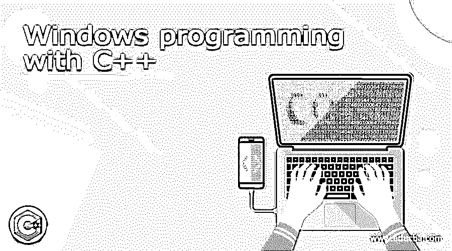

# 用 C++进行 Windows 编程

> 原文：<https://www.educba.com/windows-programming-with-c-plus-plus/>




## Windows 编程的定义

Windows 编程的同义词是 C/C++编程语言，因为其中的操作系统是用 C 编写的。尽管是纯面向对象的语言，但大多数开发人员都试图学习 C/C++语言，因为它为学习和实现 Windows 编程奠定了基础。所有主要的嵌入式软件都是用 Windows 编程编写的。NET framework 也是用 windows 编程语言编写的。它使文件和文件夹以扩展名保存。cpp 用于保存，需要包含“stdafx.h”用于检索文件和消息。

**语法:**

<small>网页开发、编程语言、软件测试&其他</small>

使用 C++进行 Windows 编程有一个正确的语法流，表示如下:

```
# include "stdafx.h"
#include<Windows.h>
Int WINAPI Winmain(Hinstance hinstnc, Hinstance hPrevInstnc, Pstr szcmd, int icmdshw)
{
MessageBox(NULL, Text("welcome_.."), Text("welcome"), Mb_ok);
Return 0;
}
```

每一个都有意义，

*   **Windows.h:** 表示 Windows 程序的头文件。
*   **WINAPI:** 它代表 Windows 应用程序编程接口，让编译器明白程序包含图形用户组件而不是控制台组件。
*   **WinMain:** 它作为 windows 程序的主程序，将四个函数作为参数。
*   这作为实例的一个句柄，因为它意味着面向对象的编程由于其他一些原因而被处理，并且与其他新的实例程序员混合实现。
*   PSTR: 这代表指向字符串的指针，这意味着它只作为一个 char*指针，但差别不大。
*   **消息框:**这是一种方法，同义地用作打印相关消息的打印语句。
*   **MB_Ok:** 代表#定义一个函数，确认文本的打印或显示是正确的。

### 如何用 C++创建 Windows 编程？

使用 C++创建 Windows 编程时，需要考虑某些先决条件，例如:

*   根据要求安装 Visual Studio 代码(版本)。
*   转到主菜单，然后选择“文件”>“新建”>“项目”，在对话框中打开并创建一个新项目。所有这些都将在 Visual Studio 代码中完成。
*   在对话框的顶部，只需将语言设置为 C++，然后将平台设置为 Windows，然后将项目类型设置为桌面。
*   此外，选择项目类型为 Windows 桌面向导，然后选择下一步进行进一步操作。
*   选择为项目创建桌面相关按钮。
*   然后开始创建用于编辑和操作的代码。

让我们深入了解 Windows 桌面应用程序所需的代码的创建:

*   正如 C 和 C++程序具有启动程序流的主要函数一样，在 windows 编程的情况下，它包含启动程序流的 WinMain 函数，表示如下:

```
int WINAPI WinMain (
_ip_ HINSTANCE hInstnce,
_Ip_op_t_ HINSTANCE hPrvInstnc,
_Ip_ LPSTR lp_cmd_line,
_Ip_ int k_CmdShow_0
);
```

*   为了表明它正在使用 Windows 桌面程序运行，理解需要包含的头很重要，如<windows>、<tchar.h>。如果已经将 Unicode 声明为代码的一部分，那么就不需要专门使用 tchar，如果启用的话，只需要直接使用 wtchar。表示如下:</tchar.h></windows>

```
#include<windows.h>
#include<wtchar.h>
```

*   WinMain()函数用于每个 windows 桌面应用程序，只要有一些事件发生在 windows 上进行转换，就可以调用和使用该函数。假设开发者试图点击窗口上的 Ok 按钮，该事件将在存在 WinMain()函数的情况下发生，其中回调函数包括具有明确意义的参数:

```
Lrslt_Call Windw_Proc (
Ip_Hd hwndow,
Ip_Uint Msg,
Ip_Wprm wprm,
Ip_Lprm lprm)
```

### 例子

让我们讨论 windows 编程的例子。

#### 示例#1

这个代码片段是一个示例，演示了如何在窗口类中注册，如下所示。

```
const wchar_t CLASS_NAME [] = L"Welcome_Demo_Class";
WINDW_CLASS wc_0 = { };
wc_0.lpfnWndw_Proc = WindowProc_0;
wc_0.hInstance_1 = hInstance_c;
wc_0.lpszClassName_0 = CLASS_NAME_1;
```

**说明:**

一旦窗口与窗口类相关联，它将把所有的类名和实例参数注册到主程序中。这将给 WINDW_CLASS wc_0 作为一个指向窗口提示的指针以供参考。一旦附加到主类，所有的事件都将与主类相关联。CLASS_NAME_1 标识引用主窗口的窗口类。然后这个 WINDW_CLASS 用 register 类注册。这使得 window 类向在其余类变量和成员中定义的结构注册。

#### 实施例 2

有一种方法可以通过调用 CreateWindowExp 函数来创建一个新的窗口实例，该函数还有一些参数供参考。

```
HWND hwnd_0 = CreateWindowExp (
0,
CLASS_NAME,
L"New to windows programming",
WS_OVERLAPPEDWINDOW,
CW_USE_DEFAULT, CW_USE_DEFAULT, CW_USE_DEFAULT, CW_USE_DEFAULT,
NULL,
NULL,
hInstance,
NULL
);
if (hwnd_0 == NULL)
{
return 0;
}
```

**说明:**

这里，该函数 createWindowexp 用于为许多操作创建窗口类的新实例，其中参数具有不同的重要性级别，从类名、窗口文本、用于定位和调整大小的默认变量开始，给出空值和实例，然后使 CreateWindowExp 用于注册实例，如果它变为空，则它将返回值。

#### 实施例 3

这个程序演示了在任何 windows 编程中正确显示消息的代码片段，从而增强了理解和可视性。

```
MSG msg_0 = { };
While (getMessage (&msg_0, NULL, 0, 0) > 0)
{
TranslateMessage (&msg_0);
DispatchMessage (&msg_0);
}
```

**说明:**

在这里，作为 get message 的一部分的消息将使用 TranslateMessage 函数将消息翻译成可理解的格式，然后它将使用 DispatchMessage 调度消息，使程序更加增强。

### 结论

Windows 编程是一种非常通用的编程语言形式，尽管需要对 C/C++有基本的了解才能开发应用程序。所有的。与. NET framework 相关的代码和编译利用了 Windows 编程，这使得开发人员和最终用户的整体体验得到了增强和增强。C++中的 Windows 编程已经发展了很多，并且随着多种技术的结合仍在发展。

### 推荐文章

这是一个用 C++进行 Windows 编程的指南。这里我们讨论定义，语法，如何用 C++创建 Windows 编程？代码实现示例。您也可以看看以下文章，了解更多信息–

1.  [Lua 编程](https://www.educba.com/lua-programming/)
2.  [Python 中的套接字编程](https://www.educba.com/socket-programming-in-python/)
3.  [后端编程语言](https://www.educba.com/back-end-programming-languages/)
4.  [Windows Powershell 命令](https://www.educba.com/windows-powershell-commands/)


