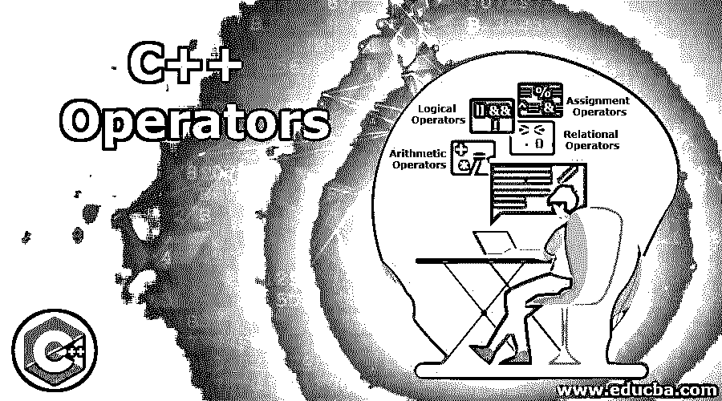

# C++运算符

> 原文：<https://www.educba.com/c-plus-plus-operators/>

## C++运算符简介

运算符是通知编译器执行数学运算的符号；C++提供了各种类型的运算符，如算术运算符、赋值运算符、逻辑运算符、比较运算符和按位运算符。算术运算符用于执行加、减、乘、除等数学运算。赋值运算符用于给另一个变量赋值。比较运算符用于根据条件比较值；逻辑运算符标识变量之间的逻辑。

### C++中的运算符有哪些？

C++中使用的不同类型的运算符如下:

<small>网页开发、编程语言、软件测试&其他</small>

*   算术运算符
*   关系运算符
*   逻辑运算符
*   赋值运算符

#### 1.算术运算符

在 C++中，算术运算符用于执行算术运算，如下所述。

让我们以值分别为 10 和 5 的操作数 a、b 为例。

| **c++中的算术运算符** |
| **操作员** | **描述** | **例子** |
| + | 两个操作数相加 | a + b
将给出 15 |
| – | 左操作数减去右操作数 | a–b
将给出 5 |
| * | 两个操作数的乘法 | a * b会给Fifty |
| / | 左操作数除以右操作数 | a / b会给

Two

 |
| % | 模数–左操作数除以右操作数的余数 | a % b 将给出 0 |
| ++ | 增量运算符，将操作数的值增加 1。 | b++会给 6 |
| — | 减量运算符，将操作数的值减 1。 | b —将给出 4 |

#### 2.关系运算符

关系运算符用于比较操作数之间的值，并根据语句中指定的条件返回**真**或**假**。

| **c++中的关系运算符** |
| **操作员** | **描述** | **例子** |
| > | 如果左操作数的值大于右操作数的值，则条件为真；如果不是，则为假。 | a > b |
| < | 如果左操作数的值小于右操作数的值，则条件为真；如果不是，则为假。 | a < b |
| == | 如果两个操作数的值相等，则条件为真；如果不是，则为假。 | a == b |
| != | 如果两个操作数的值不相等，则条件为真；如果不是，则为假。 | 答！= b |
| >= | 如果左操作数的值大于或等于右操作数，则条件为真；如果不是，则为假。 | a >= b |
| <= | 如果左操作数的值小于或等于右操作数，则条件为真；如果不是，则为假。 | a <= b |

让我们假设操作数 a = 10，b = 5 的值，并执行各种运算来理解关系运算符。

*   当 10 大于 5 时，a > b 给出的结果为真。
*   a < b 将给出假结果，因为 10 大于 5。
*   因为 10 不等于 5，所以 a == b 将给出假结果。
*   答！= b 将给出结果 TRUE，因为 10 不等于 5。
*   当 10 大于 5 时，a >= b 的结果为真。
*   a <= b 将给出假结果，因为 10 不等于或小于 5。

#### 3.逻辑运算符

C++中使用的逻辑运算符如下所示:

| **c++中的逻辑运算符** |
| **操作员** | **描述** | **例子** |
| &#124;&#124; | 它是逻辑或运算符。如果两个操作数中的任何一个不为零，则该条件为真。 | a &#124;&#124; b |
| && | 它是逻辑 AND 运算符。如果两个操作数都不为零，则该条件为真。 | a 和 b |
| ! | 它是逻辑“非”运算符，反转与其一起使用的逻辑运算符的状态。 | !一 |

让我们假设操作数 a = 1，b = 0 的值，并执行各种运算来理解逻辑运算符。

*   当两个操作数之一不为零时，a || b 将为真。
*   a && b 将为假，因为其中一个操作数为零。
*   !当 a 反转操作数的状态时，它将为 0。

#### 4.赋值运算符

C++中使用的赋值操作符如下所示。

| **c++中的赋值运算符** |
| **操作员** | **描述** | **例子** |
| = | 这是一个简单的赋值运算符，它将右侧操作数的值赋给左侧操作数。 | x = y 会将 y 的值赋给 x。 |
| += | 该运算符执行右操作数与左操作数的加法，结果赋给左操作数。 | x += y 解释为 x = x + y |
| -= | 该运算符执行左操作数减去右操作数的运算，结果赋给左操作数。 | x -= y 等于 x = x–y |
| *= | 该运算符执行右操作数与左操作数的乘法，结果赋给左操作数。 | x *= y 等于 x = x * y |
| /= | 该运算符执行左操作数与右操作数的除法运算，结果赋给左操作数。 | x /= y 等于 x = x / y |
| %= | 它取两个操作数的模，结果赋给左操作数。 | x %= y 等于 x = x % y |
| >>= | 这是一个二元右移位和赋值运算符。 | x >> 5 等于 x = x >> 5 |
| <<= | 这是一个二元左移和赋值运算符。 | x << 5 等于 x = x << 5 |
| ^= | 这称为按位异或和赋值运算符。 | x ^= 5 等于 x = x ^ 5 |
| &#124;= | 这称为按位“或”赋值运算符。 | x &#124;= 5 等于 x = x &#124; 5 |
| &= | 这称为按位 AND 赋值运算符。 | x &等于 5 等于 x = x & 5 |

让我们假设 x 的值为 5。使用上面显示的几个赋值操作符执行了几个操作示例。

*   x = 5 会将值 5 赋给 x。
*   x += 3 将给出 x = x +3 的结果，即 5+3= 8 将被分配给 x。
*   x -=2 将给出 x = x +3 的结果，即 5-2= 3 将被分配给 x。

### 推荐文章

这是 C++操作者的指南。这里我们讨论了 C++中使用的不同类型的运算符及其语法和例子。您也可以阅读以下文章，了解更多信息——

1.  [C++命令](https://www.educba.com/c-plus-plus-commands/)
2.  [c++简介](https://www.educba.com/introduction-to-c-plus-plus/)
3.  [C 运算符](https://www.educba.com/c-operators/)
4.  [C 语言中的关系运算符](https://www.educba.com/relational-operators-in-c/)

