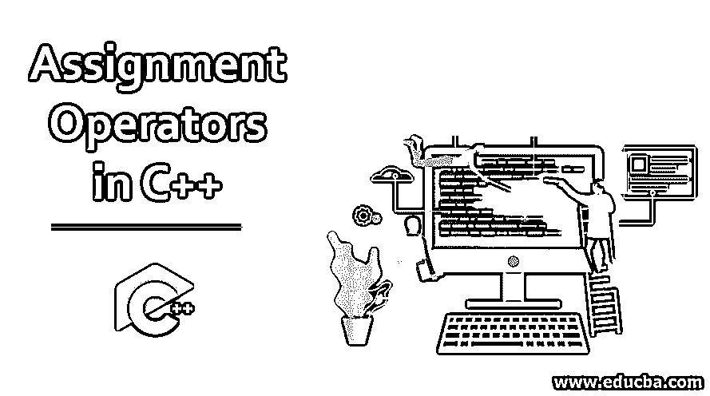
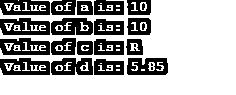
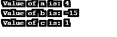
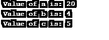
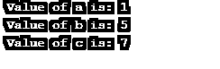

# C++中的赋值运算符

> 原文：<https://www.educba.com/assignment-operators-in-c-plus-plus/>




## C++中赋值运算符简介

这里，让我们开始了解 C++中的赋值操作符。顾名思义，这些运算符有助于为变量赋值。我们就运算符和操作数来讨论这些。这些运算符帮助我们为操作数分配一个特定的值。

主要的简单赋值操作符是“=”。我们必须确保操作符的左右两边必须有相同的数据类型。我们有不同级别的操作员。让我们来了解一下 C++中的每一项。赋值运算符是二元运算符的一部分。例如:=、+=、-=、*=、/=、%=。让我们通过例子来了解这些。

<small>网页开发、编程语言、软件测试&其他</small>

### 赋值运算符

有三个级别的运算符。

*   [一元运算符](https://www.educba.com/unary-operators-in-java/)
*   二元运算符
*   [三元运算符](https://www.educba.com/python-ternary-operator/)

赋值运算符是二元运算符的一部分。

例如:=、+=、-=、*=、/=、%=。让我们通过例子来了解这些。

#### 示例#1

让我们从下面给出的带有' = '操作符的第一个例子开始。

**代码:**

```
#include <iostream>
using namespace std;
int main()
{
int a,b;
char c;
float d;
a=10;
b=10.5;
c='R';
d=5.85;
cout<<" Value of a is: "<<a<<endl;
cout<<" Value of b is: "<<b<<endl;
cout<<" Value of c is: "<<c<<endl;
cout<<" Value of d is: "<<d<<endl;
}
```

**输出:**




因此，作为一个例子，我们可以理解赋值操作符' = '只是基于使用操作数和变量的数据类型来赋值。上面，我们可以看到，对于给定数据类型为 int 的值 b，只给出小数点后的值。只有当我们像变量 d 一样给出数据类型 float 时，完整的值才会显示出来。因此，我们可以说，数据类型在根据不同操作数的值设置和显示它们的值时也起着重要的作用。

#### 示例#2

在这个例子中，让我们学习'+= '这个操作数是如何工作的。

**代码:**

```
#include <iostream>
using namespace std;
int main()
{
int a,b,c;
a=10;
b=5;
c=5;
a+=6;
b+=20;
c=c+20;
cout<<" Value of a is: "<<a<<endl;
cout<<" Value of b is: "<<b<<endl;
cout<<" Value of c is: "<<c<<endl;
}
```

**输出:**


如上所述，我们如何获得变量 c 的值的例子是操作符“+=”如何工作的过程。按照操作数，首先将左侧操作数加到左侧操作数，然后将最终值赋给左侧操作数。这就是“+=”的用法。

#### 示例#3

现在，让我们学习操作数'-= '。这几乎类似于“+=”的情况。上面的操作数将值相加，但在这里它被减去。下面我们来看一个例子。

**代码:**

```
#include <iostream>
using namespace std;
int main()
{
int a,b,c;
a=10;
b=5;
c=5;
a-=6;
b-=20;
c=c-4;
cout<<" Value of a is: "<<a<<endl;
cout<<" Value of b is: "<<b<<endl;
cout<<" Value of c is: "<<c<<endl;
}
```

**输出:**




在这里，我们也给出了变量“c”的例子，说明实际上是如何赋值的。首先，左边的操作数值减去右边的数值。在此过程中，可能会获得负值。

#### 实施例#4

这里让我们一起来看一个赋值操作符*=、/=和%=的例子。

**代码:**

```
#include <iostream>
using namespace std;
int main()
{
int a,b,c;
a=10;
b=20;
c=25;
a*=2;
b/=5;
c%=10;
cout<<" Value of a is: "<<a<<endl;
cout<<" Value of b is: "<<b<<endl;
cout<<" Value of c is: "<<c<<endl;
}
```

**输出:**




现在来解释上面的例子。

*   变量“a”的值是通过将右操作数和值分别乘以左操作数而得到的。
*   变量“b”的值是用左边的操作数除以右边的值得到的。输出是从该除法得到的商。
*   变量 c 的值只能通过除法得到。但是这里的输出值是除法的余数。众所周知，左边的操作数除以右边的值/操作数。

#### 示例#5

现在让我们看看运算符&=，^=和|=是如何如下所示的。

**代码:**

```
#include <iostream>
using namespace std;
int main()
{
int a,b,c;
a=5;
b=6;
c=7;
a&=3;
b^=3;
c|=3;
cout<<" Value of a is: "<<a<<endl;
cout<<" Value of b is: "<<b<<endl;
cout<<" Value of c is: "<<c<<endl;
}
```

**输出:**




我们期待这个结果吗？现在让我们看看它是如何计算的。我们将从' &= '操作开始。下表列出了按位运算符的值。

| **P** | **问** | **P^Q** | **P & Q** | **P&#124;Q** |
| Zero | Zero | Zero | Zero | Zero |
| Zero | One | One | Zero | One |
| One | One | Zero | One | One |
| One | Zero | One | Zero | One |

我们已经知道，' & '是一个按位 and 运算符。因此，对于变量' a '的输出，我们的计算如下。“a”的初始值:二进制中的 5–101。二进制中的正确值是 3–011。现在计算这两者之间的' & '值得到 001。这是正常小数的第一(1)位。这就是我们得到输出的方式。

#### 实施例 6

在这里，让我们了解一下下面给出的运算符。

**代码:**

```
#include <iostream>
using namespace std;
int main()
{
int a,b;
a=5;
b=5;
a>>=1;
b<<=1;
cout<<" Value of a is: "<<a<<endl;
cout<<" Value of b is: "<<b<<endl;
}
```

**输出:**


那么，现在让我们看看这些操作符实际上是如何执行其操作的。对于操作员，> > =；它被称为右移位运算符。首先，左操作数值被转换成它们的二进制表示。这里 a:二进制的 5–101，右边的值是 1 (001)。现在从二进制值向右移动一位，左边的空位被零代替。

101 → _10 1→ 010 1 → 010 → 2(十进制转换)

同样，让我用例子 5>>=2 来解释。

101 → _ _ 1 01 → 001 01→ 001→1(十进制转换)

### 推荐文章

这是 C++中赋值运算符的指南。这里我们分别讨论 C++中赋值运算符的基本概念和各种例子。您也可以浏览我们推荐的其他文章，了解更多信息——

1.  [PHP 中的三元运算符](https://www.educba.com/ternary-operator-in-php/)
2.  [三元运算符 JavaScript](https://www.educba.com/ternary-operator-javascript/)
3.  [C 语言中的赋值运算符](https://www.educba.com/assignment-operators-in-c/)
4.  [c++中的正则表达式](https://www.educba.com/regular-expressions-in-c-plus-plus/)


