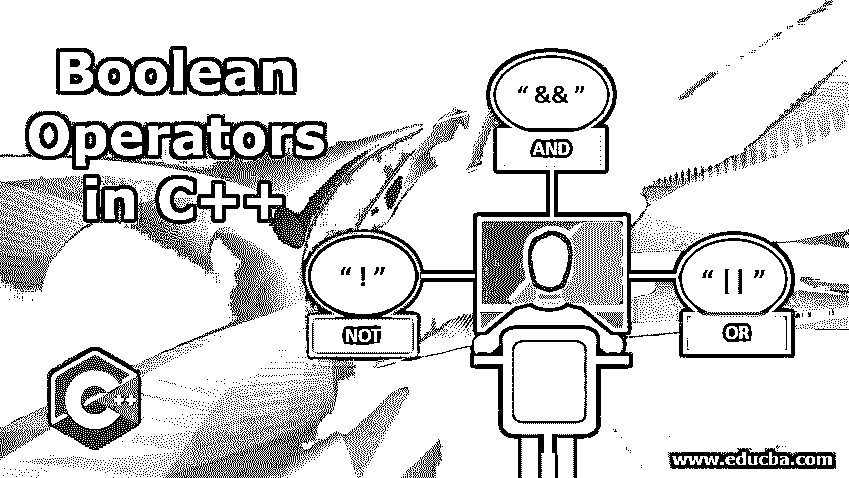

# C++中的布尔运算符

> 原文：<https://www.educba.com/boolean-operators-in-c-plus-plus/>




## C++中布尔运算符概述

布尔运算符用于执行布尔运算，以便验证操作数之间的关系，它返回 0 或 1。这个 0 或 1 输出分别相当于 false 或 true 返回值。在 C++中，为了执行布尔运算以及面向对象概念编程，使用了三种类型的布尔运算符。它们是' && '表示当两个输入都为真时产生真值的 AND 运算，|| '表示当至少一个输入为真时产生真值的 or 运算，以及'！'用于产生与输入值完全相反值的 NOT 运算。

### C++中布尔运算符的例子

下面解释了 c++中布尔运算符的例子。

<small>网页开发、编程语言、软件测试&其他</small>

#### 示例 1–AND 布尔运算符！

这种布尔运算符在 C++编程语言中用“&&”表示，也称为“与”号。这个运算符两边都有条件。所以它从操作符中取左值，然后从操作符中取右值，如果两个值匹配，它返回 true，否则返回 false。简而言之，我们可以说，在常规的英语写作中，我们只在需要两个事物或两个条件都是必要的时候使用 and。这意味着如果两个条件都为真，那么唯一的输出将为真，否则其余的条件将为假。"如果一个表达式需要被证明为真，那么两个条件都必须为真."

下面是 C++代码，演示通过检查年龄和医疗保险的给定范围之间的布尔运算符:

**代码:**

```
#include <iostream>
using namespace std;
int main ()
{
int your_age;
cout << " Please enter your age here: " ;
cin >> your_age;
if ( your_age >= 20 && your_age <= 70 )
{
cout << " Congratulations ! You're between 20 and 70 and you can save money on your medical insurance!" << endl;
}
else
{
cout << " We are so sorry, we don't have any deals for you for this month! " << endl;
}
return 0;
}
```

**输出:**


#### 例 2–或布尔运算符！

这种布尔运算符在 C++编程语言中用“||”表示，也称为逻辑或。这个算子也是两边都有条件的。但它不同于 AND 运算符，因为它是[或运算符](https://www.educba.com/matlab-or-operator/)，这意味着如果任何一方的单个条件为真，那么它将返回一个真值。简而言之，我们可以说，在常规的英语写作中，我们只使用 or，当我们可以从两个选项中选择时，即使其他选项不合适，你也会选择左边的一个。只有一个条件是必要的。这意味着如果任何一个条件为真，那么唯一的输出将为真，否则其余的条件将为假。"如果一个表达式需要被证明为真，那么只有一个条件需要为真."

下面是 C++代码来演示 OR 布尔运算符通过检查给定范围之间的年龄:

**代码:**

```
#include <iostream>
using namespace std;
int main ()
{
int age;
cout << " Please enter your age here: " ;
cin >> age;
if ( age < 0 || age > 125 )
{
cout << " Ha Ha Ha You're lying - you CANNOT be that age. Impossible " << endl;
}
else
{
cout << " Great! Thanks for providing your age ! " << endl;
}
return 0;
}
```

**输出:**


#### 示例# 3–非布尔运算符！

这个布尔运算符用“！”表示在 C++编程语言中，它也被称为逻辑非运算符。这个运营商两边都没有这样的条件。事实上，它只有一个目的，即反转给定布尔表达式的值，因为只有一个表达式可以作为前缀。简而言之，我们可以说，在常规的英语写作中，我们只在不想要某样东西时才使用 not，或者我们可以说不赞成，比如反对。"如果一个表达式需要根据它前面的表达式被证明为假或真，总是使用 NOT 运算符."

下面是通过检查给定范围之间的年龄来演示非布尔运算符的 C++代码:

**代码:**

```
#include <iostream>
using namespace std;
int main ()
{
bool initiate;
cout << " Hey ! Do you really want to initialise the application ? [0: No] [1: Yes] " << endl;
cin >> initiate ; // 0 input is false', and 1 is 'true'
if ( !initiate )
{
cout << " Then why would you open the application ? Haha Funny, too bad, I'm starting now anyway. " << endl;
}
cout << " Application initialized. " << endl;
// you can continue writing the main program code here
return 0;
}
```

**输出:**


### 结论

以上三个代码分别使用三个布尔 C + +操作符进行了演示，例如 AND、OR 和 NOT。每个操作符都有自己的专长，可以根据您想要在软件或程序中实现的功能和操作来使用。当您希望两个给定的条件相同或满足以继续执行代码时，可以使用 AND 运算符。当您希望给定条件中只有一个为真以继续执行代码时，可以使用 OR 运算符。

当您希望给出一条可用于同时处理两条语句的语句时，可以使用 NOT 运算符。总之，C + +编程语言中的布尔运算符在编程中非常有用，因为它有助于在不占用任何内存空间的情况下在几个小时内解决复杂的运算。布尔运算符广泛用于数据库管理，因为它有助于根据给定的查询缩小和扩大搜索范围。

### 推荐文章

这是 C++中布尔运算符的指南。这里我们讨论 c++中布尔运算符的概述和例子，以及代码实现。你也可以看看下面的文章来了解更多-

1.  [c++中的一元运算符](https://www.educba.com/unary-operators-in-c-plus-plus/)
2.  [c++中的存储类](https://www.educba.com/storage-class-in-c-plus-plus/)
3.  [c++中的 Deque？](https://www.educba.com/deque-in-c-plus-plus/)
4.  [c++中的朋友函数](https://www.educba.com/friend-function-in-c-plus-plus/)


