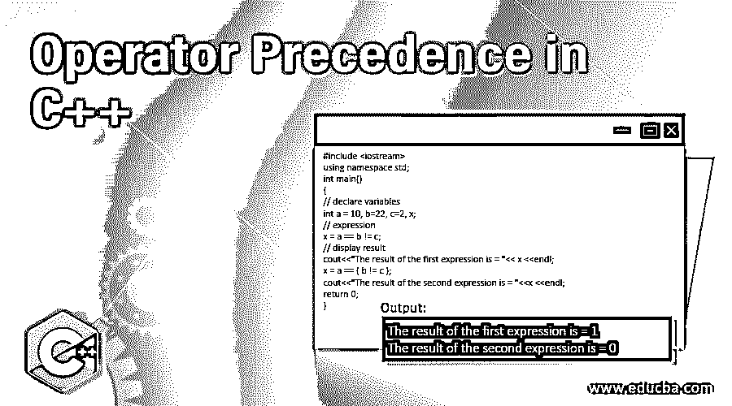

# C++中的运算符优先级

> 原文：<https://www.educba.com/operator-precedence-in-c-plus-plus/>




## C++中运算符优先级介绍

当表达式中存在一个或多个运算符时，运算符优先级决定了表达式中首先计算哪个运算符，然后计算哪个运算符。另一个与表达式相关的术语是运算符结合性。运算符结合律决定了相同运算符优先级的运算符求值方向，结合律可以是从左到右或从右到左。

我们举个例子: **x = 10 + 22 / 2。**

<small>网页开发、编程语言、软件测试&其他</small>

在上面的示例中，结果是 21，而不是 16，因为“/”运算符的优先级高于“+”运算符。

我们举个例子: **x = 10 -20+ 22 / 2。**

在上面的示例中，结果是 1，而不是 19，因为与上面相同的“/”运算符比“+”运算符具有更高的优先级，而“+”和“-”运算符具有相同的优先级，并且它们的结合律是从左到右，因此表达式的计算结果为–

*   x = 10–20+22/2
*   x = 10–20+11
*   x=-10+11
*   x=1

因此，运算符优先级和运算符结合性是运算符的两个特征，它们指定了表达式中求值的顺序。

### C++中前 15 位运算符优先级

接下来，我们在下表中看到了 C++中的运算符优先级和结合性，其中优先级最高的运算符位于顶部，优先级最低的运算符位于底部:

| **类别** | **操作员** | **关联性** |
| 后缀 | '()','[]', '.', '->','++','- -' | 左->右 |
| 一元的 | “-”、“+”、“~”、“！”，'-'，' ++ ' & ' * '(类型)' sizeof ' | 右->左 |
| 增加的 | '/', '*', ' %' | 左->右 |
| 添加剂 | '-', '+' | 右->左 |
| 变化 | '>>', '< | 左->右 |
| 有关系的 | '>', '>=', ' | 左->右 |
| 平等 | '!=', '==' | 右->左 |
| 按位 AND | '&' | 左->右 |
| 按位异或 | '^' | 左->右 |
| 按位或 | '&#124;' | 右->左 |
| 逻辑与 | '&&' | 左->右 |
| 逻辑或 | '&#124;&#124;' | 左->右 |
| 有条件的 | '?:' | 右->左 |
| 分配 | '=','+=','-=','*=','/=', '%=', '>>=', '<<=', '&=','^=', '&#124;=' | 右->左 |
| 逗号 | , | 左->右 |

### 在 C++中实现运算符优先级的示例

下面是提到的例子:

#### 示例#1

**代码:**

```
#include <iostream>
using namespace std;
int main()
{
// declare variables
int a = 10, b=22, c=2, x;
// expression
x= a + b / c;
// display result
cout<<"The result of the expression is = "<<x;
return 0;
}
```

**输出:**


**解释:**和代码中一样，表达式求值输出的是 21，而不是 16 因为先执行'/'运算符，再执行'+'运算符，所以表达式求解为 x = a + ( b / c)。

#### 实施例 2

接下来，我们用下面的例子重写上面的 c++代码来理解运算符优先级重载:

**代码:**

```
#include<iostream>
using namespace std;
int main()
{
// declare variables
int a = 10, b=22, c=2, x;
// expression
x = ( a + b ) / c;
// display result
cout<<"The result of the expression is = "<<x;
return 0;
}
```

**输出:**


**解释:**与代码中一样，表达式被求值并输出 16，而不是 16，因为'( )'首先被执行(作为子表达式)，它有'+'运算符，所以它被执行'然后'/'运算符被执行。

#### 实施例 3

接下来，我们用下面的例子编写运算符结合性的 c++代码:

**代码:**

```
#include <iostream>
using namespace std;
int main()
{
// declare variables
int a = 10, b=22, c=2, x;
// expression
x = a == b != c;
// display result
cout<<"The result of the first expression is = "<< x <<endl;
x = a == ( b != c );
cout<<"The result of the second expression is = "<<x <<endl;
return 0;
}
```

**输出:**


**解释:**如上面代码中第一个表达式运算符== and！=具有相同的优先级，并且结合性是从左到右的，所以 first == and then！=运算符已执行。而且在第二个表情里先！=然后==运算符执行。所以第一个表达式解为:

*   x = a == b！= c
*   x = 10 == 22！= 2
*   x=0！= 2
*   x=1
*   第二个表达式解为–
*   x = a == (b！= c)
*   x = 10 == (22！= 2)
*   x=10 == 1
*   x=0

#### 实施例 4

接下来，我们用下面的例子编写运算符结合性的 c++代码:

**代码:**

```
#include <iostream>
using namespace std;
int main()
{
// declare variables
int a = 10, b=22, c=2, x;
// expression
x = a > b > c;
// display result
cout<<"The result of the first expression is = "<< x <<endl;
x = a < b < c;
cout<<"The result of the second expression is = "<<x <<endl;
return 0;
}
```

**输出:**


**解释:**和上面的代码一样，第一个表达式包含了>运算符，它的结合律是从左到右。所以表达式变成((a > b) > c)，变成(0 > 2)，所以输出是 0。第二个表达式包含结合性从左到右的>运算符。所以表达式变成((a < b) < c)，变成(1 < 2)，所以输出是 1。

### 结论

运算符优先级是运算符的主要特征，当表达式中存在一个或多个运算符时，它决定了表达式中首先计算哪个运算符，而运算符的结合律决定了表达式中相同运算符优先级的运算符计算方向。

### 推荐文章

这是 C++中运算符优先级的指南。这里我们讨论 C++中的运算符优先级和结合性，以及实现的例子。您也可以浏览我们的其他相关文章，了解更多信息——

1.  [C++参考](https://www.educba.com/c-plus-plus-reference/)
2.  [C++运算符[]](https://www.educba.com/c-plus-plus-operator/)
3.  [c#中的运算符优先级](https://www.educba.com/operator-precedence-in-c-sharp/)
4.  [JS 运算符优先级](https://www.educba.com/js-operator-precedence/)


