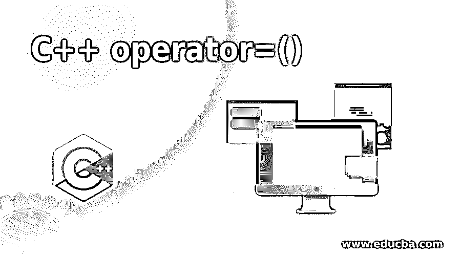

# C++运算符=()

> 原文：<https://www.educba.com/c-plus-plus-operator-equal/>




## C++运算符简介=()

Operator=()是 C++中的赋值运算符重载。运算符重载用于重新定义运算符，以便对用户定义的数据类型进行操作。C++中的运算符重载是一种静态多态性或编译时多态性。在 c++中，除了少数运算符，几乎所有运算符都可以重载。Operator=()是一个赋值运算符重载，它重载赋值运算符并重新定义以对用户定义的数据执行运算。

我们知道赋值运算符给=(等号)表示的变量赋值；它是一个带有 R 值和 L 值的二元运算符，R 值被赋值或复制到 L 值。

<small>网页开发、编程语言、软件测试&其他</small>

所以当赋值操作符重载时，赋值操作符也应该在用户定义的数据类型上执行，这样一个对象(用户定义的数据类型)的所有值都可以复制到另一个对象。

**语法**

下面是提到的语法:

```
return_type : : operator =(Parameter_list )
{
// statements to be executed to overload functionality of an assignment operator.
}
```

运算符是一个运算符函数，其中运算符是所有运算符重载时都会出现的关键字，而=是重载的赋值运算符。

### C++中 Operator=()函数的工作原理及实例

接下来，我们编写 C++代码来更清楚地理解 Operator=()函数的工作原理，在下面的示例中，我们使用 Operator=()函数将一个对象复制到另一个对象，如下所示

#### 示例#1

**代码:**

```
#include <iostream>
using namespace std;
// create user define class
class Employee
{
public:
// declar instance variable
int salary;
Employee( int sal )
{
salary = sal;
}
// Assignment Operators Overloading
Employee operator =(Employee n)
{
Employee temp = n.salary;
return temp;
}
};
int main()
{
// create user deined objects
Employee e1( 20000 );
Employee e2( 25000 );
Employee e3 = e1;
cout<< e3.salary;
return 0;
}
```

**输出:**


如上面的代码中，雇员操作符=(雇员 n)；函数是为赋值运算符重载定义的，因为此处该函数接受雇员类对象作为参数，并且它返回接受的对象薪金，这是在代码 Employee e3 = e1 中使用赋值运算符时分配或复制给另一个对象的内容；一旦编译器遇到 e3 = e1 它调用操作员的语句=(雇员 n)；将函数定义为 e3.operator =(e1)。这里 e1 对象作为参数传递，e3 是调用赋值操作符函数的对象，因此 e1.salary 被赋值或复制到 e3 对象。

接下来，我们重写上面的 C++代码，看看如果我们没有在类中定义 Operator =()函数来将一个对象复制到另一个对象会发生什么，如下所示

#### 实施例 2

**代码:**

```
#include <iostream>
using namespace std;
// create user define class
class Employee
{
public:
// declar instance variable
int salary;
Employee( int sal )
{
salary = sal;
}
// No Assignment Operators Overloading
};
int main()
{
// create user deined objects
Employee e1( 20000 );
Employee e2( 25000 );
Employee e3 = e1;
cout<< e3.salary;
return 0;
}
```

**输出:**


如上面代码中的雇员操作符=(雇员 n)；没有为要重载的赋值操作符定义函数，但是对象 e1 被复制到 e3，因为我们得到了相同的输出 20000。因此，对于用户定义的对象，赋值操作符是重载的，而其他二元操作符，默认情况下没有重载，如“+”、“-”、“*”等。

接下来，我们重写上面的 c++代码，看看如果我们不在类中定义 Operator +()函数来执行对象的添加会发生什么，如下所示

#### 实施例 3

**代码:**

```
#include <iostream>
using namespace std;
// create user define class
class Employee
{
public:
// declar instance variable
int salary;
Employee( int sal )
{
salary = sal;
}
// No addition Operators Overloading
};
int main()
{
// create user deined objects
Employee e1( 20000 );
Employee e2( 25000 );
// addition operator is using on define object which give comple time error here
Employee e3 = e1 + e2;
cout<< e3.salary;
return 0;
}
```

一旦我们编译了上面的代码，我们得到了下面的错误

**输出:**


接下来，我们重写上面的 C++代码来重载 Operator=()函数，它通过某种操作将一个对象复制到另一个对象，如下所示

#### 实施例 4

**代码:**

```
#include <iostream>
using namespace std;
// create user define class
class Employee
{
public:
int salary;
Employee( int sal )
{
salary = sal;
}
// Assignment Operators Overloading
void operator =(Employee n)
{
salary = n.salary + 10000;
}
};
int main()
{
// create user deined objects
Employee e1( 20000 );
Employee e2( 25000 );
e2 = e1;
cout<< e2.salary;
return 0;
}
```

**输出:**


如上面的代码中，雇员操作符=(雇员 n)；函数是为赋值运算符重载定义的，因为此处该函数接受 Employee 类对象作为参数，并且它用传递的对象的薪金加上 1000 来更新调用对象的薪金。因此，当在上面的代码中使用赋值操作符时，雇员 e3 = e1e3 薪金由 e1 对象薪金加 10000 更新或复制。因此，产量是 30000，而不只是 20000。

### 结论

Operator=()在 C++中重载一个赋值运算符，该运算符可用于重新定义赋值运算符，以对用户定义的数据类型执行运算。

### 推荐文章

这是一个 C++ operator=()的指南。这里我们讨论了 C++中 Operator=()函数的介绍和编程实例。您也可以看看以下文章，了解更多信息–

1.  [c++中的宏](https://www.educba.com/macros-in-c-plus-plus/)
2.  [c++中的 2D 数组](https://www.educba.com/2d-arrays-in-c-plus-plus/)
3.  [C++结构](https://www.educba.com/c-plus-plus-struct/)
4.  [c++中的递归](https://www.educba.com/recursion-in-c-plus-plus/)


