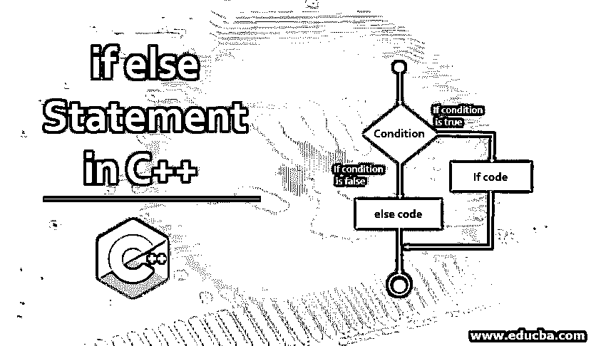
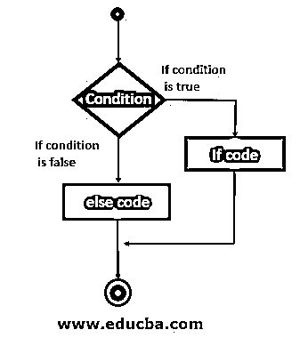

# C++中的 if else 语句

> 原文：<https://www.educba.com/if-else-statement-in-c-plus-plus/>




## C++中 if else 语句介绍

If else 语句是一个条件语句。它用于检查条件，并根据条件执行循环。用 C++语言处理 if else 语句很容易。当我们需要执行同一段代码时，如果给定的条件为真，则使用 if-else 语句，如果条件为假，则执行另一段代码。if 和 if-else 语句是相同的，唯一的区别是在 if 语句中，如果条件为真，则该语句执行，否则它停止程序；而在 if-else 语句中，如果条件为真，则该语句执行，否则它执行 else 后面的语句。在本文中，我们将讨论 C++语言中的条件语句，即 if else 语句。

**c++语言中 if else 语句的语法**

<small>网页开发、编程语言、软件测试&其他</small>

```
if(condition)
{
statement;
}
else
{
statement;
}
```

if 和 else 是用于声明[if else 语句](https://www.educba.com/if-else-statement-in-sql/)的两个关键字。条件是用于评估决策的参数。if 语句在 if 的括号内声明，else 语句在 else 的括号内声明。

### C++中 if else 语句的流程图

下面是以逐步方式定义 if-else 语句工作的流程图:




这里的条件是用菱形符号来定义的。流程图表明，首先它检查条件，如果条件为真，它将流控制转移到 if 语句，如果条件为假，它将流控制转移到 else 语句。

### if else 语句在 C++中如何工作？

正如我们前面讨论过的，这个概念很容易理解。在 if else 语句中，首先检查条件，如果条件为真，则执行 if 体中的代码，跳过 else 语句。如果条件为假，则跳过 if 语句并执行 else 主体。

### 例子

为了更好地理解这个概念，我们将讨论一些在 C++中实现 is else 的例子:

#### 示例#1

C++中 if else 语句的程序

**代码:**

```
#include <iostream>
using namespace std;
int main()
{
int n = 50;
if(n <= 50)
{
cout << "Given number is less than or equal to 50";
}
else
{
cout << "Given number is greater than 50";
}
return 0;
}
```

**解释**

这里我们写了一个简单的程序来检查数字是否小于或等于 50。首先，我们有一个初始化变量 n 到 50。如果关键字检查条件，即 n <= 50。这里我们已经将 n 初始化为 50。所以这里的条件为真，所以它会打印出小于或等于 50 的给定数字。

**输出:**


如果我们将 n 的值更改为 75，条件将变为 false，它将执行 else 语句，然后输出大于 50 的给定数字。

**输出:**


#### 实施例 2

C++中使用 if else 语句检查偶数的程序

**代码:**

```
#include <iostream>
using namespace std;
int main()
{
int n;
cout << "Enter a number ";
cin >> n;
if(n%2 == 0)
{cout << "Entered number is even";
}
else
{
cout << "Entered number is odd";
}
return 0;
}
```

**解释**

这里我们写了一个程序，使用 else 语句检查偶数和奇数。变量 n 被声明并允许用户输入值。变量 n 存储用户输入的值。If 语句检查条件 n%2 == 0，即声明检查偶数。如果用户输入的数字满足条件，它将打印输入的数字是偶数。否则它执行 Else 语句并打印输入的数字是奇数。

**输出:**


#### 实施例 3

使用 if else 语句查找投票资格[的程序](https://www.educba.com/if-else-statement-in-php/)

**代码:**

```
#include <iostream>
using namespace std;
int main()
{
int n;
cout << "Enter a age ";
cin >> n;
if(n >= 18)
{
cout << "Eligible for voting";
}
else
{
cout << "Not eligible for voting";
}
return 0;
}
```

**解释**

这里我们写了一个程序来检查投票资格。变量 sn 被声明并允许用户输入它们的用途。变量将用户的年龄存储到变量 n 中。如果语句检查条件，即 n >= 18。如果年龄大于或等于 18 岁，它将打印投票资格。如果年龄小于 18 岁，它将打印没有投票资格。

**输出:**


### 推荐文章

这是一个 C++中 if else 语句的指南。这里我们讨论 if else 语句在 C++中是如何工作的？以及流程图和相应的示例。您也可以浏览我们的其他相关文章，了解更多信息——

1.  [c++中的 Break 语句](https://www.educba.com/break-statement-in-c-plus-plus/)
2.  [Python 中的 If Else 语句](https://www.educba.com/if-else-statement-in-python/)
3.  [继续 C 中的语句](https://www.educba.com/continue-statement-in-c/)
4.  [JavaScript 中的控制语句](https://www.educba.com/control-statement-in-javascript/)


