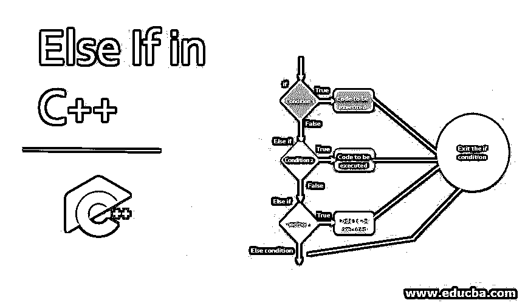
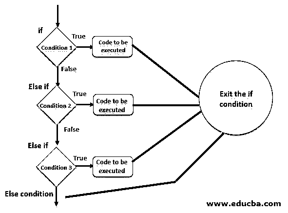
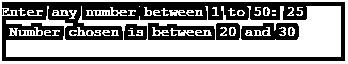
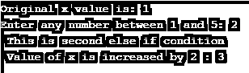

# 否则如果在 C++中

> 原文：<https://www.educba.com/else-if-in-c-plus-plus/>




## C++中的 Else if 介绍

因为我们已经熟悉了“if 和 else”语句，所以现在让我们进一步探讨 else if 条件的概念。顾名思义，这些语句一个接一个地处理这些条件。
现在让我们在 C++编程语言中利用这个概念。

**语法:**

<small>网页开发、编程语言、软件测试&其他</small>

```
if (first condition)
{
// code to be executed.
}
else if (second condition)
{
//code to be executed
}
else if (third condition)
{
//code to be executed
} …..
else
{
//code to be executed when none of the above conditions is true
}
```

通过上面的语法，我们可以理解将会有第一个 if 条件和在它之下执行的代码。然后，我们可以有多个条件，这些条件将被检查。如果这些条件都不成立，那么我们将执行写在 else 块中的代码。

### 流程图




根据流程图，我们可以注意到会有第一个 if 条件。根据布尔表达式，将执行“else if”条件或执行 true 条件中的代码，程序编译将从 if-else 条件循环中出来。

### else-如果在 C++中

C++中的条件按以下格式编写:

```
If(condition1)
{
Cout<<"code 1";
}
Else if(condition 2)
{
Cout<<"Code 2";
}
Else if(condition 3)
{
Cout<<"Code 3";
}
……….
Else
{
Cout<<"code to be executed if none of the above conditions is true";
}
```

“Else if”条件对于所有编程语言都是相同的。在 C++中，我们只对代码进行了语法层面的修改，但是按照逻辑，不会有太大的变化。

下面我们举几个例子来理解在 C++中使用‘else if’语句条件。

### C++中的 Else If 示例

下面是一些例子:

#### 示例#1

下面举个简单的例子:

**代码:**

```
#include <iostream>
using namespace std;
int main()
{
int a;
cout<<"Enter any number between 1 to 50: ";
cin>>a;
if(a >=0 && a<=10)
{
cout <<" Number chosen is between 0 and 10 ";
}
else if(a >10 && a<=20)
{
cout <<" Number chosen is between 10 and 20 ";
}
else if(a >20 && a<=30)
{
cout <<" Number chosen is between 20 and 30 ";
}
else if(a >30 && a<=40)
{
cout <<" Number chosen is between 30 and 40 ";
}
else if(a >40 && a<=50)
{
cout <<" Number chosen is between 40 and 50 ";
}
else
{
cout<<"The number you chose is out of given range";
}
}
```

**输出:**




另一个输出是:


#### 实施例 2

让我们看看这些条件的另一个例子:

**代码:**

```
#include <iostream>
using namespace std;
int main()
{
int a;
cout<<"Enter any number: ";
cin>>a;
if(a%2 == 0)
{
cout <<" Number chosen is divisible by 2 ";
}
else if(a%3 == 0)
{
cout <<" Number chosen is divisible by 3 ";
}
else if(a%7 == 0)
{
cout <<" Number chosen is divisible by 7";
}
else if(a%11 == 0)
{
cout <<" Number chosen is divisible by 11 ";
}
else if(a%13 == 0 )
{
cout <<" Number chosen divisible by 13 ";
}
else if(a%17 ==0)
{
cout<<" Number chosen is divisible by 17 ";
}
else
{
cout<<"The number chosen is not divisible by 2, 3, 7, 11, 13 and 17";
}
}
```

**输出:**


现在，如果我输入一个能被 2 和 3 整除的数会怎么样？


正如流程图中所解释的，如果起始条件匹配，则执行该条件中的代码，编译器退出 if-else if 循环。所以，这就是为什么一旦 2 的整除条件成立，编译器就会跳出“if”条件，显示所需的输出。

下面也显示了 else 条件的输出:


#### 实施例 3

让我们再举一个小例子:

**代码:**

```
#include <iostream>
using namespace std;
int main()
{
int a,x;
x=1;
cout<<"Original x value is: "<<x<<endl;
cout<<"Enter any number between 1 and 5: ";
cin>>a;
if(a==1)
{
cout <<" This is the main if condition " <<endl;
x=x+1;
cout<< " Value of x is increased by 1 : "<<x;
}
else if(a==2)
{
cout <<" This is second else if condition "<<endl;
x=x+2;
cout<< " Value of x is increased by 2 : "<<x;
}
else if(a==3)
{
cout <<" This is third else if condition " <<endl;
x=x+3;
cout<< " Value of x is increased by 3 : "<<x;
}
else if(a==4)
{
cout <<" This is fourth else if condition "<<endl;
x=x+4;
cout<< " Value of x is increased by 4 : "<<x;
}
else if(a==5 )
{
cout <<" This is fifth else if condition "<<endl;
x=x+5;
cout<< " Value of x is increased by 5 : "<<x;
}
else
{
cout<<"The number choosen is not in between 1 to 5"<<endl;
x=0;
cout<< " Value of x is made to zero : "<<x;
}
}
```

**输出:**




再举一个例子:


因此，上面提到的使用 C++的‘else-if’语句的例子很少。

### 结论

正如我们已经知道的，这些 if 条件构成了任何编程语言的逻辑部分的主要部分。下一步是通过使用‘else-if’语句来给出处理程序的各种条件。以上述方式，我们可以通过 C++编程语言使用‘else-if’的条件。

### 推荐文章

这是一个用 C++写的 Else if 的指南。这里我们讨论一些例子来理解 C++中‘else if’语句条件的工作原理以及流程图。您也可以看看以下文章，了解更多信息–

1.  [c++中的控制语句](https://www.educba.com/control-statement-in-c-plus-plus/)
2.  [C++数据类型](https://www.educba.com/c-plus-plus-data-types/)
3.  [最佳 C++编译器](https://www.educba.com/best-c-plus-plus-compiler/)
4.  [Else If in C#](https://www.educba.com/else-if-in-c-sharp/)


