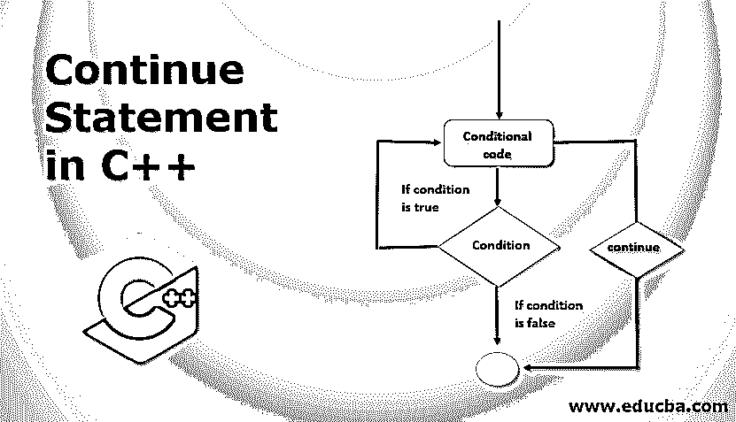
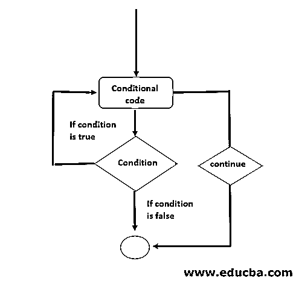
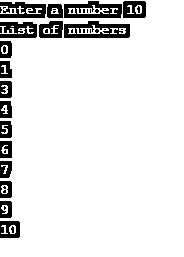
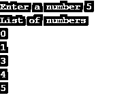
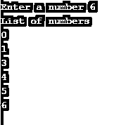

# C++中的 Continue 语句

> 原文：<https://www.educba.com/continue-statement-in-c-plus-plus/>




## C++中 Continue 语句介绍

Continue 语句是循环内部使用的循环控制语句。为了实现 continue 语句，C++使用 continue 关键字，在循环的开始转移程序的流程，并在遇到当前语句时跳过当前语句。

**语法:**

<small>网页开发、编程语言、软件测试&其他</small>

使用了 Continue 关键字。C++中 continue 语句的语法如下:

```
continue;
```

**流程图**

continue 语句的流程图如下:




### C++中 Continue 语句是如何工作的？

根据循环条件，执行循环内的语句。如果给定条件为真，则继续循环迭代。如果给定条件为假，循环将被终止。如果在循环中提到 continue 语句，它将跳过当前语句，并将控制权转移到执行循环的下一次迭代。为了理解 continue 语句在 C++中到底是如何工作的，让我们讨论一些例子以便更好地理解。

#### 示例 1–在 For 循环中使用 Continue 语句

在下面的 C++程序中，我们将看到如何在 For 循环中使用 continue 语句。为此，用户可以提供号码，然后结果将显示在屏幕上:

**代码:**

```
#include<iostream>
using namespace std;
int main()
{
int i, n;
cout << "Enter a number";
cin >> n
for(i = 0; i <=n; i++)
{
if(i == 2)
{
continue;
}
cout << "List of numbers";
cout << i;
}
return 0;
}
```

**输出:**




**上面程序的解释:**在上面的程序中，为了展示 continue 语句的实现，我们使用了 for 循环方法。这个程序是用来打印用户指定的数字列表的。这里我们初始化了两个变量 n 来存储迭代的值和 me。程序首先要求用户输入数字，然后将数字存储到 n 中。在 for 循环中，我们将 I 初始化为 0，并提到了检查 I 应小于或等于 n 的条件。在循环中，我们提到了[到](https://www.educba.com/continue-in-c-sharp/)的 continue 语句跳过数字 2。当我变成 2 时，它跳过那个值，继续循环。如果数字不是 2，那么将执行 if 之外的语句，并逐个打印数字。

#### 示例 2–在 While 循环中使用 Continue 语句

在下面的 C++程序中，我们将看到如何在 While 循环中使用 continue 语句，然后结果将显示在屏幕上:

**代码:**

```
#include<iostream>
using namespace std;
int main()
{
int i, n;
cout << "Enter a number";
cin >> n
while(i <= n)
{
if(i == 2)
{
i++;
continue;
}
cout << "List of numbers";
cout << i;
i++;
}
return 0;
}
```

**输出:**




**上面程序的解释:**在上面的程序中，为了展示 continue 语句的实现，我们使用了 While 循环方法。这个程序是用来打印用户指定的数字列表的。这里我们初始化了两个变量 n 来存储迭代的值和 me。程序首先要求用户输入数字，然后将数字存储到 n 中。在 While 循环中，我们将 I 初始化为 0，并提到了检查 I 是否应小于或等于 n 的条件。在循环中，我们提到了 continue 语句以跳过数字 2。当我变成 2 时，它跳过那个值，继续循环。如果数字不是 2，那么将执行 if 之外的语句，并逐个打印数字。

#### 示例 3–在 Do While 循环中使用 Continue 语句

在下面的 C++程序中，我们将看到如何在 [Do While 循环](https://www.educba.com/do-while-loop-in-c/)中使用 continue 语句，然后结果将显示在屏幕上。

**代码:**

```
#include<iostream>
using namespace std;
int main()
{
int i, n;
cout << "Enter a number";
cin >> n
do
{
if(i == 2)
{
i++;
continue;
}
cout << "List of numbers";
cout << i;
i++;
}while(i <= n);
return 0;
}
```

**输出:**




**上述程序说明:**在上述程序中，为了展示 continue 语句的实现，我们[使用了 Do While 循环](https://www.educba.com/do-while-loop-in-javascript/)方法。这个程序是用来打印用户指定的数字列表的。这里我们初始化了两个变量 n 来存储迭代的值和 me。程序首先要求用户输入数字，然后将数字存储到 n 中。在 Do While 循环中，我们将 I 初始化为 0，并提到了检查 I 是否应小于或等于 n 的条件。在循环中，我们提到了 continue 语句以跳过数字 2。当我变成 2 时，它跳过那个值，继续循环。如果数字不是 2，那么将执行 if 之外的语句，并一个一个地打印数字。

### 结论

在本文中，我们看到了不同的程序，以了解它们如何在 C++中使用 continue 语句。我希望这篇文章对你有所帮助。

### 推荐文章

这是一个 C++中 Continue 语句的指南。在这里，我们讨论不同的程序，以了解它们如何在 C++中执行 continue 语句。您也可以浏览我们的其他相关文章，了解更多信息——

1.  [c++中的构造函数和析构函数](https://www.educba.com/constructor-and-destructor-in-c-plus-plus/)
2.  [Java 中的 Continue 语句](https://www.educba.com/continue-statement-in-java/)
3.  [Java 中的 Break 语句](https://www.educba.com/break-statement-in-java/)
4.  [C++垃圾收集](https://www.educba.com/c-plus-plus-garbage-collection/)


