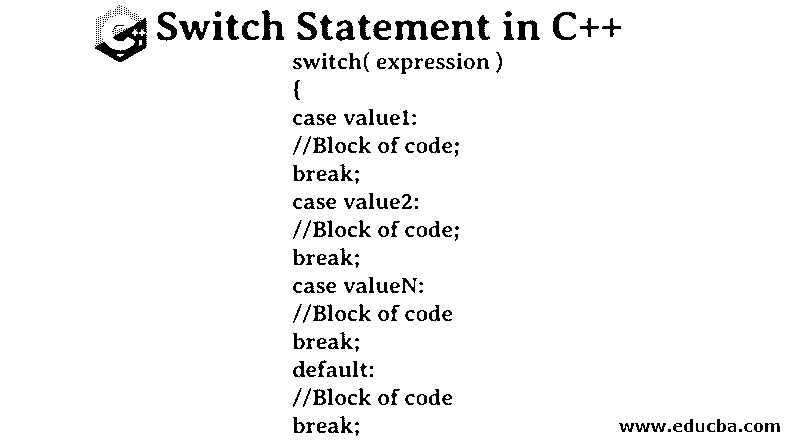
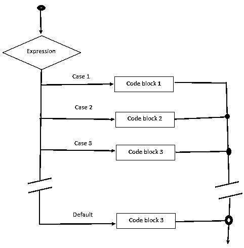
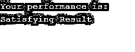
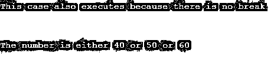
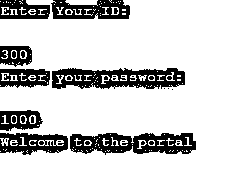
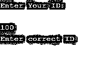
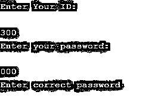

# C++中的 Switch 语句

> 原文：<https://www.educba.com/switch-statement-in-c-plus-plus/>




## C++中的 Switch 语句是什么？

Switch case 语句是被视为 if-else 语句替代的受控语句。c++中的 switch 语句是一个多路分支语句，它提供了一种根据表达式的值将执行流组织到代码部分的方法。用一个非常基本的术语来说，switch 语句评估一个表达式，测试它并将其与代码中编写的几种情况进行比较。一旦找到与任何案例的匹配，控制将进入该案例并开始执行在该案例中编写的语句[，直到找到中断语句](https://www.educba.com/break-statement-in-c-plus-plus/)。break 语句一出现，switch 语句就终止，程序控制退出开关。

有时可能会出现没有大小写与表达式的值匹配的情况。对于这种情况，我们提到一个默认情况，如果没有找到匹配，它将总是执行。switch 语句块中的事例由不同的数字或字符串表示，称为标识符。将表达式的值或用户提供的值与这些情况进行比较，直到找到匹配。

<small>网页开发、编程语言、软件测试&其他</small>

### C++开关语句的语法

C++编程语言中 switch 语句的语法如下所示

```
switch( expression )
{
case value1:
//Block of code;
break;
case value2:
//Block of code;
break;
case valueN:
//Block of code
break;
default:
//Block of code
break;
```

使用 Switch 语句时，您需要记住以下几点:

1.  案例标签可以是整数或字符，并且应该是唯一的
2.  案例标签总是以分号结尾。
3.  尽管默认案例标签不是强制性的，但如果已定义，它最多只能是一个。
4.  您需要一个 break 语句来将控制从循环中取出；否则，中断前的所有案例都会被执行。
5.  默认的案例标签没有任何特定的位置。
6.  [switch 语句也可以](https://www.educba.com/switch-statement-in-c-sharp/)嵌套。

#### Switch 语句流程图

流程图如下:




### Switch 语句在 C++中是如何工作的？

让我们理解上面流程图中描述的控制流，以便更好地理解执行流。

使用 switch 语句传递一个表达式，该表达式等于 cases 的值之一。如果值不相等，则执行默认情况。然后将该表达式的值与事例标识符或第一个事例进行比较。如果第一种情况匹配，则执行与第一种情况关联的代码块。一旦遇到中断，执行就会停止，您将[退出 switch 语句](https://www.educba.com/python-switch-statement/)。但是，如果大小写不匹配，执行将转到下一个大小写。如果这种情况匹配，则执行第二个代码块；否则，流程以类似的方式检查下一个案例。最后，如果没有匹配的案例，则执行默认代码块。

### C++中 Switch 语句的例子

让我们看看 C++中 switch 语句的一些例子。

#### 示例#1

这个例子将更清楚地说明 switch 语句的用法。

**代码:**

```
#include <iostream>
using namespace std;
int main () {
char grade_report = 'D';
cout << "Your performance is: " << endl;
switch(grade_report) {
case 'A' :
cout << "Outstanding Result!\n"  << endl;
break;
case 'B' :
cout << "Excellent Result!\n"  << endl;
break;
case 'C' :
cout << "Good Result\n"  << endl;
break;
case 'D' :
cout << "Satisfying Result\n"  << endl;
break;
case 'F' :
cout << "Poor Result\n"  << endl;
break;
default :
cout << "You did not appear for exam\n"  << endl;
}
return 0;
}
```

**输出:**




#### 实施例 2

此示例描述了开关中 break 语句的用法。如果在 case 之后没有指定 break 语句，执行流将继续，直到遇到 break 语句。

**代码:**

```
#include <iostream>
using namespace std;
int main() {
int  range_of_number=50;
switch (range_of_number) {
case 10:
case 20:
case 30:
cout << "The number is 10 or 20 or 30 " << endl;
break;
case 50:
case 55:cout << "This case also executes because there is no break " << endl;
cout << "\n" << endl;
case 60:
cout << "The number is either 40 or 50 or 60" << endl;
break;
default:
cout << "The number is greater than 60" << endl; }}
```

**输出:**




#### 实施例 3

**代码:**

```
#include <iostream>
using namespace std;
int main()
{
int x = 10, y = 5;
switch(x==y && x+y<10)
{
case 1:
cout << "hi" << endl;
break;
case 0:
cout << "bye" << endl;
break;
default:
cout << " Hello bye " << endl;
}}
```

**输出:**


#### 实施例 4

嵌套 Switch 语句

**代码:**

```
#include <iostream>
using namespace std;
int main() {
int ID = 300;
int password = 1000;
cout << "Enter Your ID:\n " << endl;
scanf("%d", & ID);
switch (ID) {
case 300:
cout << "Enter your password:\n " << endl;
scanf("%d", & password);
switch (password) {
case 1000:
cout << "Welcome to the portal\n" << endl;
break;
default:
cout << "Enter correct password" << endl;
break;
}
break;
default:
cout << "Enter correct ID" << endl;
break;
}}
```

**输出:**

这将取决于用户输入的值。

**输出 1:**




**输出 2:**




**输出 3:**




### 结论

你必须知道，switch 语句的基本流程和功能在所有编程语言中都是一样的。只有在基于所使用的编程语言的通用语法中才能看出这种差异。

### 推荐文章

这是 C++中 Switch 语句的指南。这里我们讨论 C++中 Switch 语句的概念、语法、工作原理和例子。您也可以浏览我们推荐的其他文章，了解更多信息——

1.  [C++字符串函数](https://www.educba.com/c-plus-plus-string-functions/)
2.  [什么是 C++中的模板类？](https://www.educba.com/what-is-template-class-in-c-plus-plus/)
3.  [Java 中的 Case 语句](https://www.educba.com/case-statement-in-java/)
4.  [PHP 开关语句](https://www.educba.com/php-switch-statement/)


