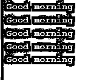
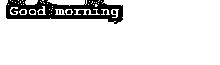
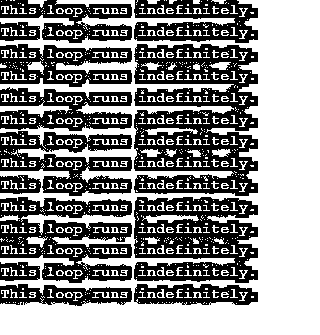

# C++中的循环

> 原文：<https://www.educba.com/loops-in-c-plus-plus/>


## C++中的循环介绍

C++中的循环语句多次执行代码或语句的某个块，主要用于通过多次执行同一个函数，减少代码的冗余，从而减少代码的长度。C++支持各种循环，如 for 循环、while 循环和 do-while 循环；每一种都有其语法、优点和用法。在编程世界中，循环是一种控制结构，当我们想要多次执行一段代码时，就会用到它。它通常会继续运行，直到满足某个结束条件。

如果我们没有循环，我们将不得不使用迭代方法来打印重复的语句块，如下所示:

<small>网页开发、编程语言、软件测试&其他</small>

```
#include <iostream>
using namespace std;
int main()
{
cout << " Good morning \n";
cout << " Good morning \n";
cout << " Good morning \n";
cout << " Good morning \n";
cout << " Good morning \n";
}
```

**输出:**




在这个例子中，我们通过重复相同的一组行将“Good morning”打印了五次。

一个循环有一组特定的指令。我们使用计数器来检查循环中循环执行的条件。如果计数器尚未达到所需的数目，则控制返回到指令序列中的第一条指令，并继续重复执行块中的语句。如果计数器已经达到所需的数目，这意味着条件已经满足，控制将脱离语句循环，并在循环之外到达剩余的代码块。

### C++中的循环类型

现在我们已经看到了循环是如何工作的，让我们通过回顾循环的类型来使它变得更清楚。在 [C++编程](https://www.educba.com/c-programming-language-basics/)中，我们在 C++中有三种类型的循环:

*   **为循环**
*   **While 循环**
*   **Do While 循环**

#### For 循环

循环是一个入口控制的循环，意味着我们指定的条件在进入循环块之前得到验证。这是一个重复控制结构。我们编写的循环运行了指定的次数。

为了控制循环，我们在 For 循环中使用一个循环变量。这个变量首先被初始化为某个值，然后我们对这个变量执行检查，将它与计数器变量进行比较，最后，我们更新循环变量。

**语法:**

```
for(initialization expression; test expression; update expression)
{
// statements to execute in the loop body
}
```

**初始化表达式:**

这里我们将循环变量初始化为一个特定的值。比如 int I = 1；

**测试表达式:**

在这里，我们编写测试条件。如果满足条件并返回 true，我们执行循环体并更新循环变量。否则，我们退出 For 循环。测试表达式的一个例子是 I < = 5；

**更新表达式:**

一旦循环体被执行，我们就在更新表达式中增加或减少循环变量的值。比如 i++；

让我们看一个 For 循环的例子:

```
#include <iostream>
using namespace std;
int main()
{
for (int i = 1; i <= 5; i++)
{
cout << " Good morning \n";
}
return 0;
}
```

**输出:**


#### While 循环

虽然该循环也是一个入口控制循环，但我们在运行该循环之前会验证指定的条件。区别在于，当我们知道循环体需要运行的次数时，我们使用 For 循环，而当我们事先不知道循环体需要运行的确切次数时，我们使用 while 循环。基于测试条件终止循环的执行。

**语法:**

初始化表达式；

```
while (test_expression)
{
// statements to execute in the loop body
update_expression;
}
```

循环的语法仅在三个表达式语句的位置上有所不同。

让我们看一个 while 循环的例子:

```
#include <iostream>
using namespace std;
int main()
{
int i = 0;    // initialization expression
while (i < 5)   // test expression
{
cout << "Good morning\n";
i++;    // update expression
}
return 0;
}
```

**输出:**


#### Do While 循环

Do while 循环是一个退出控制循环，意味着在循环执行后，在循环体的末尾验证测试条件。因此，不管测试条件是真还是假，主体至少执行一次。在 while 循环中，条件是预先测试的，而在 do 循环中，条件是在循环体结束时验证的。

**语法:**

初始化表达式；

```
do
{
// statements to execute in the loop body
update_expression;
} while (test_expression);
```

在 do while 循环中，我们用分号结束循环体，而其他两个循环没有任何分号来结束循环体。

```
#include <iostream>
using namespace std;
int main()
{
int i = 2;    // initialization expression
do
{
cout << " Good morning\n";
i++;       // update expression
} while (i < 1);  // test expression
return 0;
}
```

**输出:**




在上面给出的代码中，测试条件说 I 应该小于 1 (i<1)，但是在检查条件之前，循环至少执行 onc，因此给我们一次输出“Good morning”。

#### 无限循环

无限循环(infinite loop)或无限循环(endless loop)是一种循环，它没有适当的退出条件，使循环无限运行。当测试条件没有被正确地编写并且它永久地评估为真时，就会发生这种情况。这通常是程序中的错误。

```
#include <iostream>
using namespace std;
int main ()
{
int i;
for ( ; ; )
{
cout << "This loop runs indefinitely.\n";
}
}
```

**输出:**




在这个例子中，我们没有提到任何测试表达式，并将其留空；因此，该循环将无限期运行，直到手动终止。

### 结论–c++中的循环

在本文中，我们看到了 C++中使用的各种循环。这些[循环中的每一个都有不同的](https://www.educba.com/vb-dot-net-loops/)优势。当我们知道我们需要运行循环的次数时，我们使用 loop；当我们知道终止的条件时，我们使用 while loop；但是当我们不知道迭代的精确次数时，我们使用 do while loop 当我们需要代码至少执行一次时，如在菜单程序中。

### 推荐文章

这是 C++中循环的指南。这里我们讨论了 C++中不同类型的循环，包括语法和例子。您也可以看看以下文章，了解更多信息–

1.  [C++字符串函数](https://www.educba.com/c-plus-plus-string-functions/)
2.  [c++中的星形模式](https://www.educba.com/star-patterns-in-c-plus-plus/)
3.  [VBScript 中的循环](https://www.educba.com/vb-dot-net-loops/)
4.  [PowerShell 中的循环](https://www.educba.com/loops-in-powershell/)


