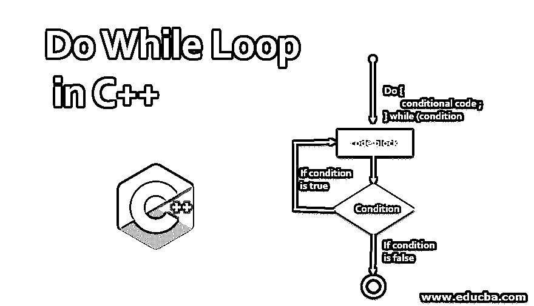
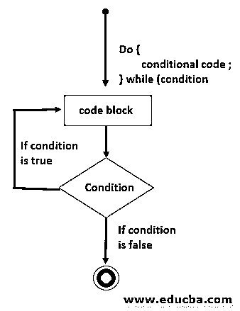
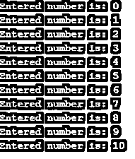
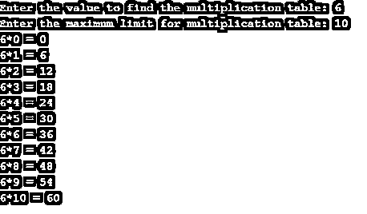
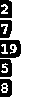
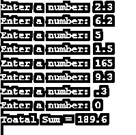

# C++中的 Do While 循环

> 原文：<https://www.educba.com/do-while-loop-in-c-plus-plus/>




## C++中 Do While 循环介绍

Do while 循环是控制程序流程的控制语句。与在循环顶部检查条件的 for 循环和 while 循环不同，do-while 循环在循环底部检查条件。 [Do while 循环](https://www.educba.com/do-while-loop-in-matlab/)类似于 while 循环；唯一的区别是 while 循环首先检查条件，然后执行循环，而 do while 首先执行循环，然后检查条件。这意味着在 do-while 循环中，循环将至少执行一次。在本文中，我们将借助例子来了解 C++中 do-while 循环的工作原理。C++编程中 do-while 循环的语法如下。

**语法:**

<small>网页开发、编程语言、软件测试&其他</small>

```
do
{
statement 1;
statement 2;
statemen n;
}
while(condition);
```

这里，关键字在循环之外，需要执行的语句写在循环内部。while 关键字用于以分号结束的循环之外。而循环包含检查条件的条件部分。

### C++中 Do While 循环的流程图

下面是 C++中 do-while 循环的流程图，该图详细说明了 do-while 循环的分步执行。




### C++中 Do While 循环的示例

以下是 C++中 do while 循环的一些示例:

#### 示例#1

在 C++中打印从 0 到 10 的数字的程序。

**代码:**

```
#include <iostream>
using namespace std;
int main()
{
int x = 0;
do
{
cout << "Entered number is: " << x << endl;
x++;
}while(x <= 10);
return 0;
}
```

**输出:**




**代码解释:**这里我们写了一个程序，用 C++编程中的 do while 循环打印 1 到 10 的数字。首先，我们将变量 x 初始化为 0。do 循环执行循环中提到的语句。首先，它打印 x 的值，然后在循环外部将 x 的值增加 1，同时检查条件以检查 x 的值是否小于或等于 10。如果条件为真，则继续迭代过程；如果条件为假，则停止执行。

#### 实施例 2

用 C++打印乘法表的程序。

**代码:**

```
#include <iostream>
using namespace std;
int main()
{
int n, count = 0, limit;
cout << "Enter the value to find the multiplication table: ";
cin >> n;
cout << "Enter the maximum limit for multiplication table: ";
cin >> limit;
do
{
cout << n << "*" << count << " = " << n*count <<endl;
count++;
}
while(count <= limit);
return 0;
}
```

**输出:**




**代码解释:**这里我们写了一段代码，打印用户想要打印的乘法表。在这里，我们初始化了三个变量 n 来获取用户的数字，count 来计算数字，limit 来限制乘法表的限制。Do 关键字将执行该语句。首先，它计算用户输入值的倍数并打印出来。每次迭代计数增加 1。检查条件时，计数是否大于或等于极限。根据结果，它打印乘法表。

#### 实施例 3

使用 do while 循环打印数组元素的程序。

**代码:**

```
#include <iostream>
using namespace std;
int main()
{
int i = 0;
int array[] = {2,7,19,5,8};
do
{
cout << array[i] << endl;
i++;
}while(i <= 4);
return 0;
}
```

**输出:**




**代码解释:**这里我们写了一个程序，用 C++编程中的 do while 循环打印数组元素。首先，我们将变量 I 初始化为 0，并声明数组元素。do 循环将打印列表中的数组元素。I 用作计数器，使值增加 1。While 关键字包含起作用的条件，即 I 必须小于或等于 4。

#### 实施例 4

程序添加数字，直到用户输入 0。

**代码:**

```
#include <iostream>
using namespace std;
int main()
{
float f_num, Total = 0.0;
do
{
cout << "Enter a number: ";
cin >> f_num;
Total += f_num;
}
while(f_num != 0.0);
cout << "Toatal Sum = " << Total;
return 0;
}
```

**输出:**




**代码解释:**这里我们写了一个程序，计算输入数字的总和。为了改变，我们在这里应用了一个条件，它要求用户输入一个数字单位，它输入 0，最后，它计算数字的总数。注意，这里我们使用了浮点数据类型。它使用户能够输入十进制值。

### 推荐文章

这是 C++中 While 循环的指南。这里我们讨论 C++中的语法、流程图和各种 Do While 循环以及代码实现。您也可以浏览我们的其他相关文章，了解更多信息——

1.  [Do While 在 C 中循环](https://www.educba.com/do-while-loop-in-c/)
2.  [c++中的类型转换](https://www.educba.com/type-casting-in-c-plus-plus/)
3.  [c++中的正则表达式](https://www.educba.com/regular-expressions-in-c-plus-plus/)
4.  [c++中的抽象](https://www.educba.com/abstraction-in-c-plus-plus/)


