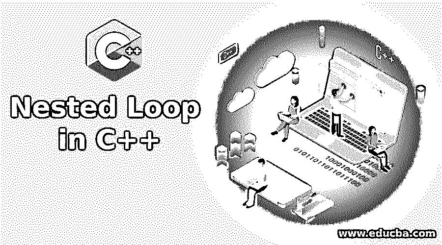
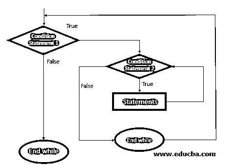
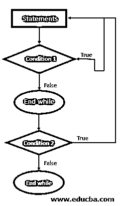
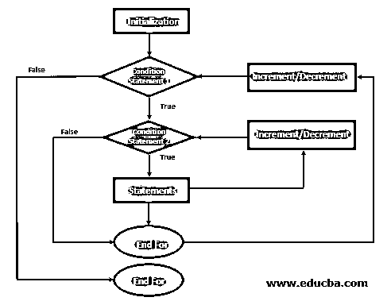
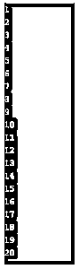
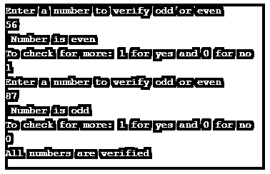
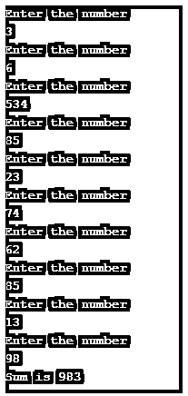
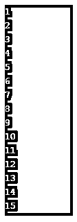
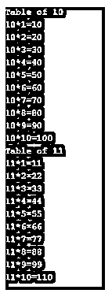

# C++中的嵌套循环

> 原文：<https://www.educba.com/nested-loop-in-c-plus-plus/>




## C++中嵌套循环介绍

嵌套循环是这样一种循环，其中一个循环驻留在另一个循环中，首先执行内部循环，满足循环中的所有条件，然后执行外部循环条件。循环内语句的执行流程是这样的:嵌套循环的内部循环被声明、初始化，然后递增。一旦内循环中的所有条件都得到满足并变为真，它就开始搜索外循环。它通常被称为“循环中的循环”。

### C++中嵌套循环的语法

以下是语法:

<small>网页开发、编程语言、软件测试&其他</small>

**1。嵌套 for 循环的语法**

```
for (initialization; condition; increment) {
for (initialization; condition; increment) {
// set of statements for inner loop
}
//set of statement for outer loop
}
```

**2。嵌套 While 循环的语法**

```
while(condition) {
while(condition) {
// set of statement of inside while loop
}
//set of statement for outer while loop
}
```

**3。嵌套 Do-While 循环的语法**

```
do {
while(condition) {
for (initialization; condition; increment) {
//set of statement of inside do-while loop
}
// set of statement of inside do-while loop
}
//set of statement of outer do-while loop
} while(condition);
```

**说明:**

在任何循环中，第一次执行将发生在内部循环的语句集上。如果条件得到满足并且为真，它将再次进入并满足第二个条件。如果结果为假，它将搜索外部循环并尝试满足所有条件。就这样，流动在继续。此外，并不强制要求循环必须放在相同类型的循环中。它可以是任何循环，这意味着任何循环都可以放在任何循环中。

### 流程图

下面是不同嵌套循环的流程图:

#### 1.嵌套 While 循环的流程图




**说明:**

最初，在 while 循环中提供了一个条件语句；如果内循环条件语句的条件为真，则循环将继续执行相同的内循环条件，形成一个循环。一旦发现条件为假，它将退出内 while 循环并搜索外循环条件。如果外部循环条件为真，那么它将执行所有的语句和信息集。在遵循了所有的指令之后，它将变成 false，并且循环将出来到主程序控制，说 end while loop。

#### 2.嵌套的 Do While 循环




**说明:**

提供一个语句作为输入，后跟一个条件，检查它是否满足该条件；如果它满足条件，那么将再次发生循环；如果不是，它将退出循环，并检查错误条件，然后当循环结束时，再执行一个循环，这也将遵循类似的执行模式。

#### 3.For 循环




**说明:**

for 循环包括变量的初始化，后跟条件 1；如果条件 1 得到满足，它将搜索第二个条件，如果第二个条件也为真，它将递增，然后当条件满足且为真时，它将搜索新的语句集，遵循相同的执行流程。一旦条件变为 false，它就退出循环，搜索 for 语句的结尾，返回到整个程序执行的主条件。

### C++中嵌套循环是如何工作的？

循环在任何编程语言中都起着非常关键的作用；C++也是如此。当一个循环驻留在另一个循环中时，称为嵌套。当我们将两个循环放在一起时，即某种嵌套，那么外部循环控制内部循环工作的次数，并负责所有的操作和计算。

### C++中嵌套循环的例子

下面是 C++中嵌套循环的例子:

#### 示例#1

带有 while 循环的嵌套循环，用于获取从 1 到 20 的所有数字。

**代码:**

```
#include <iostream>
int main () {
using namespace std;
int a = 1;
while (a <= 20) {
cout << a << endl;
a++;
}
return 0;
}
```

**输出:**




#### 实施例 2

用 while 嵌套循环来验证数字是奇数还是偶数。

**代码:**

```
#include <iostream>
int main () {
using namespace std;
int choose = 1;
while (choose == 1) {
int b;
cout << "Enter a number to verify odd or even" << endl;
cin >> b;
if (b%2 == 0) {
cout << " Number is even" << endl;
}
else {
cout << " Number is odd" << endl;
}
cout << "To check for more: 1 for yes and 0 for no" << endl;
cin >> choose;
}
cout << "All numbers are verified" << endl;
return 0;
}
```

**输出:**




#### 实施例 3

用一个嵌套的 for 循环来计算指定范围内给定数字的和。

**代码:**

```
#include <iostream>
int main () {
using namespace std;
int sum = 0, c, d;
for (c = 0; c < 10; c++) {
cout << "Enter the number" << endl;
cin >> d;
sum = sum + d;
}
cout << "Sum is " << sum << endl;
return 0;
}
```

**输出:**




#### 实施例 4

使用 do-while 循环打印数字的程序。

**代码:**

```
# include<iostream>
int main () {
using namespace std;
int k = 1;
do {
cout << k << endl;
k++;
} while (k <= 15);
return 0;
}
```

**输出:**




#### 实施例 5

程序使用嵌套的 for 循环获得 m*n 格式的给定数字的乘法表。

**代码:**

```
#include <iostream>
int main () {
using namespace std;
int m;
int n;
for (m = 10; m <= 11; m++) {
cout << "Table of " << m << endl;
for (n = 1; n <= 10; n++) {
cout << m << "*" << n << "=" << (m*n) << endl;
}
}
return 0;
}
```

**输出:**




### 结论

因此，任何编程语言中的嵌套都围绕着同一个概念:循环中的循环。内部循环的控制由外部循环负责，外部循环也可以提供一个范围，并且不强制将循环置于定义块的某种格式下。嵌套可以在任何代码块中完成，for 嵌套循环或 while 嵌套循环都基于条件满足来处理语句流。

### 推荐文章

这是 C++中嵌套循环的指南。这里我们讨论介绍，各种例子，以及嵌套循环在 C++中是如何工作的？您也可以看看以下文章，了解更多信息–

1.  [Matlab 中的嵌套循环](https://www.educba.com/nested-loop-in-matlab/)
2.  [c++中的控制语句](https://www.educba.com/control-statement-in-c-plus-plus/)
3.  [C 语言中的嵌套循环](https://www.educba.com/nested-loop-in-c/)
4.  [c++中的类型转换](https://www.educba.com/type-casting-in-c-plus-plus/)


