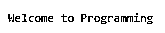
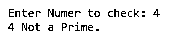
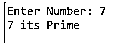
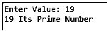
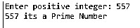

# C++用户定义函数

> 原文：<https://www.educba.com/c-plus-plus-user-defined-function/>


## C++用户自定义函数简介

C++用户自定义函数允许用户描述他们自己的函数和过程，函数是程序的组成部分，对模块性和代码可重用性来说是最重要的，而程序员可以构建一个用户自定义函数来帮助完成特定的任务，并使创建函数调用变得简单。在用户定义的函数中，一旦函数被程序调用，它就执行函数体中定义的代码。在用户定义的函数中，它与一组代码集合在一起，为它命名为标识符的代码执行任务。

用户自定义函数使程序员可以构建自己的函数。这些函数背后最重要的事情是程序员可以用可重用的代码创建应用程序。大多数用户自定义函数都带有内置函数。

<small>网页开发、编程语言、软件测试&其他</small>

### 句法

下面是语法:

```
returntype function_name(parameter-1, parameter-2,..)
{
//body of function
}
```

让我们看看调用这个函数的简单程序，

在这个简单的程序中，我们声明了函数 display()，该代码的返回类型是 void，并在函数体中写下了欢迎词，

**例如**

```
void display() // function declaration
{
cout<<"Welcome"
}
```

为了使用这个函数，我们需要进行一个函数调用，

#### 程序

```
#include <iostream>
using namespace std;
// to declare the function
void display()
{
cout << "Welcome to Programming";
}
int main() {
// function call
display();
return 0;
}
```

**输出:**




### 用户定义的函数类型

在用户定义函数中有几种类型，它们是

#### 1.没有参数和返回值的函数

没有参数和返回类型的函数，该函数不返回值，因为其返回类型为 void。在这段代码中，函数 Number_prime()中没有传递任何参数，并且该函数也没有从对主函数的函数调用中返回任何值。

**代码:**

```
#include <iostream>
using namespace std;
void Number_prime();
int main()
{
Number_prime(); // no parameters
return 0;
}
void Number_prime() // no return type - its void
{
int number, i, flag = 0;
cout << "Enter Numer to check: ";
cin >> number;
for(i = 2; i <= number/2; ++i)
{
if(number % i == 0)
{
flag = 1;
break;
}
}
if (flag == 1)
{
cout << number << " Not a Prime.";
}
else
{
cout << number << " its Prime Number.";
}
}
```

**输出:**




#### 2.没有参数但有返回值的函数

在这个程序中，Number_prime()是从 main()函数中不带任何参数调用的，这里的返回类型是一个整数，所以它在调用 main()函数时返回用户输入的整数值。

**代码:**

```
#include <iostream>
using namespace std;
int Number_prime();
int main()
{
int number, i, flag = 0;
number = Number_prime();
for (i = 2; i <= number/2; ++i)
{
if (number%i == 0)
{
flag = 1;
break;
}
}
if (flag == 1)
{
cout<<number<<" Not a Prime";
}
else
{
cout<<number<<" its Prime";
}
return 0;
}
int Number_prime() // it returns integer value
{
int n;
printf("Enter Number: ");
cin >> n;
return n;
}
```

**输出:**




#### 3.带参数且无返回值的函数

在这个程序中，我们使用相同的函数 Number_prime()来解释带有参数的 name 函数中的代码，函数 Number_prime()将一个整数值作为其参数，没有任何返回值。这里这个数字将被传递给函数调用 Number_prime()来检查输入的数字是否是质数。

**代码:**

```
#include <iostream>
using namespace std;
void Number_prime(int n);
int main()
{
int number;
cout << "Enter Value: ";
cin >> number;
// one parameter is passed to the function Number_prime()
Number_prime(number);
return 0;
}
// return type is void, so it does not return any value
void Number_prime(int n)
{
int i, flag = 0;
for (i = 2; i <= n/2; ++i)
{
if (n%i == 0)
{
flag = 1;
break;
}
}
if (flag == 1)
{
cout << n << " Not a Prime Number";
}
else {
cout << n << " Its Prime Number";
}
}
```

**输出:**




#### 4.带参数和返回值的函数

在这种类型中，函数通过参数传递，它也返回值，在这个程序中，用户将输入整数值，该值首先存储在变量中，然后传递给函数调用，以检查输入的值是否是质数。这里 Number_prime()的返回类型是一个整数，它向 main()函数返回 1 或 0。如果输入的值是质数，则返回 1，否则返回 0。在 main()函数调用中，返回值存储在标志中，基于它在屏幕上显示文本。

**代码:**

```
#include <iostream>
using namespace std;
int Number_prime(int n);
int main()
{
int number, flag = 0;
cout << "Enter positive integer: ";
cin >> number;
// one argument is passed to the function
flag = Number_prime(number);
if(flag == 1)
cout << number << " Not a Prime Number";
else
cout<< number << " its a Prime Number";
return 0;
}
/* it have a return type - integer */
int Number_prime(int n)
{
int i;
for(i = 2; i <= n/2; ++i)
{
if(n % i == 0)
return 1;
}
return 0;
}
```

**输出:**




### C++用户定义函数的好处

*   通过使用自定义函数，它支持代码的可重用性，我们可以多次使用代码，只需声明一次。
*   用户自定义函数降低了庞大程序的复杂性，优化了代码。
*   用户自定义函数有助于用户轻松地构建程序，因为每个任务都被分成几个函数。
*   用户自定义函数增强了可读性。

### 结论

希望本文通过几个例子帮助你理解 C++中的自定义函数。在本文中，我们已经看到了函数的用法以及用户定义函数中可用的不同类型。

### 推荐文章

这是一个 C++用户自定义函数的指南。在这里，我们讨论介绍，语法，用户定义的函数类型和代码实现的例子。您也可以看看以下文章，了解更多信息–

1.  [外壳排序 C++](https://www.educba.com/shell-sort-c-plus-plus/)
2.  [排序字符串 C++](https://www.educba.com/sort-string-c/)
3.  [C++ getline()](https://www.educba.com/c-plus-plus-getline/)
4.  [C++表达式](https://www.educba.com/c-plus-plus-expression/)


