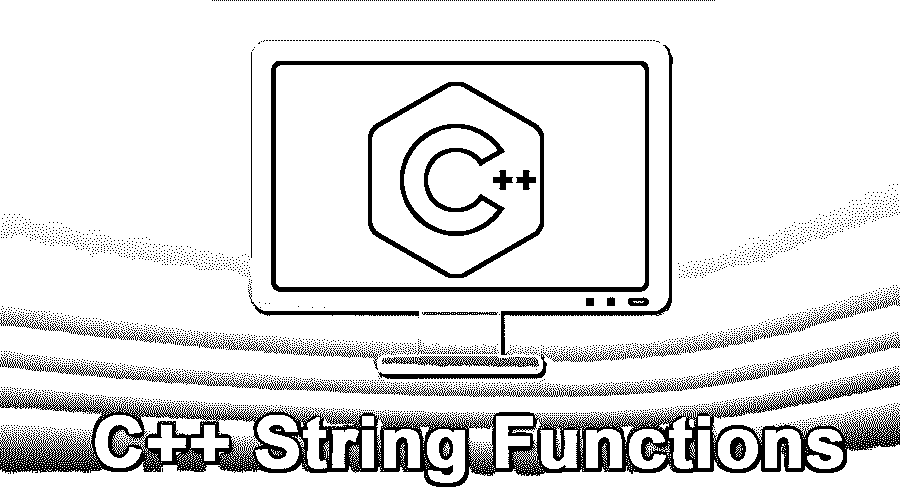

# C++字符串函数

> 原文：<https://www.educba.com/c-plus-plus-string-functions/>




## C++字符串函数

字符串函数是用于对字符串执行操作的函数。C++使用<string.h>库来提供各种字符串函数，如 strcat、strlen、strcmp、strcpy、swap 等等，其中 strcat 用于连接字符串，strlen 将计算字符串的长度，strcmp 用于比较两个字符串，strcpy 将把字符串的一个值复制到另一个值，swap 用于在字符串之间交换值。</string.h>

### 弦是什么？

要在 C++中使用字符串函数，我们需要在代码的顶部添加一个名为<string>的库，它给你提供了字符串函数。它必须包含在头文件#include <string>中。正如我们所知，字符串对象可以理解许多行为，并且我们可以对字符串对象执行一些操作。</string></string>

<small>网页开发、编程语言、软件测试&其他</small>

### C++中字符串函数的例子

这里我们将借助实例讨论如何在 [C++编程](https://www.educba.com/c-plus-plus-alternatives/)中使用字符串函数

#### 示例#1

```
String Greeting = "Hello World!";
Cout<<Greeting;
```

它给出了以下输出

**输出:** Hello World！

我们知道 cout **< <** 在 c++中是用来在屏幕上打印的，而 cin **> >** 是用来在屏幕上取输入的。

让我们看下面的例子更精确:

#### 实施例 2

```
String greeting ;
Cin>>greeting;
Cout<< " The common sentence in programming is: "<< greeting << endl;
```

这里我们的目标是学习如何弹奏琴弦。

#### 实施例 3

```
//Suppose we have three string variables
string str1 = "ice"; //initialized with value
string str2 = "cream"; //initialized with value
string str3; // empty string
str3 = str1 + str2; // Here we are concatenating the string
cout << str3;
```

**输出:**冰淇淋

##### 我们是如何实现的？

c++中的标准字符串类重载了赋值运算符(=)。为了更清楚，参见实施例 3。我们有三个对象 str1，str2，str3。我们连接了两个字符串，即 str1 和 str2，并将值复制到 str3 中。这意味着赋值操作符过载了，新的值在我们的例子中是 icecream 被复制到 str3 中。

string 类有一个[默认构造函数](https://www.educba.com/constructor-in-c-plus-plus/)，它将 string 对象初始化为空字符串。标准 c++有另一个接受值的构造函数(例如 str1 和 str2 被赋值，str3 为空)

下面是我们可以使用的一些 C++字符串函数:

*   **Substr** (开始字符索引，从该索引开始你想要多少个字符。)
*   **Strcat(str1，str2):** 追加字符串
*   **Strcmp(str1，str2):** 如果 str1 小于 str2，则返回-ve 值；如果 str1 等于 str2，则为 0；如果 str1 大于 str2，则>为 0 (+ve 值)。
*   **Strcpy(str1，str2):** 替换内容
*   **Strlen(str1):** 给出字符串的长度

这个函数非常简单。顾名思义。从给定的字符串中取出子字符串。这个函数有两个参数。

1.  第一个参数表示起始索引号
2.  第二个参数建议从起始索引开始需要多少个字符。

#### 实施例 4

string s = "C++是一种简单的语言"；

| **c** | **+** | **+** |  | **我** | **s** |  | **答** |  | **e** | **答** | **s** | **y** |  | **l** | **答** | **n** | **g** | **u** | **答** | **g** | **e** |
| **0** | **1** | **2** | **3** | **4** | **5** | **6** | **7** | **8** | **9** | **10** | **11** | **12** | **13** | **14** | **15** | **16** | **17** | **18** | **19** | **20** | **21** |

索引从 0 开始

```
string language = s.substr(0,3); // output of substr storing in language variable.
cout << language << endl;
```

**输出:** c++起始索引是 0，我们需要从第 0 个<sup>到第 3 个</sup>索引的三个字符，所以 3 是第二个参数。第二个参数是从 1 到 n，而不是从 0 到 n，所以前三个 char 给了我们 c++。

**Strcat():**c++中的这个字符串函数结合了两个不同的字符串，如例 5 **所示。**

#### 实施例 5

```
String str1 = "I love my";
string str2 = " Country";
strcat(str1, str2);
cout << str1 ;
```

在上面的示例中，strcat 函数获取复制 str2 值并将其放入 str1。它组合并输出如下:

输出:我爱我的国家

**Strcmp():** 顾名思义，它比较两个字符串并返回结果。

假设我们有两个字符串 str1 和 str2 **。**

**下表显示了准确的输出以便更好地理解:**

| str1 < str2 | 返回–ve 值 |
| str1 == str2 | 返回 0(零) |
| str1 > str2 | 返回+ve 值 |

#### 实施例 6

```
string str1 = "We have seven Continents in the wolrd";
string str2 = "We have seven Continents in the wolrd";
int result = strcmp(str1,str2);
cout << result <<endl;
```

**输出:** 0 //两个字符串相等 str1 == str2 其他情况下根据该位置的字符返回字符串的 ASCII 值。

**Strcpy():** 与 strcat 不同，它不会将字符串追加到 other 中。它将替换所有内容。

#### 实施例 7

```
string str1 = "World is beautiful";
string str2 = "Yes we can";
string str3 = strcpy(str1,str2); // simply replace all the content in str1 with the content of str2
cout<< str3 <<endl;
```

**输出:**是的，我们可以

**Strlen():** 一行中最简单的函数。

这个函数定义在<cstring>头文件中。这个函数返回字符串的长度。</cstring>

字符串的长度由结尾的空字符决定\0。

#### 实施例 8

```
string str1 = "c++ is object oriented language";
int length = strlen(str1);
cout << "Length of str1 is : " << length << endl;
```

**输出:** 31

**getline():** C++字符串库函数也提供了 getline 函数来读取整行。

该函数采用如下参数:

1.  它将第一个参数作为要读取的流。
2.  第二，它需要输入线
3.  第三，停止提取

#### 实施例 9

```
cout<<"What is your name: "<<endl;
string str1;
getline(cin, str1 '\n');
cout<< "your name is : " << str1 << endl;
```

你叫什么名字:约翰

你的名字是约翰

[C++库](https://www.educba.com/introduction-to-c-plus-plus/)中提供的最有用的数据类型之一是字符串。

为了更好地理解 string，您必须边学习边编码。不写代码我们无法得到实际的概念。

### 书

1.  Balgurusami(用 C++面向对象编程)
2.  《C++面向对象编程》,罗伯特·拉弗尔(出版社:皮尔逊)

### 推荐文章

这是 C++字符串函数的指南。这里我们借助实例讨论了如何在 C++编程中使用字符串函数。您也可以浏览我们推荐的其他文章，了解更多信息——

1.  [C++命令](https://www.educba.com/c-plus-plus-commands/)
2.  [Java 中的字符串函数](https://www.educba.com/string-functions-in-java/)
3.  [c++中的 strcat()](https://www.educba.com/strcat-in-c-plus-plus/)
4.  [C 语言中的 strcat()](https://www.educba.com/strcat-in-c/)


