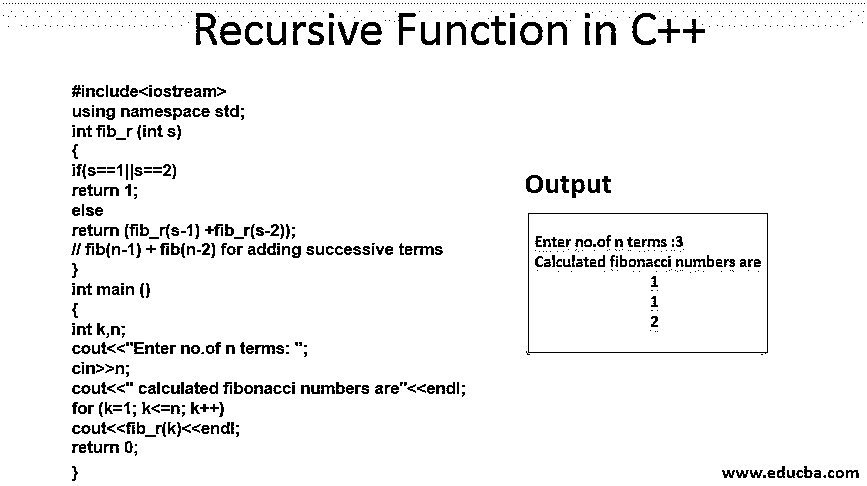
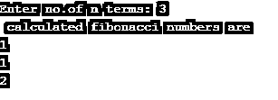

# C++中的递归函数

> 原文：<https://www.educba.com/recursive-function-in-c-plus-plus/>




## C++中递归函数介绍

从 C++中的递归函数开始，我们已经知道了 C++函数背后的基本思想，包括调用其他函数的函数定义。并且本文涵盖了递归定义背后的概念，这是数学和编程逻辑中的一个游戏工具概念。一个熟悉的例子包括一个数的阶乘，n 个自然数的和等。自行调用的函数称为递归函数。它们只是一个被反复调用的函数。递归有一个解决问题的工具，它把较大的问题分成简单的任务，然后按照一个单独的顺序逐个解决。

[数据结构概念](https://www.educba.com/data-structure-interview-questions/)像搜索、排序、遍历一棵树[使用递归函数](https://www.educba.com/recursive-function-in-c/)来求解。这种编程技术使代码更容易。迭代和递归的过程与代码的重复是一样的，但是递归的不同之处在于它们使用基函数本身来执行特定的部分。在本文中，我们将通过一个例子详细讨论递归的重要性及其工作过程。

<small>网页开发、编程语言、软件测试&其他</small>

### C++中递归函数的语法

c++中递归函数的一般语法如下所示:

```
return type function name([arguments])
{
Body of the statements;
function name ([actual arguments])        // recursive function
}
```

### 递归函数在 C++中是如何工作的？

递归对函数调用执行重复，当基本情况为真时，它停止执行。应在递归函数的[中定义基本情况条件，以避免堆栈溢出错误消息。如果没有定义基本用例，就会导致无限递归。当一个函数被调用时，它每次都将它们推入堆栈，以便为每次重复调用保留资源。它提供了最好的树遍历。有两种不同类型的递归:直接递归和间接递归。](https://www.educba.com/recursive-function-in-python/)

**直接递归:图解**

```
int fibn(n)
{
fib(n);
}
void main ()
{
fib(n);
}
```

上面的格式是直接递归调用，其中它立即调用/自己调用。考虑第二种类型，称为间接递归，它涉及另一个函数调用。可以在下图中查看:

**间接递归:图解**

```
void f(int n) {
f1();
return;
}
void f2( int n) {
f();
return;
}
void f1() {
f2();
return;
}
```

### C++中递归函数的例子

在下面的程序中，你可以看到我提供的默认基础条件下程序的执行。有时在递归中使用 if-else 条件有助于防止无限递归。代码的处理是用中间的部分解进行的，在尾部递归时，这些部分解被组合成最终解。

#### 示例#1

这里是一个简单的例子，一个数字的[斐波纳契数列。下面的程序包括一个对定义为 fib (int n)的递归函数的调用，该函数从用户处获取输入并将其存储在' n '中。下一步包括进入 for 循环以生成传递给函数 fib()的项，并返回](https://www.educba.com/fibonacci-series-in-c-plus-plus/)[斐波那契数列](https://www.educba.com/fibonacci-series-in-javascript/)。基本情况是用[设置 if 语句](https://www.educba.com/if-statement-in-python/)通过检查数字=1 或 2 来打印前两个值。最后，[这个递归函数](https://www.educba.com/recursive-function-in-javascript/)继续循环打印序列 1，1，2。

**代码:**

```
#include<iostream>
using namespace std;
int fib_r (int s)
{
if(s==1||s==2)
return 1;
else
return (fib_r(s-1) +fib_r(s-2));    // fib(n-1) + fib(n-2) for adding successive terms
}
int main ()
{
int k,n;
cout<<"Enter no.of n terms: ";
cin>>n;
cout<<" calculated fibonacci numbers are"<<endl;
for (k=1; k<=n; k++)
cout<<fib_r(k)<<endl;
return 0;
}
```

**输出:**




#### 实施例 2

使用递归函数检查回文数。

**代码:**

```
#include <iostream>
using namespace std;
int palim(int a, int t)
{
if (a == 0)
return t;
t = (t * 10) + (a % 10);
return palim(a / 10, t);
}
int main()
{
int n;
cout<<"Enter the number :"; cin>>n;
int result = palim(n, 0);
if (result == n)
cout << "Number "<<n<<" is a palindrome" << endl;
else
cout << "Number "<<n<<" is not a palindrome"<< endl;
return 0;
}
```

**输出:**


#### 实施例 3

用随机数生成器编程。

**代码:**

```
#include <iostream>
#include <cmath>
#include <cstdlib>
#include <ctime>
using namespace std;
int rand1(int n);
int main () {
int n, j;
int r;
srand(time (NULL));
cout << "Enter number of dice: ";
cin >> n;
for (j = 1; j <= n; j++) {
r = rand1(5) + 1;
cout << r << " ";
}
system("PAUSE");
return 0;
}
int rand1(int n) {
return rand () % n;
}
```

上面的程序说明了一个随机掷骰子时的随机数发生器。它通过调用函数 rand1(int n)来执行，并生成 0 到 n-1 个数字。并用 null(无地址)设置种子值。例如，如果我们输入 4，那么掷出骰子的可能性是 5，4，1，2。

**输出:**


还有一些概念，如线性搜索，公约数和最重要的给定数的阶乘，它使用递归实现。

### 递归的优点

*   通过简化较大的复杂程序，他们提供的代码简洁明了。在程序代码中使用较少的变量。
*   这里避免了复杂的代码和嵌套的 for 循环。
*   代码的某些部分需要回溯，这是递归解决的。

### 递归的缺点

*   由于所有函数调用的堆栈操作，需要更多的内存分配。
*   在执行迭代过程时，它有时会执行得较慢。所以效率更少。
*   初学者很难理解这种工作方式，因为有时代码会很深入。如果导致空间不足，最终导致程序崩溃。

### 结论

至此，我们已经讨论了 c++函数是如何工作和递归定义的。而且，我们已经讨论了递归函数在编程世界中的对应关系及其优缺点。然后我们继续展示如何使用递归函数定义在 C++中实现它。此外，我们得出结论，递归有助于在 C++中解决数据结构概念中的问题，如遍历、排序和搜索，并且可以在任何需要的地方有效地使用。

### 推荐文章

这是一个 C++递归函数的指南。这里我们讨论递归函数如何在 C++中工作，语法以及不同的例子和代码实现。您也可以阅读以下文章，了解更多信息——

1.  [C++数组函数](https://www.educba.com/c-plus-plus-array-functions/)
2.  [C++字符串函数](https://www.educba.com/c-plus-plus-string-functions/)
3.  [最佳 C++编译器](https://www.educba.com/best-c-plus-plus-compiler/)
4.  [C++命令](https://www.educba.com/c-plus-plus-commands/)


