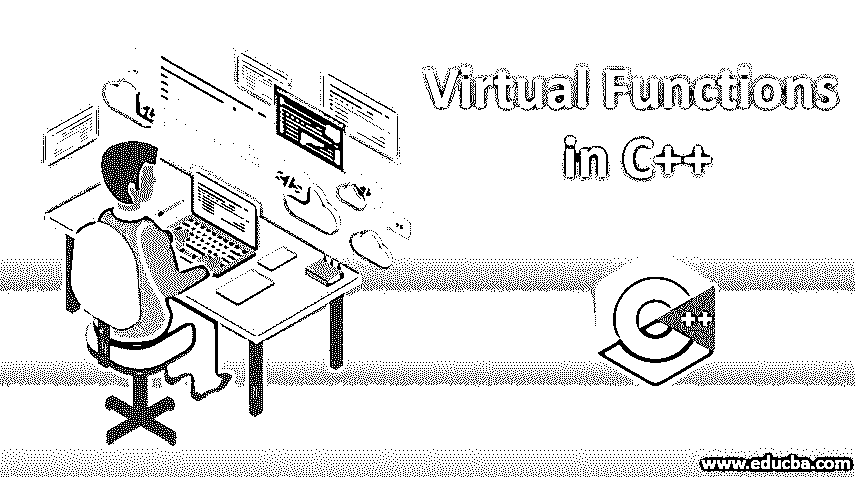
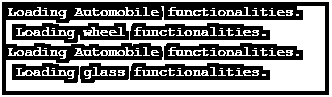
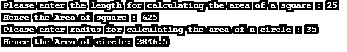

# C++中的虚函数

> 原文：<https://www.educba.com/virtual-functions-in-c-plus-plus/>




## C++中的虚函数介绍

C++中的虚函数是基类中定义的成员函数，可以在派生类中重新定义。因此，如果在编程中，您希望使用基类或指针的引用来引用派生类的对象，您可以使用虚函数来调用该对象，然后您可以执行派生类的函数。虚拟关键字用于定义编程中的虚拟函数。为了在软件程序中实现运行时多态性，使用了虚函数。函数调用将仅在运行时解析。

下面是在 C + +编程语言中定义虚函数的语法:

<small>网页开发、编程语言、软件测试&其他</small>

**语法:**

```
virtual void function_name()
```

*   虚拟是在函数名之前使用的强制关键字，函数名可以是用户选择的任何内容。

在 C + +编程语言中使用虚函数时，需要记住一些重要的规则:

*   一个类在代码中不能有虚构造函数，但同一类在代码中可以有虚析构函数。
*   数据类型或者我们称之为程序中定义的虚函数的原型在基类和派生类中都必须相同。
*   虚函数本质上不能是静态的。
*   关于虚函数最重要的规则是，它们必须只在基类中定义，并且必须通过派生类重写。
*   要在代码中实现运行时多态性，必须通过指针或基类引用来访问虚函数。

### 虚函数是如何工作的？

每当任何给定程序的类中提到虚函数时，编译器就做两件事:

如果一个类包含一个虚函数，那么编译器本身做两件事:

*   如果创建了该类的对象来指向该特定类的 VTABLE，编译器将插入虚拟指针(VPTR)作为该类的数据成员。因此，每次创建新对象时，编译器都会这样做，以便新的虚拟指针作为类的数据成员插入。
*   编译器要做的另一件事是，即使没有创建对象，函数指针的静态数组[也会调用 VTABLE，其中每个表单元格都包含该类中定义的每个虚函数的地址。](https://www.educba.com/function-pointer-in-c/)

### C++中虚函数的例子

我们已经看到了虚函数的语法和工作方式，现在我们将看看当我们在代码中实现它时，它实际上是如何工作的:

#### 示例#1

下面是演示 C + +编程语言中虚函数的工作示例的 C + +代码。

**代码:**

```
#include <iostream>
using namespace std;
class Automobile
{
public :
virtual void functionalities()
{ cout << " Loading Automobile functionalities. \n " ; }
} ;
class wheel : public Automobile
{
public:
void functionalities()
{ this -> Automobile :: functionalities();
cout << " Loading wheel functionalities. \n" ;
}
} ;
class glass : public Automobile
{
public:
void functionalities ()
{
this -> Automobile :: functionalities () ;
cout << " Loading glass functionalities. \n" ;
}
};
class RunAutomobile
{
public:
void loadfunctionalities ( Automobile *Automobile )
{
Automobile -> functionalities () ;
}
};
int main()
{
RunAutomobile *r = new RunAutomobile;
Automobile *w;
wheel b ;
glass g ;
w = &b ;
r -> loadfunctionalities ( w );
w = &g;
r -> loadfunctionalities ( w );
return 0;
}
```

**输出:**




正如你在上面的代码中看到的，Automobile 是基类，wheel 和 glass 是派生类，我们还定义了一个虚函数。定义了另一个名为 RunAutomobile 的类，其中还定义了一个名为 load functionalities 的函数，以加载基类中的上述函数。然后在主类中，定义一个对象。所定义的对象独立于派生类 wheel 和 glass，而指针对象是为基类 Automobile 定义的。

#### 实施例 2

下面是演示 C ++编程语言中虚函数的工作示例的 C++代码。

**代码:**

```
#include <iostream>
using namespace std;
// Declaring an Abstract class
class Pattern
{
protected:
float l;
public:
void getInput ()
{
cin  >> l ;
}
// virtual Function
virtual float totalArea () = 0;
};
class Squared : public Pattern
{
public:
float totalArea ()
{   return l * l ;  }
};
class Circle : public Pattern
{
public:
float totalArea ()
{ return 3.14 * l * l ; }
};
int main()
{
Squared s ;
Circle c;
cout << " Please enter the length for calculating the area of a square : " ;
s.getInput () ;
cout << " Hence the Area of square : " << s.totalArea () ;
cout << " \n Please enter radius for calculating the area of a circle : " ;
c.getInput () ;
cout << " Hence the Area of circle: " << c.totalArea () ;
return 0;
}
```

**输出:**




正如你在上面的代码中看到的，模式是基础抽象类，而 Squared 和 Circle 是派生类，我们还定义了一个名为 totalArea()的虚函数。还定义了另一个名为 getInput()的函数来获取用户的输入。然后在主类中，定义一个对象。定义的对象是分开的，对于派生类 squared 和 circle 分别用对象名 s 和 c 来计算两者的面积。

### 结论

虚函数在使编程体验有效和高效方面起着重要的作用。他们是面向对象编程的直接支持者。虚函数用于通过告诉编译器来执行后期绑定和动态链接操作。因此，它被用来指向基类。

### 推荐文章

这是一本 C++中虚函数的指南。在这里，我们讨论虚函数的介绍和如何工作，并给出例子和代码实现。您也可以阅读以下文章，了解更多信息——

1.  [c++中的枚举](https://www.educba.com/enum-in-c-plus-plus/)
2.  [c++中的虚拟关键字](https://www.educba.com/virtual-keyword-in-c-plus-plus/)
3.  [c++中的 if else 语句](https://www.educba.com/if-else-statement-in-c-plus-plus/)
4.  [c++中的类型转换](https://www.educba.com/type-casting-in-c-plus-plus/)


