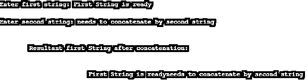

# C++中的 strcat()

> 原文：<https://www.educba.com/strcat-in-c-plus-plus/>


## C++中 strcat()的介绍

C++是一种包含许多函数的编程语言，strcat 是 string 类的内置函数之一，它和其他函数(包括 strncat、strcpy 等)一样有自己的意义。这些函数起着非常关键的作用，因为它们具有与代码优化和函数调用相关的重要性。strcat()是一个函数，它包含两个内容:str 指的是字符串，cat 指的是将字符串附加在字符串的末尾或开头，但主要是在字符串的末尾，即附加字符串的副本。

**语法:**

<small>网页开发、编程语言、软件测试&其他</small>

```
strcat (dest, src);
```

strcat()基本上是说连接两个字符串，这意味着连接两个字符串。在这个函数的帮助下，我们可以连接两个字符串，但是 strcat 的作用方式有些不同。它会将源字符串的副本追加到目标字符串的末尾。strcat()将考虑两个参数或自变量。

*   目的地
*   科学研究委员会

它的工作方式是将源字符串的副本追加到目标字符串的末尾。

**Note:** The last or the terminating character of the copy of the source code which will get appended at the end of the dest will be replaced by the very first character of the src.

**返回值:**strcat 函数的返回值返回 dest 参数，该参数指向目标字符串。如果有一个空的目标字符串，那么 strcat 函数将有重叠，即所有字符将被源字符串的副本替换。要记住的一个免责声明是，永远不要让目的地重叠，只有当 dest 为空字符串时，才可能发生，否则不会发生。此外，指向目标位置的指针应该足够大，以便它可以保存或包含一个结果级连字符串。

### C++中如何连接字符串？

Strcat()是主要的关注点，但是我们仍然会探究连接字符串的其他两种方式，因为它们也是字符串在构建连接中的一部分。

#### 示例 1–使用 strcat()函数

因为它是在一个内置的预定义函数中，所以它主要是在“string.h”头文件中关联和定义的。

**语法:**

```
char * strcat (char * arr1, char * arr2)
```

这里，arr1 和 arr2 字符串应该是字符数组(char*)，并且此函数将源或 arr1 字符串连接到 arr2 字符串{destination}的末尾。

**代码:**

```
# include<bits/stdc++.h>
using namespace std;
int main ()
{
char arr1[] = " An array with src";
char arr2[] = " needs to concatenate with dest";
strcat (arr1, arr2);
cout << arr1 << arr2;
return 0;
}
```

**输出:**


#### 示例 2–使用 append()函数

这里 str 指的是被 string 类实例化为基本 string 类模板的对象，该模板使用 char 作为其字符类型。append 函数有助于将字符串添加到文本字符串的末尾。

**语法:**

```
string& string::append (const string& str)
```

在这个例子中，我们将看到源字符串和目标字符串如何相互追加。

**代码:**

```
# include<bits/stdc++.h>
using namespace std;
int main ()
{
string str1 = " this is a src string";
string str2 = " needs to append with dest";
str1.append(str2);
cout << str1 << str2;
return 0;
}
```

**输出:**


#### 示例# 3—**使用“+”运算符**

这是连接两个字符串的最方便的方法之一。+运算符的特点是将两个字符串相加，然后返回最终的串联字符串。

**代码:**

```
#include<bits/stdc++.h>
using namespace std;
int main ()
{
string str1 = " this is a src string";
string str2 = " needs to appended with dest";
str1 = str1 + str2;
cout << str1 << str2;
return 0;
}
```

**输出:**


尽管以上三种方法用于[字符串连接](https://www.educba.com/string-concatenation-in-c/)和使用+操作符，我们可以轻松地连接两个字符串。但是我们主要关注的是使用 strcat 函数，它更加灵活，可读性更好，因为它可以在任何时候与函数重叠或者在任何函数调用时被调用。

### 在 C++中实现 strcat()的示例

一些示例可以让您更深入地了解带有输出的 strcat 函数:

#### 示例#1

这里我们有两个输入，然后我们将两者连接起来，如下所示:

**代码:**

```
#include <iostream>
#include <string.h>
#include <stdio.h>
using namespace std;
int main ()
{
char stra [100], strb [100];
cout<<"\nEnter first string: ";
gets(stra);
cout<<"\nEnter second string: ";
gets(strb);
strcat (stra, strb);
cout<<"\n\n\t\Resultant first String after concatenation: "<<endl;
cout<<"\n\n\t\t\t"<<stra<<"\n\n\t\t\t";
return 0;
}
```

**输出:**




#### 实施例 2

类似地，在本例中，我们采用 4 个输入，然后将所有内容串联起来，如下所示:

**代码:**

```
#include <stdio.h>
#include <string.h>
int main ()
{
char str [100];
strcpy (str,"concatenate ");
strcat (str,"these ");
strcat (str,"strings ");
strcat (str,"together.");
puts (str);
return 0;
}
```

**输出:**


#### 实施例 3

有时使用字符串追加和字符串连接进行基本比较，因为两者都只属于 string.h 头文件。让我们看一些 strncat()函数的例子，检查 strncat()和 strcat 函数(属于 string.h 头文件)之间的区别。

**代码:**

```
#include <stdio.h>
#include <string.h>
int main ()
{
char arr1[80];
char arr2[80];
strcpy (arr1,"To get ");
strcpy (arr2,"or not to get anything");
strncat (arr1, arr2, 30);
puts (arr1);
return 0;
}
```

**输出:**


此函数的工作方式与 strcat 函数相同，只是在从 src 到 dest 的字符串连接和附加上有细微的差别，在末尾用空字符替换+ n 个字符串，即以 dest 结尾。此外，字符串的长度应该能够容纳目标位置末尾的所有附加字符串。

如果行为违反了以下规则，则该行为无效:

*   字符串不应重叠。
*   end 即 dest 数组不够大，无法容纳最终附加的内容。

### 结论

Strcat 函数在 C++中无疑是预定义的 string.h 头文件库中非常有用的函数。Strncat 函数也是 string.h 头文件的一部分，但它与 strcat()在连接和追加的源和目标方面有所不同。它提供了在程序流内或代码块范围外随时调用函数的灵活性。

### 推荐文章

这是一个 C++中 strcat()的指南。在这里，我们讨论如何在 C++中使用 strcat()进行连接，以及各种示例和代码实现。您也可以浏览我们推荐的文章，了解更多信息——

1.  [c++中的控制语句](https://www.educba.com/control-statement-in-c-plus-plus/)
2.  [C++ any()](https://www.educba.com/c-plus-plus-any/)
3.  [C++设定精度](https://www.educba.com/c-plus-plus-setprecision/)
4.  [C++位集](https://www.educba.com/c-plus-plus-bitset/)


