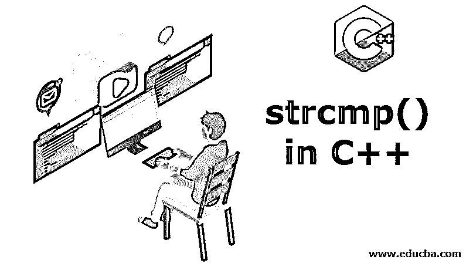
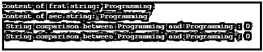
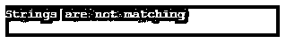
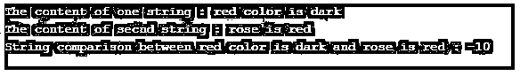

# C++中的 strcmp()

> 原文：<https://www.educba.com/strcmp-in-c-plus-plus/>




## C++中 strcmp()的介绍

下面的文章给出了 C++中 strcmp()的概要。任何编程语言中都有许多字符串函数和结构，C++也是如此。它包括 cstring 头文件中的函数。它的工作方式是，用于操作的字符串存储在预定义的 c 风格的 char 数组中，并用于复制它，方法是将字符存储在 char 数组中，然后在两个字符串的字符之间进行比较。此外，可以使用 char 数组和比较对任意数量的字符串进行初始化。

### 句法

下面是一个语法:

<small>网页开发、编程语言、软件测试&其他</small>

```
int strcmp (const char * str1, const char * str2);
```

该语法表示 str 1 和 str 2 是函数中作为参数的两个字符串。这将比较两个参数，即两个字符串，然后它将以 int 值的形式返回比较结果，这反过来又有其自身的意义。

*   如果字符串比较后返回的 int 值为 0，则表明两个字符串中的字符相同。
*   如果返回的 int 值为 1，即当第一个字符串中的字符不匹配时，ASCII 值大于第二个字符串的相同索引中的字符。
*   如果返回的 int 值为-1，则与第一个字符串不匹配的字符由小于第二个字符串的相同位置或索引处的字符的 ascii 值组成。

strcmp 里面有两个东西一个字符串可以是任何字符数组字符串和尽可能多的数字，还有一个比较函数。用编程语言的[术语概括，我们有一个 compare()函数，它是 string 类和 string.h 头文件的公共成员函数。compare 函数将 string 对象(或子字符串)的值与 arguments.int 中指定的字符序列进行比较。上述语法是最终比较的字符串返回类型，返回类型只能是 string，不能是 Boolean 或任何其他形式。还有许多定义字符串比较函数的方法，这同样取决于将用于比较的字符串类型以及当时的要求或需要。](https://www.educba.com/what-is-a-programming-language/)

**Note:** This syntax is the conventional or the most preferred way of using string compare () function. But there are many more ways of string comparison which will be represented further.

strcmp()或 compare()函数的各种语法类型的表示:

*   int string::compare(常量字符串& str)常量
*   int string::compare(size _ type idx，size_type len，const string& str) const
*   int string::compare(size _ type idx，size_type len，const string& str，size_type str_idx，size_type str_len) const
*   int string::compare(const char * CSTR)常量
*   int string::compare(size _ type idx，size_type len，const char* cstr) const
*   int string::compare(size _ type idx，size_type len，const char* chars，size_type chars_len) const

### 在 C++中实现 strcmp()的示例

所有不同类型的语法都将通过一个例子来讨论，以获得洞察力和清晰的输出。

#### 示例#1

```
#include <iostream>
#include <cstring>
using namespace std;
int main ()
{
char frst [20] = "Programming";
char sec [20] = "Programming";
char thrd [20] = "Programming";
cout<<"Content of frst string: " <<frst <<"\n";
cout<<"Content of sec string: " <<sec <<"\n";
int result = strcmp (frst, sec);
cout<<" String comparison between " <<frst <<" and " <<sec<<" : " <<result <<"\n";
result = strcmp(sec, thrd);
cout<<" String comparison between " <<sec <<" and " <<thrd<<" : " <<result <<"\n";
return 0;
}
```

**输出:**




#### 实施例 2

```
#include <iostream>
using namespace std;
void comprOprtion(string s1, string s2)
{
if((s1.compare(s2)) < 0)
cout << s1 << "is less than " << s2 << endl;
if((s1.compare(s1)) == 0)
cout << s1 << " is same as " << s1 << endl;
else
cout << "Strings are not matching ";
}
int main ()
{
string s1("God");
string s2("looks after everyone");
comprOprtion(s1, s2);
return 0;
}
```

**输出:**
T3】


#### 实施例 3

```
#include <iostream>
using namespace std;
void cmprOprtion(string s1, string s2)
{
if ((s2.compare(8, 9, s1)) == 0)
cout << "sphere, "<< s1 << " have " << s2;
else
cout << "String is not matching";
}
int main ()
{
string s1("Grapes");
string s2("areverysourandsweet");
cmprOprtion (s1, s2);
return 0;
}
```

**输出:**


#### 实施例 4

```
#include <iostream>
using namespace std;
void comprOprtion (string s1, string s2)
{
if ((s1.compare(1, 6, s2, 2, 4)) == 0)
cout << "Welcome to " << s1 << s2 << " Programming";
else
cout << "Strings not matching with programming ";
}
int main ()
{
string s1("Programs");
string s2("arenotprogrmming skills");
comprOprtion (s1, s2);
return 0;
}
```

**输出:**
T3】


#### 实施例 5

```
#include <iostream>
using namespace std;
void comprOprtion (string s1)
{
if ((s1.compare(0, 3, "educba")) == 0)
cout << s1 << " are " << "just kind people";
else
cout << "Strings are not at all matching ";
}
int main ()
{
string s1("educba");
comprOprtion(s1);
return 0;
}
```

**输出:**
T3】


#### 实施例 6

```
#include <iostream>
using namespace std;
void comprOpration (string s1, string s2)
{
if ((s1.compare(0, 6, "technocrats", 5)) == 0)
cout << "This is " << s1 <<  s2 ;
else
cout << "Strings are not matching ";
}
int main ()
{
string s1("technocrats");
string s2("becomesbig giant");
comprOpration (s1, s2);
return 0;
}
```

**输出:**




#### 实施例 7

```
#include<iostream>
#include<cstring>
using namespace std;
int main ()
{
char one [20] = "red color is dark";
char secnd [20] = "rose is red";
cout<< "The content of one string : " << one << "\n";
cout<< "The content of secnd string : " << secnd << "\n";
int result = strcmp(one, secnd);
cout<< "String comparison between " << one << " and " << secnd << " : " << result;
return 0;
}
```

**输出:**




### 结论–c++中的 strcmp()

字符串比较也是 String.h 头文件的预定义内置函数的一种形式，是 string 类的一部分。有许多形式和语法来表示相同的内容，但主要的优点是比较字符串中任何形式的 char 数组，该字符串可以在内部用于比较最大到空字符的字符。比较函数在比较所有类型的字符串、组合和分解时发挥了很大的作用，但最重要的是，返回的类型只能是整型。

### 推荐文章

这是 C++中 strcmp()的指南。这里我们讨论 C++中 strcmp()的简介、语法和不同的例子。您也可以看看以下文章，了解更多信息–

1.  [C++字符串函数](https://www.educba.com/c-plus-plus-string-functions/)
2.  [C 字符串函数](https://www.educba.com/c-string-functions/)
3.  [c++中的访问说明符](https://www.educba.com/access-specifiers-in-c-plus-plus/)
4.  [c++中的函数重载](https://www.educba.com/function-overloading-in-c-plus-plus/)


