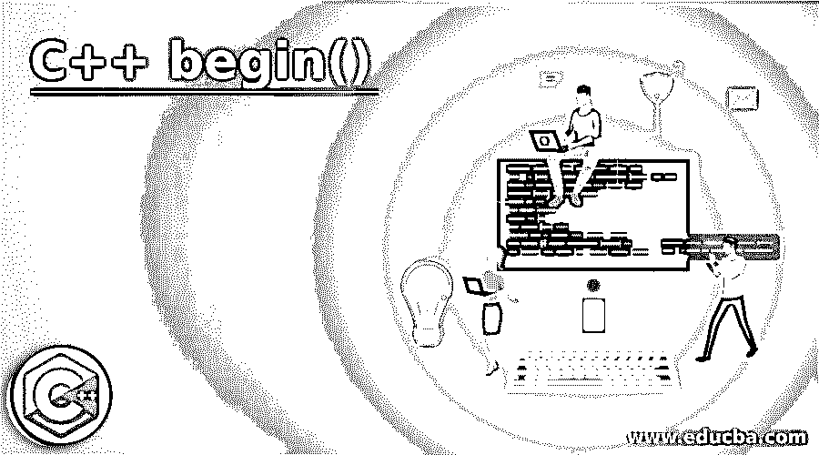

# C++ begin()

> 原文：<https://www.educba.com/c-plus-plus-begin/>




## C++入门 begin()

这个 C++ begin()用于获取指向 map 容器初始元素的迭代器。这个指针是双向的，因为它可以在序列中向任一方向移动。该函数存在于 std 名称空间中的 map associative container 类模板中，其中元素以键值对的形式存储。这里，关键字用于唯一地标识元素值，并且元素以排序的顺序存储，其中关键字是排序标准。函数不需要参数，因此可以使用映射容器引用直接调用，并保证遵循正确的语法时不会出现异常。

### 句法

Map 是以键-值对的方式存储元素的关联容器，因此任何两个元素都不能有两个相同的键。这包含 begin()函数，该函数给出一个指向容器第一个元素的双向迭代器。

<small>网页开发、编程语言、软件测试&其他</small>

```
iterator begin() noexcept;
const_iterator begin() const noexcept;
```

参数-调用 begin 函数不需要任何参数，只需要映射引用对象就可以使用点(.)运算符。

**说明:**这里 iterator 和 const_iterator 是根据调用函数的 map 对象的引用返回的两种不同类型的 iterator。

迭代器–如果映射对象不符合条件，则返回成员类型迭代器。这是一个双向迭代器，指向 map 容器的第一个元素，这里的元素指的是键-值对。

const _ iterator–如果映射引用是 const-qualified，则返回一个双向 const-iterator，指向 cont map 容器的第一个元素，这里的键值对被称为元素。

map 容器的这个函数保证不抛出异常。

### begin()函数在 C++中是如何工作的？

Map 是一个关联容器，它以排序的方式存储键值对中的元素，其中元素按键值排序。begin 函数帮助获取一个指向容器第一个元素的迭代器，并帮助遍历存储在容器中的所有元素。

当一个地图说:-map<datatype1 datatype1="">map object；声明，其中数据类型 1 和数据类型 2 是映射引用 mapObject 的键和值的数据类型。如果需要遍历给定映射中的元素，就需要一个迭代器。因此，当调用 begin 函数时-</datatype1>

```
mapObject.begin()
```

检查映射引用是否是 const-qualified，并根据调用的相应函数分别返回 const_iterator 或 iterator。调用 begin 函数不需要参数。返回的迭代器也是键-值对形式的映射函数类型。返回迭代器是双向迭代器，这意味着可以正向和反向遍历元素，这有助于轻松地以逆序遍历元素。此功能存在于标准模板库中地图的标准模板中。它保证在调用它时不会抛出异常，即使 map 中没有元素。必须注意，返回的迭代器对象不能被解引用。

### 在 C++中实现 begin()的示例

下面是提到的例子:

#### 示例#1

让我们来看一个映射的例子，它存储一个班级中学生的百分比和他们的点名号码。为了打印这些值，我们需要一个迭代器来遍历 map 中的所有元素。使用 class10.begin()函数检索该迭代器，并将其存储在引用变量 itr 中，遍历该迭代器，直到到达 map 的末尾，迭代器指向 map.end()函数所指向的元素。使用 itr->first 和 itr->Second 语句访问 itr 中的元素。

**代码:**

```
#include <iostream>
#include <iterator>
#include <map>
using namespace std;
int main()
{
map<int, int> class10; //map declaration of key-value pair of int-int type
class10.insert(pair<int, int>(1, 65));
class10.insert(pair<int, int>(2, 78));
class10.insert(pair<int, int>(3, 60));
class10.insert(pair<int, int>(4, 50));
class10.insert(pair<int, int>(5, 90));
class10.insert(pair<int, int>(6, 80));
class10.insert(pair<int, int>(7, 75));
map<int, int>::iterator itr;  // iterator of int-int  type
cout << "\nThe map of percentages of students of  class10 is : \n";
cout << "\tRoll_no  \t Percentage\n";
for (itr = class10.begin(); itr != class10.end(); ++itr) {
cout << '\t' << itr->first
<< '\t' << itr->second << '\n';
}
cout << endl;
return 0;
}
```

**输出:**


#### 实施例 2

在这个例子中，我们将尝试访问一个空映射上的迭代器，看不到任何错误或异常被抛出，但是没有任何东西被打印出来。

**代码:**

```
#include <iterator>
#include <map>
using namespace std;
int main()
{
map<int, int> class10;
map<int, int>::iterator itr;
cout << "\nThe map of percentages of students of  class10 is : \n";
cout << "\tRoll_no  \t Percentage\n";
for (itr = class10.begin(); itr != class10.end(); ++itr) {
cout << '\t' << itr->first
<< '\t' << itr->second << '\n';
} return 0;
}
```

**输出:**


#### 实施例 3

让我们看一个例子，如果我们以无序的顺序插入元素。我们将看到 map 将根据键值(即 roll_no)对元素进行排序，因为 map 只按排序顺序存储元素，然后遍历并打印值。

**代码:**

```
#include <iostream>
#include <map>
#include <string>
int main()
{
using namespace std;
map<int,string> Student = {
{ 4, "Raj"},
{ 1, "Prakash"  },
{ 3, "Priya" },
{ 2, "Savi" },
{ 5, "Rituraj"  }};
cout<<"Students in class are:" <<endl;
map<int, string>::const_iterator myIterator;
myIterator = Student.begin();  //iterator to first element is returned
cout << "ROLL_NO"<<"\t" <<"NAME" << "\n";
while (myIterator != Student.end() )
{
cout << myIterator->first <<"\t"  << myIterator->second << "\n";
++myIterator;
}
cout << endl;
return 0;
}
```

**输出:**


### 结论

begin()函数用于检索指向映射的第一个元素的双向迭代器，这是一个与映射类型相同的关联容器。这个函数保证不抛出任何异常，并且如果映射为空，返回的迭代器对象不能被解引用。

### 推荐文章

这是一个 C++ begin()的指南。这里我们讨论 C++ begin()的介绍，包括适当的语法，它是如何工作的，以及相应的例子。您也可以浏览我们的其他相关文章，了解更多信息——

1.  [c++中的迭代器](https://www.educba.com/iterator-in-c-plus-plus/)
2.  [C++ any()](https://www.educba.com/c-plus-plus-any/)
3.  [C++测试()](https://www.educba.com/c-test/)
4.  [C++设定精度](https://www.educba.com/c-plus-plus-setprecision/)


